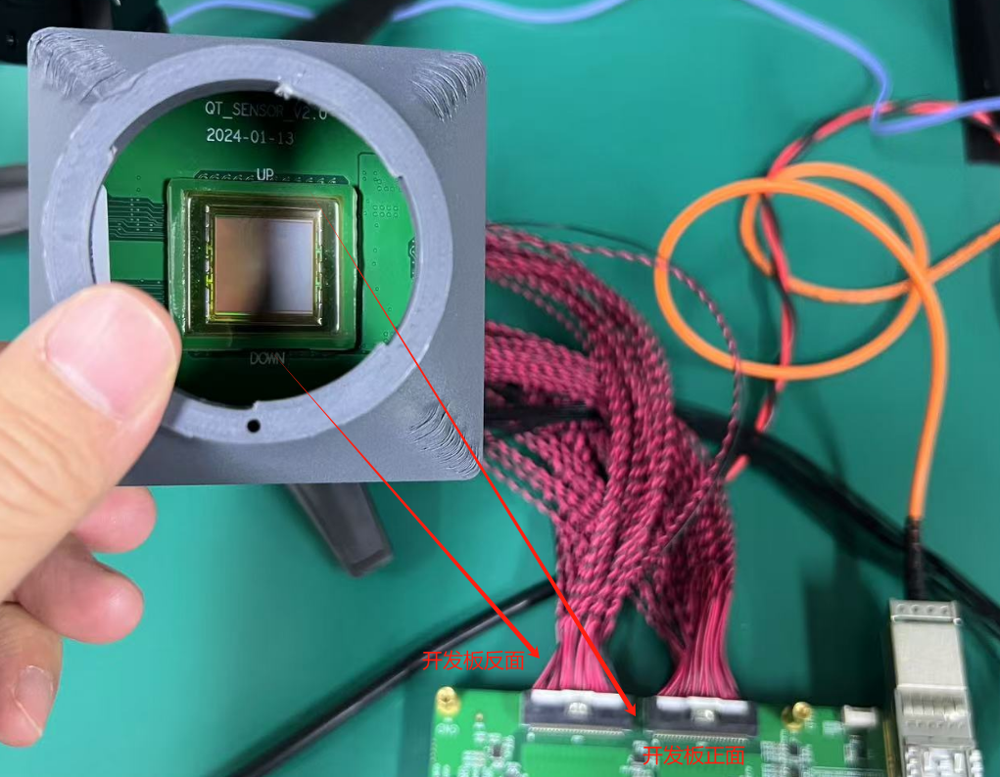

# 基础说明

7ev开发板上电要求：25V  4A

光纤开发板上电要求：12V  3A  （正常的电源适配器）

一次发送图像1280 - 1024 - 8

存储图像地址：0x4xxx xxxx

指令地址：0xA001 0000


开发板详情：

​	UART1：靠近USB

​	SD0 ：emmc

​	FLASH：64MB


**vcu配置：**

​	模式：AVC（H.264）

​	分辨率：1920*1080

​	频率：45

​	颜色格式：4:0:0 （灰度）

​	颜色深度：8bit


光纤记录仪（zcu板子）：按照协议发数据  通过Aurora推数据，  7EV压缩

图像格式：视频流  h264

脉冲数据和压缩数据全存到记录仪

脉冲数据：
	采集的数据是通过脉冲信号格式发送，


连接方式




# VCU的使用记录

产生一个测试视频，并输出到DP显示器

```shell
gst-launch-1.0 videotestsrc ! video/x-raw, width=1920, height=1080, framerate=30/1 ! kmssink bus-id=fd4a0000.display fullscreen-overlay=1
```

产生一个模拟视频，并把视频发送到云端 

```shell
sudo gst-launch-1.0 videotestsrc ! video/x-raw, width=1280, height=1024, framerate=30/1 ! videoconvert n-threads=2 ! timeoverlay ! omxh264enc qp-mode=auto gop-mode=low-delay-p gop-length=30 periodicity-idr=30 b-frames=0 target-bitrate=3000 num-slices=8 control-rate=low-latency prefetch-buffer=true low-bandwidth=true filler-data=0 cpb-size=4000 initial-delay=2000 ! mpegtsmux ! udpsink host=123.56.87.55 port=5000
```

gst-launch-1.0 videotestsrc ! video/x-raw, width=1280, height=1024, framerate=30/1 ! videoconvert n-threads=2 ! timeoverlay ! x264enc tune=zerolatency bitrate=3000 ! mpegtsmux ! udpsink host=123.56.87.55 port=5000


（视频云端地址：http://123.56.87.55:8889/test1/）

（云端地址：http://123.56.87.55:8501）


# 最终操作流程

ramdisk镜像文件：https://wyc-yun.lanzn.com/iGhRE215vksd

petalinux工程：https://github.com/FPGAmaster-wyc/7evVcu-plnx

fpga工程：https://github.com/FPGAmaster-wyc/7evVcu-fpga

```shell
## 生成petalinux系统

## 清除生成的文件（导入xsa之前可以清除一下）
petalinux-build -x mrproper -f	

## petalinux本地编译库地址：
file:///home/peta21/sstate_petalinux/downloads
/home/peta21/sstate_petalinux/aarch64

## 更改根文件系统位置 emmc0的第二分区
Root filesystem type (EXT4 (SD/eMMC/SATA/USB))  --->     
(/dev/mmcblk0p2) Device node of SD device

## 修改设备树
&qspi {
        status = "okay";
        flash@0 {
        compatible = "n25q512a", "jedec,spi-nor";
        reg = <0x0>;
        spi-tx-bus-width = <4>;
        spi-rx-bus-width = <4>;
        spi-max-frequency = <10000000>;
        #address-cells = <1>;
        #size-cells = <1>;
  };
};
```


## 添加根文件系统
全部的dev版本（" " 基础版本，"dbg" debug版本，"dev" 开发版本）


## 打包BOOT.bin (/image/linux)
```shell
petalinux-package --boot --format BIN --fsbl ./zynqmp_fsbl.elf --u-boot ./u-boot.elf --pmufw ./pmufw.elf --fpga system.bit --force
petalinux-package --boot --format BIN --fsbl --u-boot --pmufw --fpga --force
```


## 打包成BSP

```shell
petalinux-package --bsp -p ./VCU/ --hwsource ./VCU/vcu.xsa --output 7ev-vcu --force
```

说明：此指令把硬件文件也打包进去了


## 启动系统

先用ramdisk进入系统，然后对emmc进行分区，具体步骤：[emmc分区](##emmc进行分区)
1、FAT分区 （image.ub）
2、ext4分区 （rootfs）

​	tar -zxvf ./rootfs.tar.gz -C /ROOT

然后通过usb把上述几个文件考进去

[然后进入u-boot 把BOOT进行更新](##更新升级流程：)

[设置从emmc启动镜像：](##设置从emmc启动镜像：)


## 设置从emmc启动镜像

```shell
## 添加指令
setenv my_emmc_boot "mmc dev 0:1 && load mmc 0:1 0x10000000 /image.ub && bootm 0x10000000"
setenv my_emmc_boot "mmc dev 0:1 && load mmc 0:1 0x10000000 /uImage && load mmc 0:1 0x20000000 system.dtb && bootm 0x10000000 - 0x20000000"

## 将bootcmd的命令修改成my_emmc_boot
setenv bootcmd "run my_emmc_boot" 

## 保存环境变量
saveenv
```


## 更新升级流程

更新只需修改

BOOT.bin	（FLASH）

 image.ub  或者 system.dtb和uImage	（EMMC）

**说明**

如果只更改PL中的某几个.v文件，只需更新BOOT.bin即可，编译只需petalinux-build -c bootloader即可

**在u-boot进行更新**

```shell
##	更新image.ub（system.dtb同理） ##
## 从usb 下载image.ub   
load usb 0 0x10000000 image.ub
## 更新到emmc  
save mmc 0:1 ${fileaddr} image.ub ${filesize}

## 更新BOOT.bin  （因为BOOT在FLASH分区的 0x1E00000，所以只需擦除这部分）
## 从usb 下载BOOT.bin
load usb 0 0x10000000 BOOT.bin
load usb 0 0x10000000 BOOT_RAM.bin

## 烧写到FLASH (全部擦除为 0x4000000)
sf probe
sf erase 0 0x4000000
sf erase 0 0x1E00000
sf write 0x10000000 0 ${filesize}

## 重新加载u-boot
reset
```

**在linux进行更新**

```shell
## 更新BOOT.bin
## 写入FLASH （包含擦除、写入、校验）  （校验出问题 应该没事）
flashcp -v ./BOOT.BIN /dev/mtd0

## 重启linux
reboot
```


## 验证操作系统

```shell
## 查询启动日志
dmesg

## 查询VCU驱动
root@7ev-vcu:~# ls /dev/all*
/dev/allegroDecodeIP  /dev/allegroIP

## 查看内核模块
root@7ev-vcu:~# lsmod
Module                  Size  Used by
xt_conntrack           16384  1
xt_MASQUERADE          16384  1
xt_addrtype            16384  2
iptable_filter         16384  1
iptable_nat            16384  1
nf_nat                 36864  2 iptable_nat,xt_MASQUERADE
dmaproxy               16384  0
al5e                   20480  0
al5d                   16384  0
allegro                36864  2 al5e,al5d
mali                  233472  0
xlnx_vcu               20480  1 allegro
regmap_mmio            16384  1 xlnx_vcu
uio_pdrv_genirq        16384  0

## 使用devmem指令访问DDR 内存
eg：devmem 0x30001000 32 0x10  (向这个地址写32b 0x10)


```


## 给user用户sudo权限

用root用户登录系统：

修改 `/etc/sudoers` 文件中配置权限

1. 运行以下命令以编辑 `/etc/sudoers` 文件：

```shell
visudo
```

2. 在打开的文件中找到类似以下行的内容：

```shell
root    ALL=(ALL) ALL
```

3. 在该行下方添加以下内容，将 `<your_username>` 替换为您的用户名：

```shell
<your_username>    ALL=(ALL) ALL
```


## 给根文件系统添加彩色目录

修改user目录下的.barch文件，把里面的内容取消注释掉

**配置 Bash 或其他 shell**： 如果使用的是 Bash，可以通过编辑 `~/.bashrc` 或 `/etc/profile` 文件，添加以下内容来启用彩色输出：

```shell
# 启用 ls 彩色输出
alias ls='ls --color=auto'
```


## EMMC分区步骤

1、首先查看emmc设备：
	fdisk -l	查询到emmc的名称

2、如果挂载了这个emmc，需要先卸载 （df查询是否挂载）
	卸载emmc：	umount /dev/mmcblk0*（第一步查询到的名称）
	
3、使用fdisk格式划分区

```shell
fdisk /dev/mmcblk0
```

4、格式划分区选择：
	（1）使用帮助m

​	（2）删除所以分区d		（No partition is defined yet！ 表示删除完毕）

​	（3）创建新的分区n

​	（4）选择分区类型p		（也可以直接回车，默认）

​			Partition type
​			   p   primary partition (1-4) 
​			   e   extended

​	（5）输入分区号
​			Partition number (1-4, default 1): 1 

​	（6）输入分区起始地址
​		First sector (2048-31116287, default 2048): 2048 

​	（7）输入分区结束地址   （如果想创建多个分区，请合理分配地址）
​		Last sector, +sectors or +size{K,M,G} (2048-31116287, default 31116287): 31116287 

​	（8）打印分区情况 p
​	（9）修改分区类型 t		（83为根文件系统分区类型，0C为FAT32）
​	（10）保存并退出 w	
​	

5、记得格式化一下分区

```shell
## EXT4
mkfs.ext4 /dev/mmcblk0p2

## FAT32
mkfs.vfat /dev/mmcblk0p1
```

​	 

## 安装ubuntu根文件系统

### 

1、首先解压ubuntu根文件系统

2、然后把petalinux生成的rootfs里面的/lib/modules下的文件夹拷贝到 ubuntu根文件系统的位置，同时删除ubuntu本身的

3、把petalinux生成的根文件系统中/lib/firmware文件夹拷贝到 ubuntu根文件系统

**说明：**

modules：内核驱动文件夹

firmware：设备固件文件夹

```shell
sudo cp -r -n ./lib/modules/. ../ubuntu-18.04.4/lib/modules/
sudo cp -r -n ./lib/firmware/ ../ubuntu-18.04.4/lib/

## 压缩
sudo tar -czvf 7ev-ubuntu.tar.gz -C ./ubuntu-18.04.4/ .

## 复制到U盘
sudo cp 7ev-ubuntu.tar.gz /media/linuxusb/ROOT/
sync
```

### 移植ubuntu18.04

配置网络

启动后，以太网无法自行连接到网络。相反，它需要一些配置才能正常工作。如果您发现自己处于断开连接的情况，请执行以下步骤。

```shell
## 查看所有网口
ip link show 

sudo vi /etc/netplan/networkmanager.yaml

## 放入以下内容（注意缩进保持下面不变）（自动获取ip）

network:
    version: 2
    renderer: networkd
    ethernets:
        enx0826ae3d2eb1:
            dhcp4: true
        
## 复制版本        
network:
version: 2
renderer: networkd
ethernets:
enx0826ae3d2eb1:
dhcp4: true

```

**然后启动配置并重启**

```shell
sudo netplan generate
sudo netplan apply
sudo reboot

./make_ubuntu_rootfs.sh ubuntu-18.04.4-server-arm64.iso
```

现在，这将自动配置 ubuntu 网络设置。最后，您应该能够连接到网络/互联网

安装软件：

```shell
sudo apt install gstreamer1.0-tools gstreamer1.0-plugins-base gstreamer1.0-plugins-good gstreamer1.0-plugins-bad gstreamer1.0-plugins-ugly gstreamer1.0-libav
sudo apt-get install libopencv-dev
sudo apt-get install -y build-essential cmake git libgtk2.0-dev pkg-config libavcodec-dev libavformat-dev libswscale-dev
```


**问题：**

未能显示桌面到DP 

可能问题：

在官方zynq配置的里面，提示需要禁止PCI和设置size为128，具体如下

- petalinux-config -c kernel

- (1) Disable PCI (CONFIG_PCI=n) because otherwise Xorg will segfault
- (2) Set CMA_SIZE_MBYTES to 128 so that Xorg doesn't throw an error: Device Drivers > Generic Driver Options > DMA Contiguous Memory Allocator > Size in Mega Bytes.


### 移植ubuntu16.04 （成功）

**介绍：**

用户名密码：user，password

root：直接输入root


**开机等待修复**

```shell
sudo vim /etc/systemd/system/network-online.target.wants/networking.service

将里面的TimeoutStartSec=5min 修改为TimeoutStartSec=2sec
```


**修复unable to resolve host ubuntu**

```shell
## 1. 检查 `/etc/hostname` 文件 
##查看 `/etc/hostname` 文件的内容：
cat /etc/hostname

##假设它的内容是： 
ubuntu

##2. 编辑 `/etc/hosts` 文件
##确保 `/etc/hosts` 文件包含适当的主机名解析条目。编辑 `/etc/hosts` 文件：
sudo vim /etc/hosts
   
##确保它包含如下条目：  
127.0.0.1       localhost
127.0.1.1       ubuntu
```

   


**添加用户**

需要添加一个user用户，密码password

```shell
## 添加用户user （在root用户）
adduser user

## 给user root权限
usermod -aG sudo user

## 添加sudo 权限
chown root:root /usr/bin/sudo
chmod 4755 /usr/bin/sudo

```


**配置网络**

```shell
sudo vim /etc/network/interfaces

## 网线
auto enx0826ae3d2eb1
iface enx0826ae3d2eb1 inet dhcp

## 5G
auto usb0
iface usb0 inet dhcp

sudo systemctl restart networking
```

**换国内源**

```shell
sudo vi /etc/apt/sources.list

# 默认注释了源码镜像以提高 apt update 速度，如有需要可自行取消注释
deb http://mirrors.tuna.tsinghua.edu.cn/ubuntu-ports/ xenial main restricted universe multiverse
# deb-src http://mirrors.tuna.tsinghua.edu.cn/ubuntu-ports/ xenial main restricted universe multiverse
deb http://mirrors.tuna.tsinghua.edu.cn/ubuntu-ports/ xenial-updates main restricted universe multiverse
# deb-src http://mirrors.tuna.tsinghua.edu.cn/ubuntu-ports/ xenial-updates main restricted universe multiverse
deb http://mirrors.tuna.tsinghua.edu.cn/ubuntu-ports/ xenial-backports main restricted universe multiverse
# deb-src http://mirrors.tuna.tsinghua.edu.cn/ubuntu-ports/ xenial-backports main restricted universe multiverse

# 以下安全更新软件源包含了官方源与镜像站配置，如有需要可自行修改注释切换
deb http://ports.ubuntu.com/ubuntu-ports/ xenial-security main restricted universe multiverse
# deb-src http://ports.ubuntu.com/ubuntu-ports/ xenial-security main restricted universe multiverse

# 预发布软件源，不建议启用
# deb http://mirrors.tuna.tsinghua.edu.cn/ubuntu-ports/ xenial-proposed main restricted universe multiverse
# # deb-src http://mirrors.tuna.tsinghua.edu.cn/ubuntu-ports/ xenial-proposed main restricted universe multiverse
```

16.04原本源

```shell
sudo vi /etc/apt/sources.list

deb http://ports.ubuntu.com/ubuntu-ports/ xenial main restricted
deb http://ports.ubuntu.com/ubuntu-ports/ xenial-updates main restricted
deb http://ports.ubuntu.com/ubuntu-ports/ xenial universe
deb http://ports.ubuntu.com/ubuntu-ports/ xenial-updates universe
deb http://ports.ubuntu.com/ubuntu-ports/ xenial multiverse
deb http://ports.ubuntu.com/ubuntu-ports/ xenial-updates multiverse
deb http://ports.ubuntu.com/ubuntu-ports/ xenial-backports main restricted universe multiverse
deb http://ports.ubuntu.com/ubuntu-ports/ xenial-security main restricted
deb http://ports.ubuntu.com/ubuntu-ports/ xenial-security multiverse
deb http://ports.ubuntu.com/ubuntu-ports/ xenial-security universe
```


**同步时间**

```shell
## 安装ntp
sudo apt-get install ntpdate

## 启动时间同步
sudo timedatectl set-ntp true

## 修改时区
sudo timedatectl set-timezone Asia/Shanghai
```


**SSH服务配置错误**

```shell
## 修改下面的文件
vim /etc/ssh/sshd_config

## 确保这几个是yes
PubkeyAuthentication yes
# To disable tunneled clear text passwords, change to no here!
PasswordAuthentication yes   （52行）
# Change to yes to enable challenge-response passwords (beware issues with
# some PAM modules and threads)
KbdInteractiveAuthentication yes
```


**修改5G网络：**

安装udhcpc

```shell
apt install udhcpc
```

删除现有的 `/etc/resolv.conf` 文件：

```shell
sudo rm /etc/resolv.conf
```

创建指向 `/run/resolvconf/resolv.conf` 的符号链接：

```shell
sudo ln -s /run/resolvconf/resolv.conf /etc/resolv.conf
```

**重新启动网络服务**（或重启系统）以应用更改：

```shell
sudo systemctl restart networking
```


## 参考文献

FLASH分区配置：https://support.xilinx.com/s/article/000033588?language=en_US

ZYNQ QSPI驱动：https://xilinx-wiki.atlassian.net/wiki/spaces/A/pages/18841901/Linux+ZynqMP+GQSPI+Driver#LinuxZynqMPGQSPIDriver-Device-tree


# 在线更新FLASH

## 内核配置

（zynq）

The following config options need to be enabled
CONFIG_ZYNQ_SPI_QSPI
It depends on SPI_MEM, SPI_MASTER and ARCH_ZYNQ


If required, enable MTD block devices support - MTD_BLKDEVS

（zynqMP）

Kernel Configuration Options

The following config options need to be enabled
CONFIG_SPI_ZYNQMP_GQSPI
It depends on SPI_MASTER, SPI_MEM and HAS_DMA


If required, enable MTD block devices support - MTD_BLKDEVS

## QSPI设备树

zynqMP

```dtd
&qspi {
        status = "okay";
        flash@0 {
        compatible = "n25q512a", "jedec,spi-nor";
        reg = <0x0>;
        spi-tx-bus-width = <4>;
        spi-rx-bus-width = <4>;
        spi-max-frequency = <10000000>;
        #address-cells = <1>;
        #size-cells = <1>;
        partition@0x00000000 {
                label = "boot";
                reg = <0x0 0x1E00000>;
        };

        partition@0x1E40000 {
                label = "bootenv";
                reg = <0x1E400000 0x40000>;
        };

  };
};
```

## Linux指令：

```shell
## 查询FLASH分区：
cat /proc/mtd

dev:    size   erasesize  name
mtd0: 00400000 00020000 "qspi-fsbl-uboot"
mtd1: 01a00000 00020000 "qspi-linux"
mtd2: 00010000 00020000 "qspi-device-tree"
mtd3: 00500000 00020000 "qspi-rootfs"
mtd4: 005e0000 00020000 "qspi-bitstream"

## 写入FLASH （包含擦除、写入、校验）  （校验出问题 应该没事）
flashcp -v ./BOOT.BIN /dev/mtd0

Erasing block: 32/32 (100%)
Writing kb: 4088/4096 (99%)
Verifying kb: 4088/4096 (99%)

## 直接更新
dd if=新的BOOT.BIN of=/dev/mtdb0
```

## **参考文献：**

ZYNQ QSPI驱动：https://xilinx-wiki.atlassian.net/wiki/spaces/A/pages/18841901/Linux+ZynqMP+GQSPI+Driver#LinuxZynqMPGQSPIDriver-Device-tree

https://xilinx-wiki.atlassian.net/wiki/spaces/A/pages/18842262/Zynq+QSPI+Driver

zynqMP官方移植ubuntu：https://ubuntu.com/download/amd


# zynq系列添加保留内存

## zynqMP

修改/home/peta21/petalinux/zu7ev/7evVcu-plnx/components/plnx_workspace/device-tree/device-tree目录下的system-top.dts文件，添加以下代码

```dtd
reserved-memory {
   #address-cells = <2>;
   #size-cells = <2>;
   ranges;

   reserved: buffer@0 {
      no-map;
      reg = <0x0 0x70000000 0x0 0x10000000>; 	## 
   };
};

reserved-driver@0 {
   compatible = "xlnx,reserved-memory";
   memory-region = <&reserved>;
};
```

**说明：** 

reg = <0x0 0x70000000 0x0 0x10000000>; 	代表<ddr1 ddr0  ddr1 ddr0> 起始地址，大小 

## zynq

修改Petalinux project-spec/meta-user/recipes-bsp/device-tree/files/system-user.dtsi文件，添加以下代码

```dtd
/ {
   reserved-memory {
      #address-cells = <1>;
      #size-cells = <1>;
      ranges;

      reserved: buffer@0x38000000 {
         no-map;
         reg = <0x38000000 0x08000000>;
      };
   };

   reserved-driver@0 {
      compatible = "xlnx,reserved-memory";
      memory-region = <&reserved>;
   };
};
```

**说明：** 

reg = <0x70000000 0x10000000>; 	代表：起始地址，大小 

## 参考文献

https://xilinx-wiki.atlassian.net/wiki/spaces/A/pages/18841683/Linux+Reserved+Memory


# 5G拨号总结：

在板子上使用microcom工具对5G模块发送AT指令，实现拨号控制

1、串口工具使用

```shell
microcom -t 5000 -s 115200 /dev/ttyUSB2
## -t 5000:指示串口接收输入时间为5S，超时microcom退出
## -s 115200:指示串口波特率为115200
## /dev/ttyUSB2:驱动层指定的用于AT指令发送的调试串口，由USB转出
```

使用 Ctrl + A 然后按 X 键 退出

2、拨号使用的AT指令

```c
at+qcfg="usbnet",5 		//把网卡类型配置成NCM，驱动的时候也是在系统中对应驱动成NCM网卡
AT+QCFG="nat",0 	//配置成网卡模式
AT+CFUN=1,1 		//软重启模块，端口会断开，需要等待模块重连
AT+QNETDEVCTL=1,3,1	//拨号命令，看到分配的公网IP为拨号成功  设置成自动拨号 之后只需要执行step3即可

ATD18864443115;		//可以打电话，挺有意思
```

3、使用udhcpc做路由配置

```shell
root@rev1:~# udhcpc -i usb0			## 终端设备作为DHCP客户端
udhcpc: started, v1.31.0
udhcpc: sending discover
udhcpc: sending select for 10.10.183.62
udhcpc: lease of 10.10.183.62 obtained, lease time 86400
/etc/udhcpc.d/50default: Adding DNS 219.141.136.10		#域名解析
/etc/udhcpc.d/50default: Adding DNS 219.141.140.10
```

备注:
以上流程可以使用quectel提供的拨号工具实现，对于到NCM以及NAT的配置，可以设置成网卡的默认项。

4、测试

```shell
root@rev1:~# ping www.baidu.com
PING www.baidu.com (220.181.38.149): 56 data bytes
64 bytes from 220.181.38.149: seq=0 ttl=52 time=41.958 ms
64 bytes from 220.181.38.149: seq=1 ttl=52 time=47.906 ms
64 bytes from 220.181.38.149: seq=2 ttl=52 time=23.290 ms
```

5、关闭5G网络通道

```shell
## 关闭
ifconfig usb0 down
## 重新开启
ifconfig usb0 up
```

6、添加开机自启动

```shell
## 1、进入到/etc/init.d，创建脚本程序，并给权限
cd /etc/init.d
vim autorun.sh

## 脚本内容开始
#!/bin/bash

function pppoe()
{
    udhcpc -i usb0
    if [ $? -ne 0 ];
    then
        echo -e "\033[1;31m --------pppoe failed!--------\033[0m"
    else
        echo "pppoe successfully!"
    fi
}

pppoe
## 脚本内容结束

## 2、使脚本生效
update-rc.d autorun.sh defaults 99

## 3、自启动选项移除
update-rc.d -f autorun.sh remove
```

## 参考文献：

https://www.cnblogs.com/downey-blog/p/10473939.html


# 遇到的报错：

使用vitis烧写程序时报错“Could not read hardware specification. Please check platform associated with project”

**原因及解决办法：**
工程文件拷贝到别处后，很多配置信息丢失，需要重新配置。
这个问题就是app project里的platfor[文件路径丢失导致的，重新添加platform文件


查看烧写的系统是否为可以存储的：

root@ia2610end:~# mount
none on / type rootfs (rw)    			(表示，此操作系统为只读操作系统，如果显示mmc表示可以存储的)


