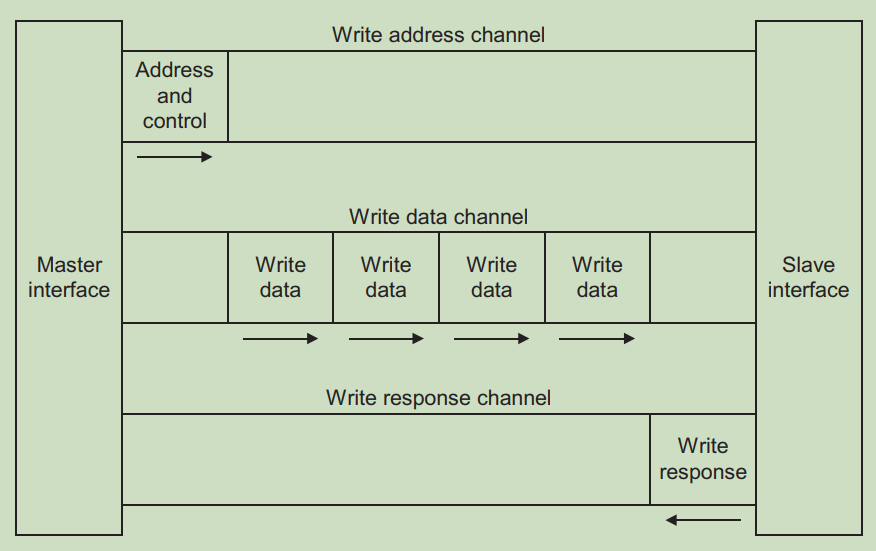
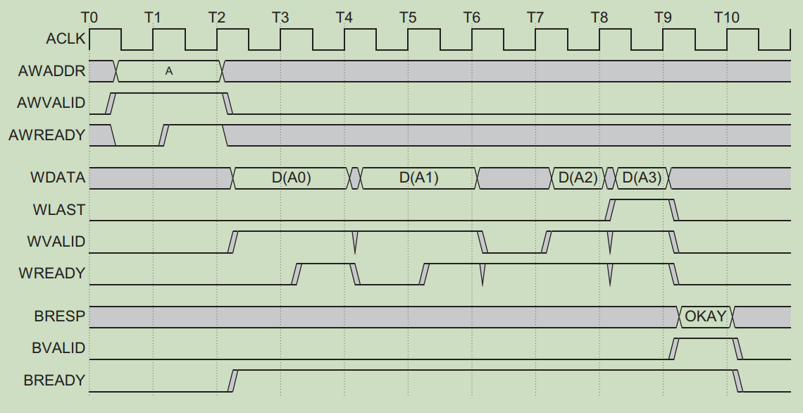
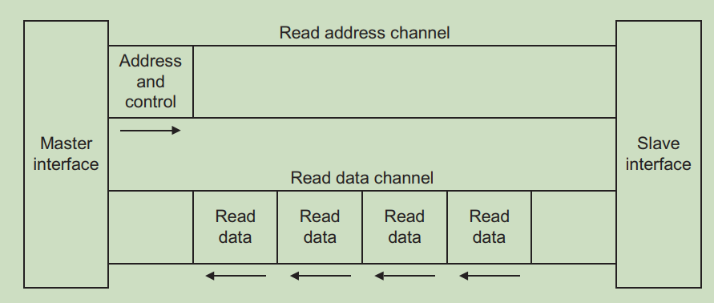
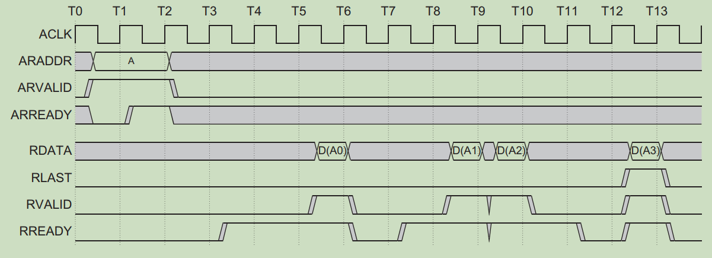
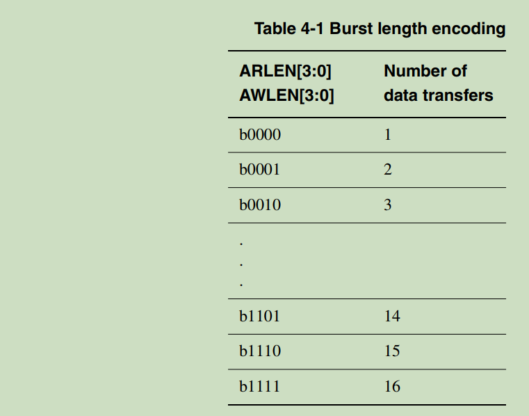
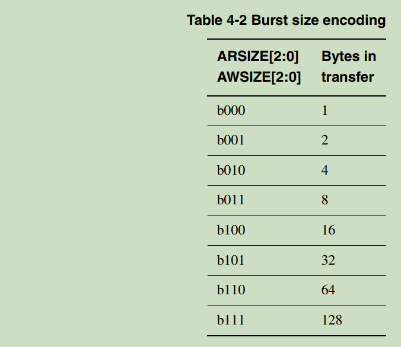
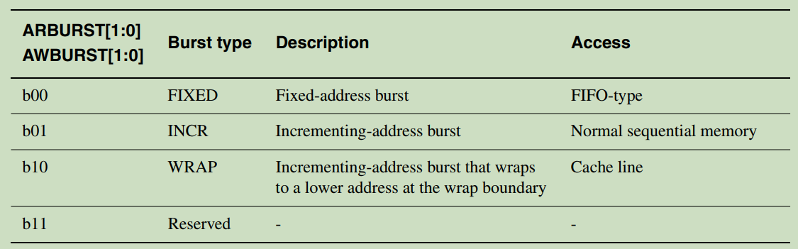
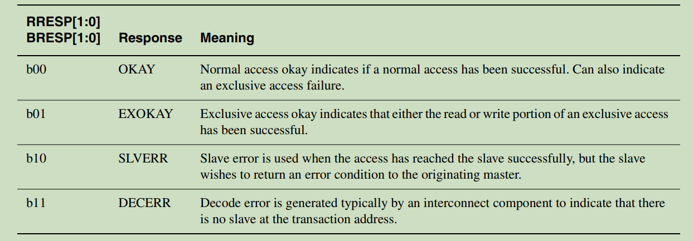
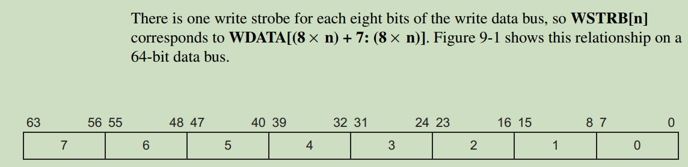

# 1、AXI总线接口

- AXI规范描述了**单个**AXI主（master）从（slave）之间的接口。
- 多个Master和Slave之间的内存映射可以通过Xilinx AXI Interconnect IP 和 AXI SmartConnect IP 连接在一起。
- 数据可以同时在主->从和从->主两个方向传输。数据传输的大小可以变化。
- AXI4中的限制是最多**256**个数据传输的突发事务。AXI4-Lite只允许每个事务进行**1**个数据传输。

## 1.1 写通道

- 读或写事务的 地址 与 数据 的连接分离。所以可以同时、双向传输。
- 一个读或写地址后可以跟着256个突发数据传输。

### 1.1.1 从机写地址信道 

从机写地址信道，将存储器映射接口中的写访问中的写数据的地址（从主动传递给从机），单向化为一个单向流（从控制器主机流向存储器从机**s_axi_aw**）：

| 信号              | 信息源 | 描述                     | 备注                     |
| ----------------- | ------ | ------------------------ | ------------------------ |
| **s_axi_aw**addr  | 主机   | 写数据的地址             | 写地址信号waddr，        |
| **s_axi_aw**id    | 主机   | 写数据和地址的ID         | 写地址控制信号controller |
| **s_axi_aw**len   | 主机   | 写数据突发的长度类型     |                          |
| **s_axi_aw**size  | 主机   | 写数据突发数据的宽度类型 |                          |
| **s_axi_aw**burst | 主机   | 写数据的突发类型         |                          |
| **s_axi_aw**lock  | 主机   | 写数据的锁定类型         |                          |
| **s_axi_aw**cache | 主机   | 写数据的高速缓存类型     |                          |
| **s_axi_aw**prot  | 主机   | 写数据的保护类型         |                          |
| **s_axi_aw**qos   | 主机   | 写数据的协处理器类型     |                          |
| **s_axi_aw**valid | 主机   |                          | 写地址握手信号           |
| **s_axi_aw**ready | 从机   |                          |                          |

### 1.1.2 从机写数据信道

  从机写数据信道，将存储器映射接口中的写访问中的写数据从主机传递给从机，要写数据的ID与写地址的ID相同，**则表示数据写入对应的地址**。单向化为一个单向流（从控制器主机流向存储器从机**s_axi_w**）：

| 信号             | 信息源 | 描述                   | 备注                     |
| ---------------- | ------ | ---------------------- | ------------------------ |
| **s_axi_w**data  | 主机   | 写数据                 | 写数据信号data，         |
| **s_axi_w**id    | 主机   | 写数据的ID             | 写数据控制信号controller |
| **s_axi_w**strb  | 主机   | 写数据突发的选通类型   |                          |
| **s_axi_w**last  | 主机   | 写数据突发的最后字指示 |                          |
| **s_axi_w**valid | 主机   |                        | 写数据握手信号           |
| **s_axi_w**ready | 从机   |                        |                          |

###  1.1.3 从机写响应通道

从机写响应信道，是从机对主机发出的写地址信道和写数据信道的应答，是从机传递给主机的信息，单向化后其前缀为 **s_axi_b**：

| 信号             | 信息源 | 描述       | 备注                     |
| ---------------- | ------ | ---------- | ------------------------ |
| **s_axi_b**resp  | 从机   | 写响应信息 | 写响应信号response，     |
| **s_axi_b**id    | 从机   | 写响应的ID | 写响应控制信号controller |
| **s_axi_b**valid | 从机   |            | 写响应握手信号           |
| **s_axi_b**ready | 主机   |            |                          |

 

 

## 1.2 读通道

### 1.2.1 从机读地址通道

从机读地址信道，是主机对从机的读访问中，将读数据地址发送给从机的单向通道。（从主动传递给从机），单向化为一个单向流（从控制器主机流向存储器从机**s_axi_ar**）：

| 信号              | 信息源 | 描述                 | 备注                     |
| ----------------- | ------ | -------------------- | ------------------------ |
| **s_axi_ar**addr  | 主机   | 读数据地址           | 读数据地址addr           |
| **s_axi_ar**id    | 主机   | 读数据地址的ID       | 读地址控制信号controller |
| **s_axi_ar**len   | 主机   | 读数据的突发长度类型 |                          |
| **s_axi_ar**size  | 主机   | 读数据的宽度类型     |                          |
| **s_axi_ar**burst | 主机   | 读数据的突发类型     |                          |
| **s_axi_ar**lock  | 主机   | 读数据的锁定类型     |                          |
| **s_axi_ar**cache | 主机   | 读数据的高速缓存类型 |                          |
| **s_axi_ar**prot  | 主机   | 读数据的保护类型     |                          |
| **s_axi_ar**qos   | 主机   | 读数据协处理器类型   |                          |
| **s_axi_ar**valid | 主机   |                      | 读地址握手信号           |
| **s_axi_ar**ready | 从机   |                      |                          |

 

### 1.2.2 从机读数据通道

从机读数据信道，是主机对从机的读访问中，从机响应主机的读地址信道（ID相同）的数据，单向化为一个单向流（从存储器从机流向控制器主机**s_axi_r**）：

| 信号             | 信息源 | 描述               | 备注                     |
| ---------------- | ------ | ------------------ | ------------------------ |
| **s_axi_r**data  | 从机   | 读数据             | 读数据data               |
| **s_axi_r**id    | 从机   | 读数据的ID         | 读数据控制信号controller |
| **s_axi_r**resp  | 从机   | 读数据响应         |                          |
| **s_axi_r**last  | 从机   | 读数据突发末字指示 |                          |
| **s_axi_r**valid | 从机   |                    | 读数据握手信号           |
| **s_axi_r**ready | 主机   |                    |                          |

##  1.3 突发长度类型（Ax_LEN）

- 两个last信号间隔的数据量个数（不是字节数）
- 单次突发长度最大为：256 

**例：**Ax_len = 8'd128，表示一次突发传输128个数据

## 1.4 突发数据位宽（Ax_SIZE）

- 突发传输数据字节数

**例：**突发数据位宽为：64，即8个字节，则AxSIZE = 3'b011 

但是在vivado开发中，AXI SmartConnect这个ip中，最低为32

## 1.5 突发类型（Ax_BURST）

突发传输类型

| AxBURST | 突发类型         | 描述                                             | 访问                     |
| ------- | ---------------- | ------------------------------------------------ | ------------------------ |
| b00     | 固定长度突发     | 地址固定的突发                                   | FIFO类型                 |
| b01     | 增量突发（INCR） | 地址递增的突发                                   | 正常序列memory           |
| b10     | 回环突发（WRAP） | 地址递增的突发，在回环边界会卷回到一个较低的地址 | 高速缓存线（Cache line） |
| b11     | 保留             | -                                                | -                        |

## 1.6 响应类型（X_BESP）

写数据反馈信号，从机发出，检测是否写数据成功

| X_RESP | 响应   | 含义                                                         |
| ------ | ------ | ------------------------------------------------------------ |
| b00    | OKAY   | 正常访问okey，表示一个正常访问成功，也可以表示一个独占访问失败 |
| b01    | EXOKAY | 独占访问okay，表示一个独占访问读写都成功                     |
| b10    | SLVERR | 从机错误，用于当访问成功到达从机，但是从机期望返回一个错误条件给源主机 |
| b11    | DECERR | 解码错误，通常由一个互联组件产生，表示没有从机对应实物的地址 |

## 1.7 访问类型（AxLOCK）

AXI访问类型

| AxLOCK | 访问类型 |
| ------ | -------- |
| b0     | 正常访问 |
| b1     | 独占访问 |

## 1.8 写字节选通（w_strb）

写字节选通信号 

**例：**写数据位宽为64位 ，且每个位宽都有效。则w_strb = 8'b1111_1111

 (一个字节一位，64bit位8字节，所以是八位)

