# 硬件环境

实现板卡：A3P250


外FLASH：ｗ25Q128 （spi协议）


# 大体步骤

1、如何下载文件到flash，擦除flash  √

2、读取flash是否需要缓存  

3、读出来的数据传到jtag端口


# SPI协议总结

根据从机设备的个数，SPI通讯设备之间的连接方式可分为一主一从和一主多从，全双工通信协议


**四个信号线：**

SCK (Serial Clock)：时钟信号线，用于同步通讯数据。

MOSI (Master Output， Slave Input)：主设备输出/从设备输入引脚。

MISO (Master Input，Slave Output)：主设备输入/从设备输出引脚。

(Chip Select)：片选信号线，也称为CS_N，以下用CS_N表示。当有多个SPI从设备与SPI主机相连时，设备的其它信号线SCK、MOSI及MISO同时并联到相同的SPI总线上，即无论有多少个从设备，都共同使用这3条总线；而每个从设备都有独立的这一条CS_N信号线，本信号线独占主机 的一个引脚，即有多少个从设备，就有多少条片选信号线。当主机要选择从设备时，把该从设备的CS_N信号线设置为低电平，所以**SPI通讯以CS_N线置低电平为开始信号，以CS_N线被拉高作为结束信号**。


**四种模式**

SPI通讯协议一共有四种通讯模式，模式0、模式1、模式2以及模式3，这4种模式分别由**时钟极性**(CPOL，Clock Polarity)和**时钟相位**(CPHA，Clock Phase)来定义

CPOL参数规定了空闲状态(CS_N为高电平，设备未被选中)时SCK时钟信号的电平状态

CPHA规定了数据采样是在SCK时钟的奇数边沿还是偶数边沿。


模式0：CPOL= 0，CPHA=0。空闲状态时SCK串行时钟为低电平；数据采样在SCK时钟的奇数边沿，本模式中，奇数边沿为上升沿；数据更新在SCK时钟的偶数边沿，本模式中，偶数边沿为下降沿。

模式1：CPOL= 0，CPHA=1。空闲状态时SCK串行时钟为低电平；数据采样在SCK时钟的偶数边沿，本模式中，偶数边沿为下降沿；数据更新在SCK时钟的奇数边沿，本模式中，偶数边沿为上升沿。

模式2：CPOL= 1，CPHA=0。空闲状态时SCK串行时钟为高电平；数据采样在SCK时钟的奇数边沿，本模式中，奇数边沿为下降沿；数据更新在SCK时钟的偶数边沿，本模式中，偶数边沿为上升沿。

模式3：CPOL= 1，CPHA=1。空闲状态时SCK串行时钟为高电平；数据采样在SCK时钟的偶数边沿，本模式中，偶数边沿为上升沿；数据更新在SCK时钟的奇数边沿，本模式中，偶数边沿为下降沿。

**注意采集数据和更新数据不是同一个时钟沿**


**采用模式0设计**

SPI通讯协议的4中通讯模式，其中模式0和模式3比较常用，下面我们以模式0为例


# W25Q128介绍

总容量：128Mbit 16MB

**W25Q128存储芯片是由65536可编程的页组成的，每页有256个字节。一次最多可以写256个字节。可以一次擦除16页（4K字节）、128页（32K字节）、256页(64K字节)或者一整片。W25Q128有4096个可擦除的扇区，256个可擦除的块。4K字节的扇区对于数据和参数存储有更高的灵活性。**

每个芯片有256块：每块64KB

每个块有16个扇区：每扇区4KB

每一个扇区有16页：每页256B （一页内存地址为 ：0X000000-0X0000FFh,共256个字节（16x16=256））


**FLASH页、扇区、块介绍**

以W25Q128为例子：


**页**

页就是flash中一种区域划分的单元，就像一本书中的一页一样，图中红色框选部分就为1页。

一页内存地址为 ：0X000000-0X0000FFh,共256个字节（16x16=256）。

**扇区**

扇区和页类似，也是一种存储结构单元，只是扇区更常见，大部分Flash主要还是以扇区为最小的单元。图中粉红色部分为一个扇区的大小。我们从sector 0 ，也就是扇区0 开始分析（粉红色框下下面的扇区）。我们看到：

　　一个扇区是从 0x000000-----0x0000FF
　　　　　　　 　0x000100-----0x0001FF
　　　　　　　 　0x000200-----0x0002FF
　　　　　　　 　0x000300-----0x0003FF

　　　　　　　　　　　　**......**
　　　　　　　 　0x000f00----0x000FFF 为止 ===========16*256=4096字节=4K

一个扇区有16个页，又因为每一个页有256字节，所以一个扇区有4k字节。

**块**

块是比扇区更高一个等级，一般1块包含多个扇区也就是图中蓝色标识的区域。我们看到：　

一块的是从  0x000000-0x000FFF

 　　　　　0x001000-0x001FFF

 　　　    0x002000-0x002FFF

　　　　　　 0x003000-0x003FFF

​                  .......

 　　　　　0x00F000-0x00FFFF为止= ====================4K*16=64K

 

可以看出，一个块有16个扇区组成。
而一个芯片内部存储区域是绿色部分所画的，有256个块，所以W25Q128总共的存储空间为256个块。即一个FLASH为256个块，一个块为16个扇区，一个扇区为4K字节。所以：*256\*16\*4K=16384K=16M/8=128Mbit。*


- 最高性能的串行Flash
  -104MHz的SPI时钟信号
  -在双线或者四线SPI模式下等效于208M/416M
  -传输速度可达约50MB/S
  -超过100000次擦除/编程循环
  -超过20年的数据保存能力

# SPI-FLASH擦除设计

**全擦除操作**

全擦除指令是将Flash芯片中的所有存储单元设置为全1，在Flash芯片写入全擦出指令之前，需要先写入写使能(WREN)指令，将芯片设置为写使能锁存(WEL)状态；随后要拉低片选信号，写入全擦除指令，在指令写入过程中，片选信号始终保持低电平，待指令被芯片锁存后，将片选 信号拉高；全擦除指令被锁存并执行后，需要等待一个完整的全擦除周期(tBE)，才能完成Flash芯片的全擦除操作

全擦除操作指令：8’b1100_0111(C7h)


**写使能指令**

在每一次页写操作(PP)、扇区擦除(SE)、全擦除(BE)和写状态寄存器(WRSR)操作之前，都需要先进行写使能指令写入操作

写使能(Write Enable)指令，简称WREN，操作指令为8’b0000_0110(06h)


**串行输入时序**

写使能指令、全擦除指令以及其它操作指令在写入Flash芯片时要严格遵循芯片的串行输入时序，相关操作指令在写入芯片之前需要先拉低片选信号，在片选信号保持低电平时将指令写入数据输入端口，指令写入完毕，拉高片选信号，数据输出端口在指令写入过程中始终保持高阻态。


其中有三个我们需要格外注意，分别是tSLCH、tCHSH和tSHSL。时间参数参考数值


片选信号自下降沿始到第一个有效数据写入时止，这一段等待时间定义为片选信号有效建立时间 tSLCH，这一时间段必须大于等于5ns；片选信号自最后一个有效数据写入时始到片选信号上升沿止，这一段等待时间定义为片选信号有效保持时间tCHSH，这一时间段必须大于等于3ns；片选信号自上一个上升沿始到下一个下降沿止，这一段等待时间定义为片选信号高电平等待时间tSHSL，这一时间段必须大于等于50ns。

到这里我们已经讲解了写使能指令、全擦除指令的相关内容和操作时序，对Flash芯片的串行输入时序也做了说明。综上所述，绘制完整全擦除操作时序图如图


**程序设计**

整个全擦除工程调用3个模块，按键消抖模块(key_filter)， Flash全擦除模块(flash_be_ctrl)和顶层模块(spi_flash_be)

为了设计方便，时间延时都按照640ns处理，系统时钟为50M，也就是5个时钟周期


仿真时序


# SPI-Flash页写设计

**页写操作**

页写(Page Program)操作，简称PP，操作指令为8’b0000_0010(02h)


在写入页写指令之前，需要先写入**写使能(WREN)指令**，将芯片设置为写使能锁存(WEL)状态；随后要拉低片选信号，写入**页写指令、扇区地址、页地址、字节地址**，紧跟地址写入要存储在Flash的字节数据， 在指令、地址以及数据写入过程中，片选信号始终保持低电平，待指令、地址、数据被芯片锁存后，将片选信号拉高；片选信号拉高后，等待一个完整的页写周期(tPP)，才能完成Flash芯片的页写操作。

**页写时序图**


# SPI_Flash连续写实验


通过页写指令实现数据的连续写操作，方法有二

其一，每次页写入只写入单字节数据，若想连续写入N字节数据，需要连续执行N次页写操作；

其二，先通过页写指令一次性写满第一页数据，计算剩余数据所占整数页，通过页写指令写满整数页，每次页写指令一次写满一页，剩余不足一页的数据，再通过一次页写指令一次性写入。

**第一种方法**


# SPI_Flash读数据

**读数据操作**

SPI-Flash芯片数据读操作的相关内容。数据读操作，操作指令为8’b0000_0011(03h)


要执行数据读指令，首先拉低片选信号选中Flash芯片，随后写入数据读(READ)指令，紧跟指令写入3字节的数据读取首地址，指令和地址会在串行时钟上升沿被芯片锁存。随后存储地址对应存储单元中的数据在串行时钟下降沿通过串行数据总线输出


数据读操作指令写入之前无需先写入写使能指令，且执行数据读操作过程中，片选信号拉低后和拉高前**无需做规定时间等待**，上图中的时序图就是完整的数据读操作时序。

因用杜邦线连接，稳定性太差，所以把sck时钟改小为2.5M，sys_clk为10M

注意：在libero中 FIFO的读写使能默认是地有效，需要修改


# JTAG启动petalinux

`petalinux-boot` 是一个用于在硬件上加载和引导 PetaLinux 镜像的工具，支持 JTAG 和 QEMU 两种模式。常见的使用场景包括通过 JTAG 下载比特流到 FPGA，并加载 FSBL、PMUFW、U-Boot 或 Linux 内核等。

**基本用法**

- **--jtag | --qemu**: 必选参数，用于指定引导模式。`--jtag` 通过 JTAG 引导，`--qemu` 通过 QEMU 仿真引导。
  - `1`: 下载 FPGA 比特流和 FSBL (Zynq)，FSBL 和 PMUFW (ZynqMP)。
  - `2`: 仅引导 U-Boot。
  - `3`: 仅引导 Linux 内核。

**可选参数**

- **--boot-addr <BOOT_ADDR>**: 指定引导地址。
- **--image <IMAGE>**: 指定要引导的镜像文件。
- **--pmufw [<PMUFW_ELF>]**: 指定 PMUFW 的路径，仅适用于 ZynqMP。也可以通过 `--pmufw no` 跳过加载 PMUFW。
- **--u-boot**: 引导 U-Boot 镜像。如果指定了 `--kernel`，则 `--u-boot` 无效。
- **--kernel**: 引导 Linux 内核镜像（zImage、Image 或 image.elf）。
- **--fpga**: 下载并配置 FPGA 比特流。
- **--bitstream <BITSTREAM>**: 使用指定的比特流文件配置 FPGA。
- **--tcl <TCL_OUTPUT>**: 生成用于 XSDB 的 Tcl 脚本文件。
- **--verbose**: 输出调试信息。
- **--hw_server-url <URL>**: 指定硬件服务器的 URL，默认连接到本地服务器 (`localhost:3121`)。

**使用示例**

1. **下载比特流和 FSBL**:

   ```shell
   petalinux-boot --jtag --prebuilt 1
   ```

2. **引导 U-Boot**:

   ```shell
   petalinux-boot --jtag --prebuilt 2
   ```

3. **引导 Linux 内核**:

   ```shell
   petalinux-boot --jtag --prebuilt 3
   ```

4. **生成用于 XSDB 的 Tcl 脚本**:

   ```shell
   petalinux-boot --jtag --kernel --fpga --tcl mytcl
   ```


**下载指定文件**

如果您的设计包含 FPGA 配置，需要首先下载比特流到 FPGA。

**命令：**

```shell
petalinux-boot --jtag --fpga
```

**说明：**

- 该命令将在 FPGA 上配置位于 `<project-root>/images/linux/` 目录下的默认比特流文件（通常为 `*.bit` 文件）。

**指定自定义比特流：**

```shell
petalinux-boot --jtag --bitstream path/to/your.bit
```

**说明：**

- 使用 `--bitstream` 选项可以指定自定义的比特流文件路径。

**步骤 2：加载 FSBL**

FSBL 是系统引导的第一阶段，引导过程需要将 FSBL 加载到目标设备。

**命令：**

```shell
petalinux-boot --jtag --u-boot
```

**说明：**

- 该命令将加载 FSBL 和 U-Boot，FSBL 会初始化硬件并加载 U-Boot。

**如果只想加载 FSBL：**

```shell
petalinux-boot --jtag --u-boot --fsbl path/to/your_fsbl.elf
```

**说明：**

- 使用 `--fsbl` 选项可以指定自定义的 FSBL 文件。

**步骤 3：加载 U-Boot 引导加载程序**

U-Boot 是一个灵活的引导加载程序，负责加载并启动内核。

**命令：**

```shell
petalinux-boot --jtag --u-boot
```

**说明：**

- 该命令将在加载 FSBL 后继续加载 U-Boot。

**步骤 4：启动内核并挂载根文件系统**

**方法一：使用预构建的镜像**

如果您已经有预构建的完整镜像，可以使用以下命令：

```shell
petalinux-boot --jtag --prebuilt 3
```

**说明：**

- `--prebuilt 3` 表示加载预构建的内核和根文件系统。
- 预构建的镜像通常位于 `<project-root>/pre-built/linux/images/` 目录。

# JTAG介绍

JTAG(Joint Test Action Group;联合测试行动小组)是一种国际标准测试协议（IEEE 1149.1兼容），主要用于芯片内部测试。现在多数的高级器件都支持JTAG协议，如DSP、FPGA器件等。标准的JTAG接口是4线：TMS、TCK、TDI、TDO，分别为模式选择、时钟、数据输入和数据输出线。

JTAG接口包括以下几个信号：
TMS（Test Mode Select）：用于设置测试模式和测试状态机的状态。通过 TMS 信号，可以控制 TAP 在不同的状态间相互转换。TMS 信号在 TCK 的上升沿有效。TMS 具有内部电阻式上拉，可在引脚未驱动时提供逻辑高。
TCK（Test Clock）：用于提供时钟信号，控制测试状态机的运行。
TDO（Test Data Out）：q效。TDO具有内部电阻拉拔，如果引脚不活动，则提供逻辑高。
TDI（Test Data Input）：用于向测试状态机输入数据。在 TCK 的上升沿有效。TDI 具有内部电阻拉拔，可在引脚未驱动时为系统提供高逻辑。
TRST(Test Reset Input)： RST可以用来对TAP Controller进行复位(初始化)。不过这个信号接口在IEEE 1149.1标准里是可选的，并不是强制要求的。 因为通过 TMS 也可以对 TAP Controller 进行复位（初始化）

**TAP控制器状态机**

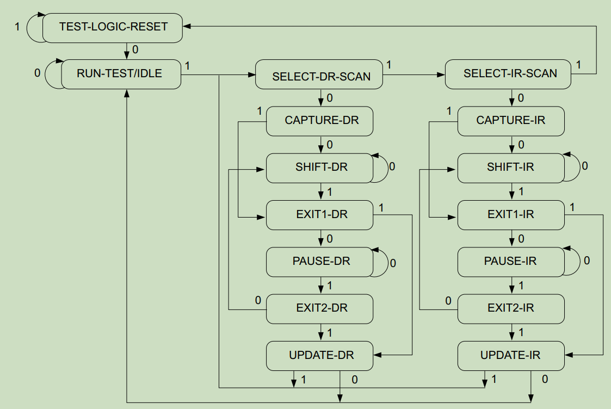


图上的 0和1 代表输入tms的值

当TAP处在Shift-IR模式下，就可以通过TDI每次写入一bit到IR寄存器，然后IR寄存器会自动移动一位。通过这样的方式总是可以向IR寄存器写入任何想要的值。同样地，当TAP处于Shift-DR模式下，可以向D(E)R寄存器写入任何想要的值。

指令寄存器
IR寄存器中的值被当成调试指令，芯片内部根据这些指令完成响应的动作。随便举例，当IR=0b1001时，将芯片内部的xxx寄存器的值输出；当IR=0b1011时，将芯片hang住。

协议特殊规定，对于IR寄存器，如果其每个bit都是1，则表示BYPASS指令，此时TDI经过一个cycle到TDO。注意每个芯片内部的IR寄存器的位数不一定相同。

数据寄存器
DR寄存器可以理解成为IR操作的数据。需要注意的是DR寄存器有很多，每个IR指令可以对应不同的DR。一个特殊的DR动作是，当TAP进入Test-Logic-Reset状态时，DR寄存器自动装入这个器件对应的ID，规定这是一个32位的值。这一状态的控制权比IR寄存器大。


PS端 IR指令

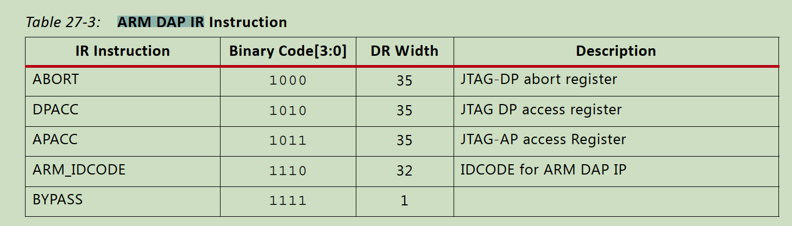

# JTAG加载PL程序

主要根据UG470，来设计烧写PL端程序

首先通过vivado生产.rbt文件（bit文件的阿斯克码文件）

如何根据UG470的166页的时许，来配置SPI

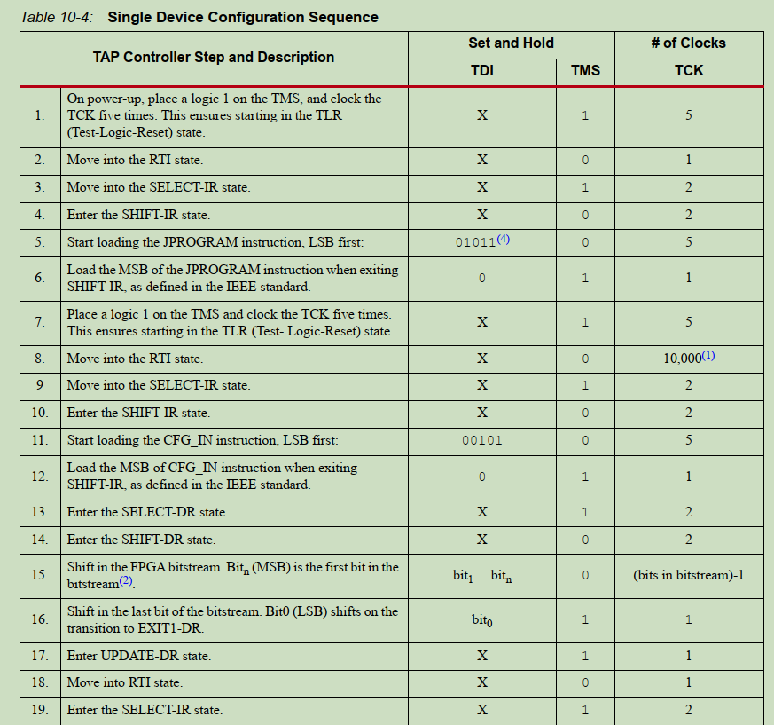

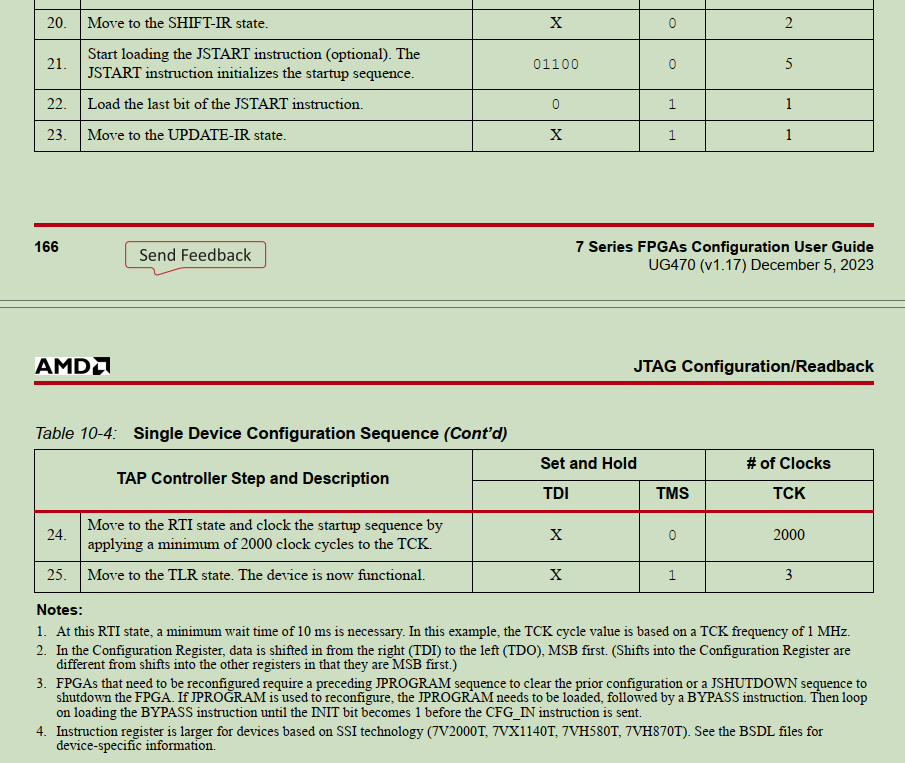


需要注意的是在加载zynq的时候，需要在IR寄存器中添加4位寄存器,

组合顺序为：PS_IR[3:0] + PL_IR[5:0] 


# JTAG加载PS程序

## 1.   概要

本文档描述了使用JTAG协议对Zynq SOC进行重构加载的控制逻辑。本控制器采用verilog实现，可部署于CPLD/FPGA，用于对Zynq器件的PL端、PS端进行程序加载。目前的实现中，PL端支持全局配置比特流文件；PS端支持zynq_fsbl和u-boot的加载运行，也支持在zynq_fsbl之后加载任意elf可执行文件映像运行。

Zynq常规启动模式包括QSPI、SD、JTAG等。其JTAG启动模式一般用于连接调试上位机，通过Vivado和SDK软件加载需要调试运行的程序。本控制器可以实现JTAG启动模式下无外部干预的加载运行，用于Zynq硬件设备的备份启动模式或量产测试等目的。

理解本文档内容需要读者了解JTAG协议时序及其状态机。读者应熟悉Zynq SOC功能架构，了解PL/PS之间的关系和启动模式，理解Zynq BootROM、FSBL、u-boot的功能和运行流程。

用户需要自行准备用于PL配置的bitstream文件，FSBL和u-boot的ELF文件。不同硬件电路的映像文件并不能兼容。

## 2.   基本原理

Zynq器件中的调试接口为JTAG，按照协议，共串联了两个JTAG控制器，其一为Xilinx TAP控制器，用于对PL部分进行操作；其二为ARM DAP控制器，用于对PS部分进行操作。两者除底层JTAG协议外，工作方式完全独立，需要按照各自的控制协议进行访问。

Xilinx TAP是第一个设备，其IR长度为6bit，IDCODE为0x23727093(XC7Z045，其他设备会不同)。TAP的主要参考资料为：

l *《UG470 - 7 Series FPGAs Configuration User Guide**》*

ARM DAP是第二个设备，其IR长度为4bit。IDCODE为0x4ba00477。DAP的主要参考资料为：

l *《ARM Debug Interface Architecture Specification ADIv5.0 to ADIv5.2**》*

l *《ARM Architecture Reference Manual ARMv7-A and ARMv7-R edition**》*

Zynq的JTAG内部连接关系如下，正常模式下使用的是PL JTAG接口，MIO PJTAG和EMIO PJTAG都是未选通的。由于JTAG的IR和DR是LSB First的移位寄存器，TDI上先输出的比特进入到TAP，后输出的进入到DAP。

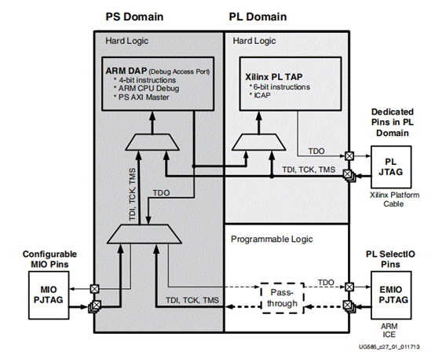

<center>图 1 Zynq的JTAG链结构示意图</center> 

## 2.1. JTAG接口

JTAG的基本时序逻辑如下：

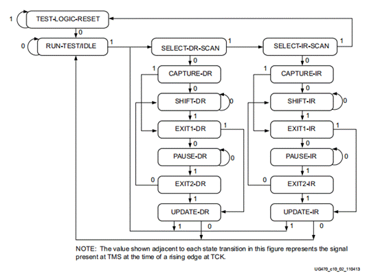

<center>图 2 JTAG 状态机</center> 

Xilinx TAP和ARM DAP均符合上述时序。

## 2.2. TAP控制器

Xilinx TAP的实现相对简单，严格按照UG470 Table-10-4的操作序列执行即可。需要注意的要点有：

1. 由于串接了DAP，需要通过IR指令将DAP置为BYPASS，此时DAP的DR变为1bit。即：总IR长度10bit，其中前6bit为TAP指令，后4比特为1111；DR长度除了加载正常的bit流外，还要额外移入1bit，作为DAP的bypass位。此操作官方文档中无解释。
2. 操作序列为JPROGRAM->CFGIN->DR写入bit数据->JSTART。中间需要按要求插入RUN/TEST时钟等待。
3. CFGIN指令下DR的写入使用了一种连续SHIFT-DR的时序，一次性加载超长bit流，只在最后执行一次EXIT1-DR和UPDATE-DR。
4. .bit文件中的数据需要进行bit翻转。对于每个字节，都将其8个bit完全翻转，即LSB变为MSB。然后数据按照little-endian方式以32位读入，即为每次写入DR的数据。这是由于Xilinx的配置数据按MSB移位但JTAG协议按LSB移位，所以需要先处理一遍。

## 2.3. DAP控制器

ARM的DAP控制器相对复杂。首先DAP是一个通用规范，所有ARM结构处理器都采用这个接口作为调试用途。但每个ARM核心架构的调试寄存器接口均不同，需要参照各自的手册。就Zynq而言，应参照ARMv7-A。

所有DAP的操作也需要考虑串联的TAP的影响。与前文操作TAP类似，在操作DAP时，IR 10bit中的前6比特应为0x3f，表示将TAP旁路；后4bit才是DAP的IR指令码。在进行Shift-DR时，需要扩展为36位，DATA[0]是TAP的BYPASS寄存器，DATA[35:1]才是DAP的DR的数据。

### 2.3.1. DAP接口

DAP接口对应ARM Debug Interface中的JTAG-DP。DAP接口包括一个DP和若干个AP。Zynq的实现提供了两个AP，其中AP0可以访问AHB系统总线，AP1通过APB接口访问Cortex-A的Debug接口。理论上AP0可以对整个地址空间进行操作，但缺少官方说明，目前所有的编程器都是采用通用方式，通过AP1接口间接访问所有资源。

DAP上实现的指令清单：

**表 1 DAP JTAG IR指令清单**

| IR指令 | 二进制值 | DR位宽 | 用途               |
| ------ | -------- | ------ | ------------------ |
| ABORT  | 1000     | 35     | 中止指令，基本不用 |
| DPACC  | 1010     | 35     | 访问DP             |
| APACC  | 1011     | 35     | 访问AP             |
| IDCODE | 1110     | 32     | 读取IDCODE         |
| BYPASS | 1111     | 1      | BYPASS模式         |

主要操作通过DPACC和APACC指令进行。DAP的主要访问数据位宽是35位，其中前3位是操作码，后32位是数据。所有读写都是以32bit为单位。

**表 2 DPACC和APACC指令的DR数据格式**

| DATA[34:3] | DATA[2:1]                    | DATA[0]                |
| ---------- | ---------------------------- | ---------------------- |
| 32位数据   | 访问地址，需要*4作为实际地址 | 0 - 读操作  1 - 写操作 |
| MSB后传输  |                              | LSB先传输              |

根据DPACC或者DPACC指令，DATA[2:1]*4表示的地址对应寄存器定义为：

**表 3 DP和AP的寄存器清单**

| DPACC     | 地址     | 寄存器     | 功能                   |
| --------- | -------- | ---------- | ---------------------- |
|           | 0x4      | CTRL/STAT  | 控制/状态              |
|           | 0x8      | SELECT     | 选择AP通道             |
|           | 0xC      | RDBUFF     | 读取前一次读操作的结果 |
| **APACC** | **地址** | **寄存器** | **功能**               |
|           | 0x0      | CSW        | 访问控制               |
|           | 0x4      | TAR        | 目标地址               |
|           | 0x8      | RSV        |                        |
|           | 0xC      | DRW        | 读写数据               |

DPACC指令对应的寄存器主要进行DAP接口的功能控制如使能和禁用等。SELECT寄存器选择访问哪个AP及AP的哪个bank。

APACC指令用于访问SELECT选定的AP，其中TAR用于设定APB总线地址，DRW则为读写的数据。CSW控制访问属性如地址自增等。

通过DPACC+APACC配合使用，可以间接访问APB上按地址映射的资源，也就是Cortex-A的Debug接口。

DP和AP的详细定义参见*《**ARM Debug Interface Architecture Specification ADIv5.0 to ADIv5.2**》。关于AP**的实现信息参见《UG585 - Zynq 7000 SoC Technical Reference Manual**》Chapter 27 JTAG and DAP Subsystem**。*

 

### 2.3.2. ARM Debug接口

大部分ARM处理器都提供了Debug接口，其中包括一定数量的寄存器可以进行调试相关的操作。具体到Zynq，其实现了Cortex-A的Debug Interface Registers。Debug接口的具体定义参见*《**ARM Architecture Reference Manual ARMv7-A and ARMv7-R edition**》 Chapter C6 Debug Register Interfaces.*

**表 4 ARM Debug接口主要寄存器清单**

| 地址偏移量 | 寄存器 | 功能                                  |
| ---------- | ------ | ------------------------------------- |
| 0x80       | DTRRX  | 用于配合指令进行Host到CPU的数据传递   |
| 0x84       | ITR    | 用于写入要执行的指令机器码            |
| 0x88       | DSCR   | 调试状态和控制寄存器                  |
| 0x8C       | DTRTX  | 用于配合指令进行CPU到Host的数据传递   |
| 0x90       | DRCR   | 调试运行控制寄存器，控制Halt和Restart |

XC7Z045包括两个Cortex-A核心，每个核心有一套独立的Debug寄存器接口，可以单独控制。Zynq的两个核心的Debug接口APB地址分配未在官方文档提及，但通过OpenOCD反向工程查到分配如下：

**表 5 Zynq Debug接口APB地址映射**

| CPU   | Debug接口基地址 | 功能           |
| ----- | --------------- | -------------- |
| CPU.0 | 0x80090000      | CPU0 Debug接口 |
| CPU.1 | 0x80092000      | CPU1 Debug接口 |

由于启动阶段仅使用CPU0运行fsbl和u-boot，所以基本上只使用位于0x80090000的CPU0 Debug接口。例如：APACC的TAR寄存器写入0x80090080是访问CPU0.DTRRX；写入0x80090090是访问CPU0.DRCR。

利用上述Debug接口寄存器可以对CPU的运行/挂起进行控制，并通过数据传递寄存器和指令寄存器执行任意CPU指令。

### 2.3.3. C14协处理器

利用ITR寄存器可以执行任意ARM指令。对于调试功能来说最常用的是CP14指令。CP14指ARM第14号协处理器，该协处理器用于Debug功能，主要是在Host和CPU之间传递数据。利用CP14指令，可以在DTRRX和CPU通用寄存器（R0~R15）之间传递数据。

CP14指令一共有5条：

**表 6 CP14指令集概要**

| 指令 | 功能                                               |
| ---- | -------------------------------------------------- |
| CDP  | 协处理器寄存器到协处理器寄存器的数据操作           |
| LDC  | 将源寄存器内容所指的存储器数据读取到目标寄存器     |
| STC  | 将源寄存器内容写入到目标寄存器内容所指的存储器地址 |
| MCR  | 将ARM处理器源寄存器内容传送到协处理器目标寄存器    |
| MRC  | 将协处理器源寄存器内容传送到ARM处理器目标寄存器    |

加载功能主要实现的是将程序区段（segment）写入到其对应的内存地址。这个目标可以利用STC指令实现。ARM为了方便调试加载操作，在DSCR寄存器设置中，提供了FAST_MODE，在该模式下起始地址首先写入R0寄存器，然后STC指令写入ITR，之后的每次DTRRX写入都会自动执行STC指令并自增地址，从而顺序写入程序数据。

完成程序写入内存后，再将程序入口地址写入R0寄存器，并执行一条通用指令“B0”，表示跳转到R0寄存器指向的地址运行。然后设置DRCR为Restart，程序将从设定的入口地址开始执行。

## 2.4. 逻辑设计

控制器顶层代码为bootloader.v，其中实现了JTAG控制器、MRAM控制器、加载控制器、串口通讯控制器等。

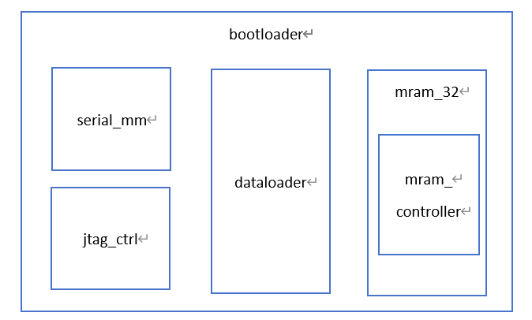

<center>图 3 bootloader控制器逻辑组成框图</center> 

jtag_ctrl.v实现通用JTAG协议。

mram_32实现了一个32位数据接口的MRAM读写控制器，用于写入和读取数据。

dataloader按特定协议播放ROM数据中的读写命令，控制jtag_ctrl执行相应功能。

serial_mm实现了一个串口通讯接口，通过串口执行内部寄存器或MRAM的读写。

## 2.5. 接口信号

顶层模块bootloader.v的接口如下：

**表 7 bootloader模块接口信号清单**

| 信号           | 位宽 | 方向  | 功能                                       |
| -------------- | ---- | ----- | ------------------------------------------ |
| rst            | 1    | In    | 高电平复位                                 |
| clk            | 1    | In    | 工作时钟                                   |
| boot_start     | 1    | In    | 高脉冲触发加载流程                         |
| boot_done      | 1    | Out   | 高有效表示加载完成                         |
| serial_rx_data | 8    | In    | 串口输入数据字节                           |
| serial_rx_vld  | 1    | In    | 串口输入数据有效标识                       |
| serial_tx_data | 8    | Out   | 串口发送数据字节                           |
| serial_tx_vld  | 1    | Out   | 串口发送使能信号                           |
| serial_tx_rdy  | 1    | In    | 串口发送就绪，1表示可以发送数据，0表示正忙 |
| mram_we        | 1    | Out   | mram写有效                                 |
| mram_oe        | 1    | Out   | mram输出使能                               |
| mram_ce        | 1    | Out   | mram片选                                   |
| mram_ube       | 1    | Out   | Mram高字节选通                             |
| mram_lbe       | 1    | Out   | mram低字节选通                             |
| mram_dq        | 16   | Inout | mram数据总线                               |
| mram_addr      | 20   | Out   | mram地址总线                               |
| tck            | 1    | Out   | JTAG TCK输出                               |
| tms            | 1    | Out   | JTAG TMS输出                               |
| tdi            | 1    | Out   | JTAG TDI输出                               |
| tdo            | 1    | In    | JTAG TDO输入                               |
| boot_mode      | 3    | Out   | Zynq的BOOTMODE配置                         |
| ps_por_b       | 1    | Out   | Zynq的复位信号                             |

 

### 2.5.1. JTAG控制器

JTAG控制器代码为jtag_ctrl.v

JTAG控制器是一个通用的JTAG协议接口模块，其主要功能除了实现了IEEE 1149.1定义的TAP主控端协议外，还拓展实现了对多TAP串联的优化支持，从而满足对Zynq中PL端TAP和ARM端DAP串联JTAG链的高速访问。

控制器包括一套内存映射的用户访问接口，在这个接口上实现了一系列寄存器用于JTAG控制。

**表 8 jtag_ctrl模块寄存器清单**

| 偏移量 | 寄存器 |               |
| ------ | ------ | ------------- |
| 0x00   | CTRL   | 功能控制      |
| 0x04   | STAT   | 状态读取      |
| 0x08   | LEN    | 字段长度配置  |
| 0x0C   | CMD    | JTAG命令配置  |
| 0x10   | DOUT0  | 字段0输出数据 |
| 0x14   | DOUT1  | 字段1输出数据 |
| 0x18   | DOUT2  | 字段2输出数据 |
| 0x1C   | DOUT3  | 字段3输出数据 |
| 0x20   | DIN0   | 字段0输入数据 |
| 0x24   | DIN1   | 字段1输入数据 |
| 0x28   | DIN2   | 字段2输入数据 |
| 0x2C   | DIN3   | 字段3输入数据 |

jtag_ctrl.v还提供了几个GPIO信号，可用于通过软件控制zynq的PS_POR_B以及BOOTMODE引脚等功能。默认PS_POR_B连接到GPIO[0]，BOOTMODE[2:0]连接到GPIO[3:1]。GPIO引脚仅在软件控制下使能，默认状态以及完成加载后可以设置为高阻，以避免和外部JTAG电路的冲突。

对jtag_ctrl.v的控制代码参见测试用例test_jtag_ctrl.sv和上位机程序jtagloader.py.

### 2.5.2. 加载控制器

加载控制器代码为dataloader.v

加载控制器支持从ROM类器件中读取数据映像并执行相关操作。ROM中的数据格式必须符合以下定义：

ROM映像文件格式，以数据包为单位，每个数据包中包括该数据包的读写类型和数据数量。每个数据包代表对内存映射地址的32位读或写访问。每个数据包的第一个32位是包头，其中包括操作类型和数据量，数据量以32位为单位。例如：TYPE==0x3, COUNT==4表示数据包包括4个32位数据，写入以ADDR起始的连续地址空间。

数据包的第二个32位是字节地址，代表读写操作的目的地址。TYPE为固定地址读写时，每次读写操作地址保持初始值不变。TYPE为自增地址读写时，每完成一次读写地址自增0x4。

**表 9 dataloader数据包格式**

| 字节偏移量       | 字段定义 |         |         |         |        | 说明                                                         |
| ---------------- | -------- | ------- | :------ | ------- | ------ | ------------------------------------------------------------ |
| 0x00             | [31:24]  | [23:22] | [21:20] | [19:18] | [17:0] | 0xFFFFFFFF表示映像结束，否则必须包含以MAGIC开头的指令；  MAGIC固定为0x1A;  TYPE:  0x0:  固定地址读  0x1:  固定地址写  0x2:  自增地址读  0x3:  自增地址写  COUNT:  操作数据量，表示32位读写的个数 |
| MAGIC            | RSV      | YPE     | RSV     | COUNT   |        |                                                              |
| 0x04             | ADDR     |         |         |         |        | 目标地址                                                     |
| 0x08             | DATA0    |         |         |         |        | Write指令：  COUNT个数据  Read指令：  空                     |
| 0x0C             | DATA1    |         |         |         |        |                                                              |
| ……               | ……       |         |         |         |        |                                                              |
| 0x08+(COUNT-1)*4 | DATAn    |         |         |         |        |                                                              |

加载控制器的start信号输入检测到高电平时，启动加载过程：从ROM中逐个读取数据包并执行数据包定义的读写操作，直到读到0xFFFFFFFF，表示数据映像结束。

利用加载控制器，可以在ROM中预存对JTAG控制器的读写操作序列，从而实现各种复杂的JTAG数据时序。

### 2.5.3. 串口控制器

串口控制器实现了一个从串行字节流到内存映射数据总线的访问接口，支持读写操作。其控制协议参见测试用例test_serial_mm.sv和上位机程序jtagloader.py里的SerialAccess类。

串口控制器不包括UART串行部分实现，需要配合一套uart_tx/uart_rx程序工作。示例工程中已包含该代码。

### 2.5.4. 上位机程序

FPGA程序功能是JTAG操作指令的播放，而JTAG指令的生成才是主要内容。基于bitstream文件和ELF文件，生成用于写入MRAM的JTAG指令序列，这部分程序在jtagloader.py中实现，并且在gui.py中提供了一个操作界面。其主要执行流程是：

1. 读取bitstream文件，生成PL加载的JTAG指令序列，包括JPROGRAM，CFGIN和JSTART指令；
2. 读取fsbl的elf文件，生成加载并运行fsbl的JTAG指令序列，包括初始化DAP，halt，写入内存，写入跳转指令，restart；
3. 读取u-boot的elf文件，生成加载并运行u-boot的JTAG指令序列。由于u-boot默认需要在DDR中运行，而DDR的初始化在fsbl中，因此必须先保证fsbl已经运行完毕，才能开始加载u-boot并执行；
4. 将以上生成的JTAG操作序列写入MRAM，dataloader将会读取并执行该指令序列。

# 3.   使用说明

## 3.1. 代码构成

### 3.1.1. FPGA代码

表 10 FPGA程序文件清单

| 文件              | 功能                             |
| ----------------- | -------------------------------- |
| Bootloader.v      | 控制器顶层                       |
| Dataloader.v      | 读取并执行JTAG操作               |
| Jtag_ctrl.v       | JTAG控制器实现                   |
| Mram_32.v         | 32位MARM访问接口                 |
| Mram_controller.v | MRAM器件访问接口                 |
| Serial_mm.v       | 串口访问地址映射寄存器的实现     |
| My_uart_rx.v      | 串口接收程序                     |
| My_uart_tx.v      | 串口发送程序                     |
| A3p250_top.v      | 用于A3P250开发板的FPGA顶层代码   |
| Zx005a_top.v      | 用于一体化组件的A3P400的顶层代码 |
| test_xxx.v        | 相关功能的单元测试               |

源代码包提供了两个fpga工程

l A3p240_top - 用于A3P250开发板

l Zx005_top - 用于一体化组件上的A3P400

### 3.1.2. Python代码

表 11 上位机Python程序文件清单

| 文件          | 功能                         |
| ------------- | ---------------------------- |
| Jtagloader.py | JTAG控制器的上位机逻辑实现   |
| Gui.py        | 一个简单的操作界面           |
| Test_xxx.py   | 相关功能的单元测试和示例代码 |

Python源代码的运行和编译需要以下Python依赖：

l Python3.8以上

l Pyelftools

l Pyserial

l Gooey

l pyinstaller

## 3.2. 上位机软件

预编译的上位机控制界面是gui.exe，其运行界面如下：

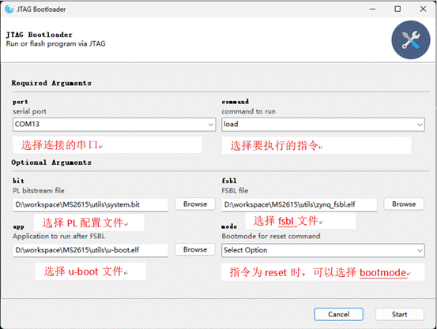

Command命令可选项有：

表 12 上位机界面命令功能

| 命令  | 功能                                                         |
| ----- | ------------------------------------------------------------ |
| Load  | 直接通过串口加载运行                                         |
| Flash | 加载序列写入MRAM                                             |
| Reset | 执行复位操作，可选mode有：  QSPI - 从QSPI启动  JTAG - JTAG模式启动 |
| Boot  | 从MRAM里加载运行                                             |

点击start即可开始运行选定的命令，窗口会显示运行进度和运行结果。

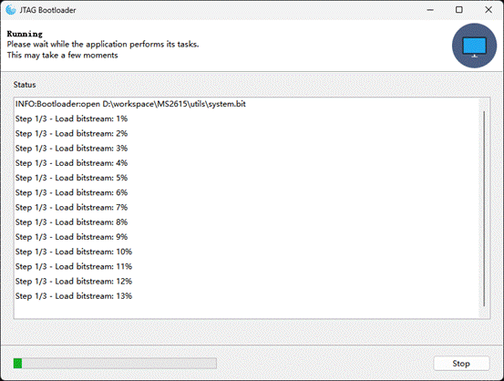

图 4 上位机界面运行过程显示

 

 

 

 

 

 

 

 

## 33 串口操作说明

读mram指令：06 00 00 00 00 FF 读取0地址

写mram指令：1a 00 00 00 00 00 00 00 01 FF 向0地址写入数据1

 

从mram加载指令：1A 80 00 01 00 00 00 00 01 FF

 

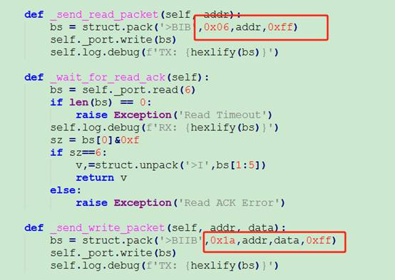

 

 

 

 

 

 


引脚约束

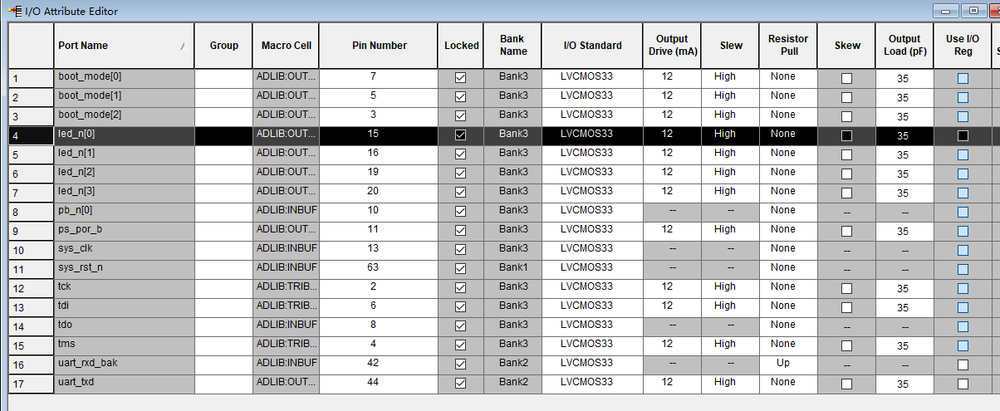


如果FLASH发送过来的数据，出现问题，且和sck不同步，此时应该考虑连接线稳定性，大概率是延迟太大

解决办法：降低SPI速率，更换连接线，增加稳定性，加延时

# 参考资料

在libero使用在线逻辑分析：https://www.freesion.com/article/5826961757/

读写flash：https://doc.embedfire.com/fpga/altera/ep4ce10_pro/zh/latest/code/spi_flash.html


