# 硬件环境

实现板卡：A3P250

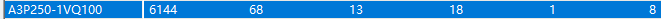

外FLASH：ｗ25Q128 （spi协议）


# 大体步骤

1、如何下载文件到flash，擦除flash  √

2、读取flash是否需要缓存  

3、读出来的数据传到jtag端口


# SPI协议总结

根据从机设备的个数，SPI通讯设备之间的连接方式可分为一主一从和一主多从，全双工通信协议


## **四个信号线：**

SCK (Serial Clock)：时钟信号线，用于同步通讯数据。

MOSI (Master Output， Slave Input)：主设备输出/从设备输入引脚。

MISO (Master Input，Slave Output)：主设备输入/从设备输出引脚。

(Chip Select)：片选信号线，也称为CS_N，以下用CS_N表示。当有多个SPI从设备与SPI主机相连时，设备的其它信号线SCK、MOSI及MISO同时并联到相同的SPI总线上，即无论有多少个从设备，都共同使用这3条总线；而每个从设备都有独立的这一条CS_N信号线，本信号线独占主机 的一个引脚，即有多少个从设备，就有多少条片选信号线。当主机要选择从设备时，把该从设备的CS_N信号线设置为低电平，所以**SPI通讯以CS_N线置低电平为开始信号，以CS_N线被拉高作为结束信号**。


## **四种模式**

SPI通讯协议一共有四种通讯模式，模式0、模式1、模式2以及模式3，这4种模式分别由**时钟极性**(CPOL，Clock Polarity)和**时钟相位**(CPHA，Clock Phase)来定义

CPOL参数规定了空闲状态(CS_N为高电平，设备未被选中)时SCK时钟信号的电平状态

CPHA规定了数据采样是在SCK时钟的奇数边沿还是偶数边沿。


模式0：CPOL= 0，CPHA=0。空闲状态时SCK串行时钟为低电平；数据采样在SCK时钟的奇数边沿，本模式中，奇数边沿为上升沿；数据更新在SCK时钟的偶数边沿，本模式中，偶数边沿为下降沿。

模式1：CPOL= 0，CPHA=1。空闲状态时SCK串行时钟为低电平；数据采样在SCK时钟的偶数边沿，本模式中，偶数边沿为下降沿；数据更新在SCK时钟的奇数边沿，本模式中，偶数边沿为上升沿。

模式2：CPOL= 1，CPHA=0。空闲状态时SCK串行时钟为高电平；数据采样在SCK时钟的奇数边沿，本模式中，奇数边沿为下降沿；数据更新在SCK时钟的偶数边沿，本模式中，偶数边沿为上升沿。

模式3：CPOL= 1，CPHA=1。空闲状态时SCK串行时钟为高电平；数据采样在SCK时钟的偶数边沿，本模式中，偶数边沿为上升沿；数据更新在SCK时钟的奇数边沿，本模式中，偶数边沿为下降沿。

**注意采集数据和更新数据不是同一个时钟沿**


## 采用模式0设计

SPI通讯协议的4中通讯模式，其中模式0和模式3比较常用，下面我们以模式0为例


# W25Q128介绍

总容量：128Mbit 16MB

**W25Q128存储芯片是由65536可编程的页组成的，每页有256个字节。一次最多可以写256个字节。可以一次擦除16页（4K字节）、128页（32K字节）、256页(64K字节)或者一整片。W25Q128有4096个可擦除的扇区，256个可擦除的块。4K字节的扇区对于数据和参数存储有更高的灵活性。**

每个芯片有256块：每块64KB

每个块有16个扇区：每扇区4KB

每一个扇区有16页：每页256B （一页内存地址为 ：0X000000-0X0000FFh,共256个字节（16x16=256））


## FLASH页、扇区、块介绍

以W25Q128为例子：

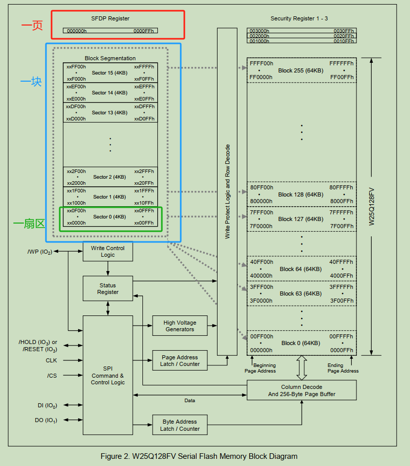

### 页

页就是flash中一种区域划分的单元，就像一本书中的一页一样，图中红色框选部分就为1页。

一页内存地址为 ：0X000000-0X0000FFh,共256个字节（16x16=256）。

### 扇区

扇区和页类似，也是一种存储结构单元，只是扇区更常见，大部分Flash主要还是以扇区为最小的单元。图中粉红色部分为一个扇区的大小。我们从sector 0 ，也就是扇区0 开始分析（粉红色框下下面的扇区）。我们看到：

　　一个扇区是从 0x000000-----0x0000FF
　　　　　　　 　0x000100-----0x0001FF
　　　　　　　 　0x000200-----0x0002FF
　　　　　　　 　0x000300-----0x0003FF

　　　　　　　　　　　　**......**
　　　　　　　 　0x000f00----0x000FFF 为止 ===========16*256=4096字节=4K

一个扇区有16个页，又因为每一个页有256字节，所以一个扇区有4k字节。

### 块

块是比扇区更高一个等级，一般1块包含多个扇区也就是图中蓝色标识的区域。我们看到：　

一块的是从  0x000000-0x000FFF

 　　　　　0x001000-0x001FFF

 　　　    0x002000-0x002FFF

　　　　　　 0x003000-0x003FFF

​                  .......

 　　　　　0x00F000-0x00FFFF为止= ====================4K*16=64K

 

可以看出，一个块有16个扇区组成。
而一个芯片内部存储区域是绿色部分所画的，有256个块，所以W25Q128总共的存储空间为256个块。即一个FLASH为256个块，一个块为16个扇区，一个扇区为4K字节。所以：*256\*16\*4K=16384K=16M/8=128Mbit。*


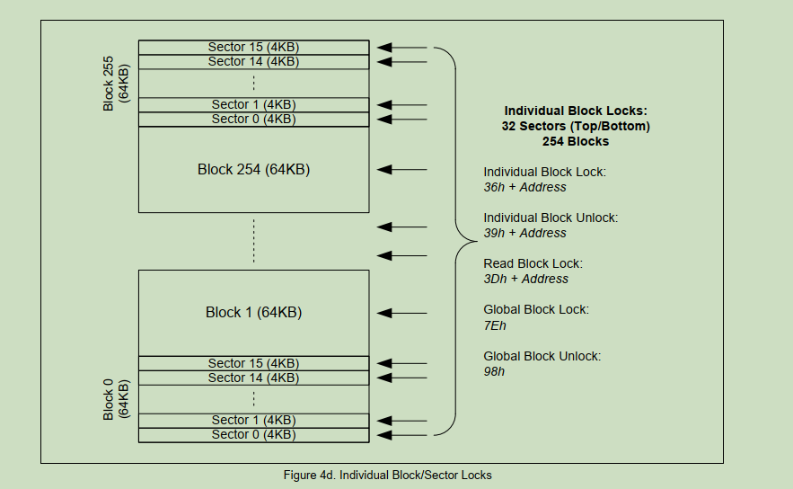

- 最高性能的串行Flash
  -104MHz的SPI时钟信号
  -在双线或者四线SPI模式下等效于208M/416M
  -传输速度可达约50MB/S
  -超过100000次擦除/编程循环
  -超过20年的数据保存能力

# SPI-FLASH擦除设计

## 全擦除操作

全擦除指令是将Flash芯片中的所有存储单元设置为全1，在Flash芯片写入全擦出指令之前，需要先写入写使能(WREN)指令，将芯片设置为写使能锁存(WEL)状态；随后要拉低片选信号，写入全擦除指令，在指令写入过程中，片选信号始终保持低电平，待指令被芯片锁存后，将片选 信号拉高；全擦除指令被锁存并执行后，需要等待一个完整的全擦除周期(tBE)，才能完成Flash芯片的全擦除操作

全擦除操作指令：8’b1100_0111(C7h)

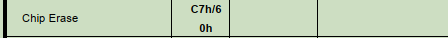

## 写使能指令

在每一次页写操作(PP)、扇区擦除(SE)、全擦除(BE)和写状态寄存器(WRSR)操作之前，都需要先进行写使能指令写入操作

写使能(Write Enable)指令，简称WREN，操作指令为8’b0000_0110(06h)


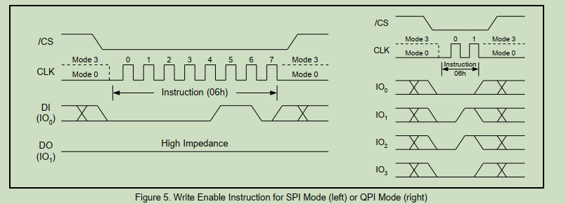

##  串行输入时序

写使能指令、全擦除指令以及其它操作指令在写入Flash芯片时要严格遵循芯片的串行输入时序，相关操作指令在写入芯片之前需要先拉低片选信号，在片选信号保持低电平时将指令写入数据输入端口，指令写入完毕，拉高片选信号，数据输出端口在指令写入过程中始终保持高阻态。

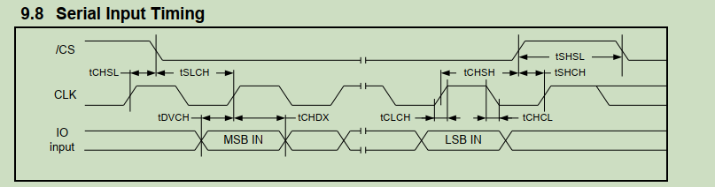

其中有三个我们需要格外注意，分别是tSLCH、tCHSH和tSHSL。时间参数参考数值

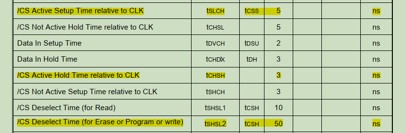

片选信号自下降沿始到第一个有效数据写入时止，这一段等待时间定义为片选信号有效建立时间 tSLCH，这一时间段必须大于等于5ns；片选信号自最后一个有效数据写入时始到片选信号上升沿止，这一段等待时间定义为片选信号有效保持时间tCHSH，这一时间段必须大于等于3ns；片选信号自上一个上升沿始到下一个下降沿止，这一段等待时间定义为片选信号高电平等待时间tSHSL，这一时间段必须大于等于50ns。

到这里我们已经讲解了写使能指令、全擦除指令的相关内容和操作时序，对Flash芯片的串行输入时序也做了说明。综上所述，绘制完整全擦除操作时序图如图

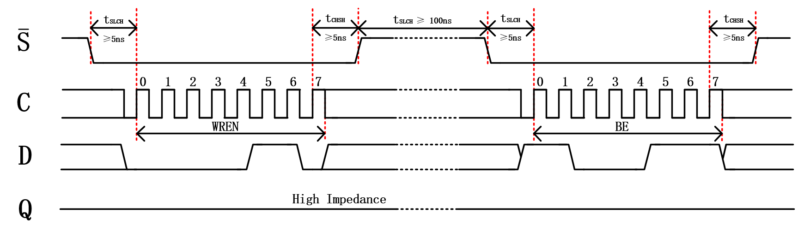

## 程序设计

整个全擦除工程调用3个模块，按键消抖模块(key_filter)， Flash全擦除模块(flash_be_ctrl)和顶层模块(spi_flash_be)

为了设计方便，时间延时都按照640ns处理，系统时钟为50M，也就是5个时钟周期

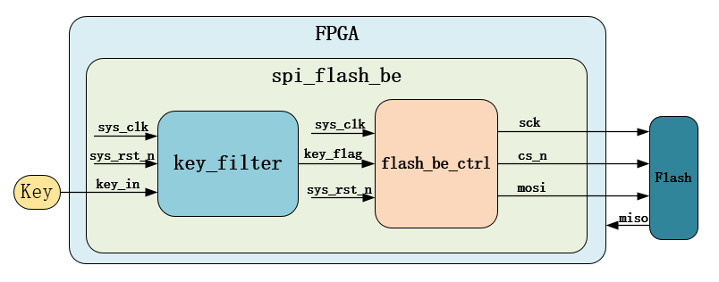

仿真时序

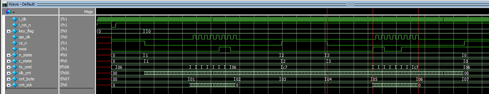


# SPI-Flash页写设计

## 页写操作

页写(Page Program)操作，简称PP，操作指令为8’b0000_0010(02h)


在写入页写指令之前，需要先写入**写使能(WREN)指令**，将芯片设置为写使能锁存(WEL)状态；随后要拉低片选信号，写入**页写指令、扇区地址、页地址、字节地址**，紧跟地址写入要存储在Flash的字节数据， 在指令、地址以及数据写入过程中，片选信号始终保持低电平，待指令、地址、数据被芯片锁存后，将片选信号拉高；片选信号拉高后，等待一个完整的页写周期(tPP)，才能完成Flash芯片的页写操作。

## 页写时序图

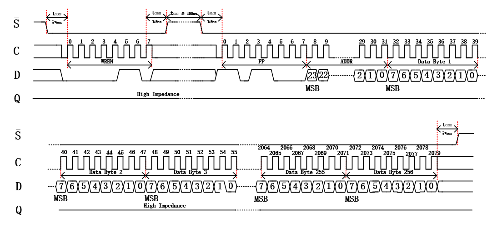


# SPI_Flash连续写实验


通过页写指令实现数据的连续写操作，方法有二

其一，每次页写入只写入单字节数据，若想连续写入N字节数据，需要连续执行N次页写操作；

其二，先通过页写指令一次性写满第一页数据，计算剩余数据所占整数页，通过页写指令写满整数页，每次页写指令一次写满一页，剩余不足一页的数据，再通过一次页写指令一次性写入。

## 第一种方法


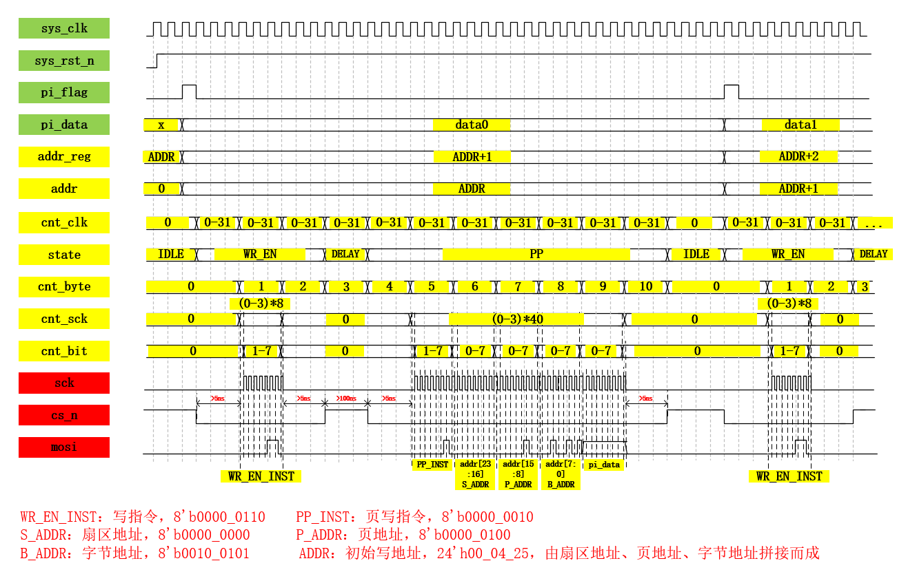


# SPI_Flash读数据

## 读数据操作

SPI-Flash芯片数据读操作的相关内容。数据读操作，操作指令为8’b0000_0011(03h)

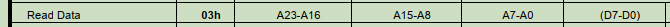

要执行数据读指令，首先拉低片选信号选中Flash芯片，随后写入数据读(READ)指令，紧跟指令写入3字节的数据读取首地址，指令和地址会在串行时钟上升沿被芯片锁存。随后存储地址对应存储单元中的数据在串行时钟下降沿通过串行数据总线输出

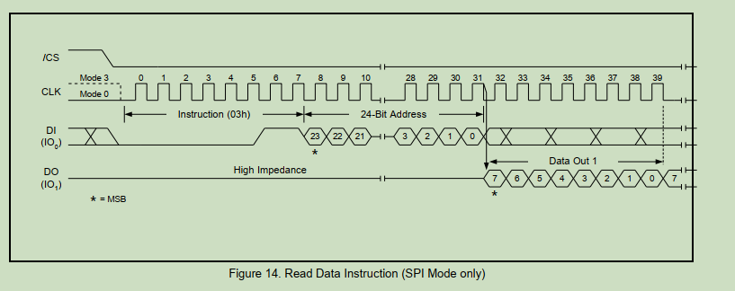


数据读操作指令写入之前无需先写入写使能指令，且执行数据读操作过程中，片选信号拉低后和拉高前**无需做规定时间等待**，上图中的时序图就是完整的数据读操作时序。

因用杜邦线连接，稳定性太差，所以把sck时钟改小为2.5M，sys_clk为10M

注意：在libero中 FIFO的读写使能默认是地有效，需要修改

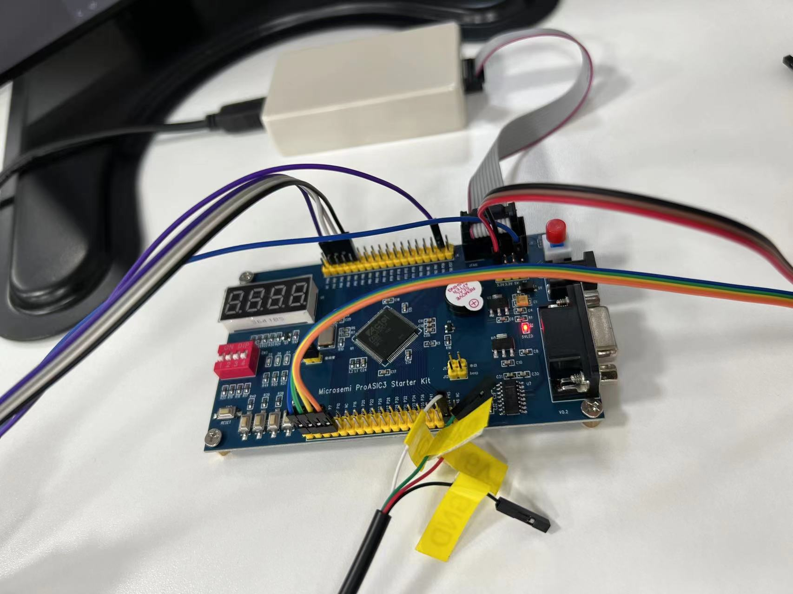


# JTAG启动petalinux

`petalinux-boot` 是一个用于在硬件上加载和引导 PetaLinux 镜像的工具，支持 JTAG 和 QEMU 两种模式。常见的使用场景包括通过 JTAG 下载比特流到 FPGA，并加载 FSBL、PMUFW、U-Boot 或 Linux 内核等。

## **基本用法**

- **--jtag | --qemu**: 必选参数，用于指定引导模式。`--jtag` 通过 JTAG 引导，`--qemu` 通过 QEMU 仿真引导。
  - `1`: 下载 FPGA 比特流和 FSBL (Zynq)，FSBL 和 PMUFW (ZynqMP)。
  - `2`: 仅引导 U-Boot。
  - `3`: 仅引导 Linux 内核。

**可选参数**

- **--boot-addr <BOOT_ADDR>**: 指定引导地址。
- **--image <IMAGE>**: 指定要引导的镜像文件。
- **--pmufw [<PMUFW_ELF>]**: 指定 PMUFW 的路径，仅适用于 ZynqMP。也可以通过 `--pmufw no` 跳过加载 PMUFW。
- **--u-boot**: 引导 U-Boot 镜像。如果指定了 `--kernel`，则 `--u-boot` 无效。
- **--kernel**: 引导 Linux 内核镜像（zImage、Image 或 image.elf）。
- **--fpga**: 下载并配置 FPGA 比特流。
- **--bitstream <BITSTREAM>**: 使用指定的比特流文件配置 FPGA。
- **--tcl <TCL_OUTPUT>**: 生成用于 XSDB 的 Tcl 脚本文件。
- **--verbose**: 输出调试信息。
- **--hw_server-url <URL>**: 指定硬件服务器的 URL，默认连接到本地服务器 (`localhost:3121`)。

**使用示例**

1. **下载比特流和 FSBL**:

   ```shell
   petalinux-boot --jtag --prebuilt 1
   ```

2. **引导 U-Boot**:

   ```shell
   petalinux-boot --jtag --prebuilt 2
   ```

3. **引导 Linux 内核**:

   ```shell
   petalinux-boot --jtag --prebuilt 3
   ```

4. **生成用于 XSDB 的 Tcl 脚本**:

   ```shell
   petalinux-boot --jtag --kernel --fpga --tcl mytcl
   ```


## 下载指定文件

如果您的设计包含 FPGA 配置，需要首先下载比特流到 FPGA。

**命令：**

```shell
petalinux-boot --jtag --fpga
```

**说明：**

- 该命令将在 FPGA 上配置位于 `<project-root>/images/linux/` 目录下的默认比特流文件（通常为 `*.bit` 文件）。

**指定自定义比特流：**

```shell
petalinux-boot --jtag --bitstream path/to/your.bit
```

**说明：**

- 使用 `--bitstream` 选项可以指定自定义的比特流文件路径。

**步骤 2：加载 FSBL**

FSBL 是系统引导的第一阶段，引导过程需要将 FSBL 加载到目标设备。

**命令：**

```shell
petalinux-boot --jtag --u-boot
```

**说明：**

- 该命令将加载 FSBL 和 U-Boot，FSBL 会初始化硬件并加载 U-Boot。

**如果只想加载 FSBL：**

```shell
petalinux-boot --jtag --u-boot --fsbl path/to/your_fsbl.elf
```

**说明：**

- 使用 `--fsbl` 选项可以指定自定义的 FSBL 文件。

**步骤 3：加载 U-Boot 引导加载程序**

U-Boot 是一个灵活的引导加载程序，负责加载并启动内核。

**命令：**

```shell
petalinux-boot --jtag --u-boot
```

**说明：**

- 该命令将在加载 FSBL 后继续加载 U-Boot。

**步骤 4：启动内核并挂载根文件系统**

**方法一：使用预构建的镜像**

如果您已经有预构建的完整镜像，可以使用以下命令：

```shell
petalinux-boot --jtag --prebuilt 3
```

**说明：**

- `--prebuilt 3` 表示加载预构建的内核和根文件系统。
- 预构建的镜像通常位于 `<project-root>/pre-built/linux/images/` 目录。


## 裸机启动helloword


# JTAG介绍

JTAG(Joint Test Action Group;联合测试行动小组)是一种国际标准测试协议（IEEE 1149.1兼容），主要用于芯片内部测试。现在多数的高级器件都支持JTAG协议，如DSP、FPGA器件等。标准的JTAG接口是4线：TMS、TCK、TDI、TDO，分别为模式选择、时钟、数据输入和数据输出线。

JTAG接口包括以下几个信号：
TMS（Test Mode Select）：用于设置测试模式和测试状态机的状态。通过 TMS 信号，可以控制 TAP 在不同的状态间相互转换。TMS 信号在 TCK 的上升沿有效。TMS 具有内部电阻式上拉，可在引脚未驱动时提供逻辑高。
TCK（Test Clock）：用于提供时钟信号，控制测试状态机的运行。
TDO（Test Data Out）：用于从测试状态机中输出数据。在 TCK 的下降沿有效。TDO具有内部电阻拉拔，如果引脚不活动，则提供逻辑高。
TDI（Test Data Input）：用于向测试状态机输入数据。在 TCK 的上升沿有效。TDI 具有内部电阻拉拔，可在引脚未驱动时为系统提供高逻辑。
TRST(Test Reset Input)： RST可以用来对TAP Controller进行复位(初始化)。不过这个信号接口在IEEE 1149.1标准里是可选的，并不是强制要求的。 因为通过 TMS 也可以对 TAP Controller 进行复位（初始化）

## TAP控制器状态机

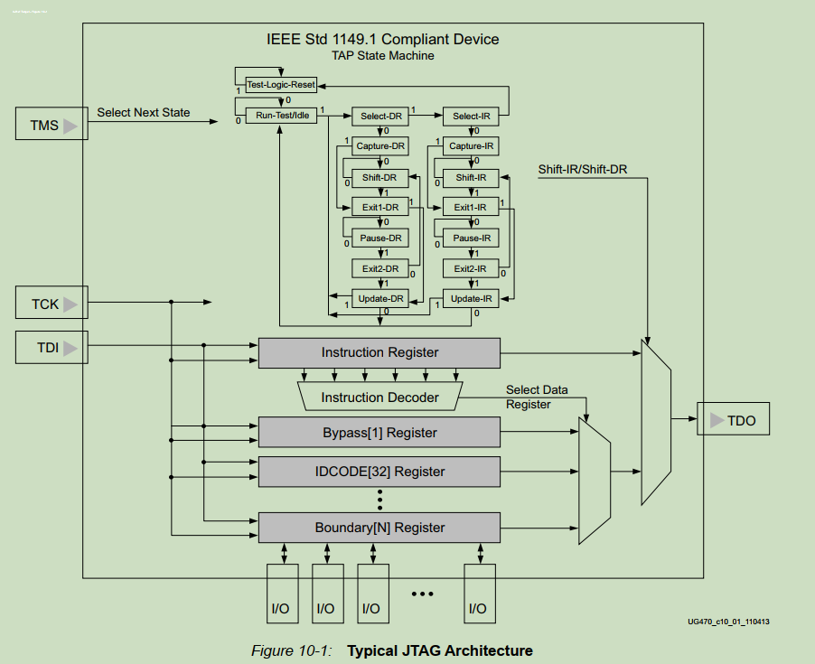

图上的 0和1 代表输入tms的值

当TAP处在Shift-IR模式下，就可以通过TDI每次写入一bit到IR寄存器，然后IR寄存器会自动移动一位。通过这样的方式总是可以向IR寄存器写入任何想要的值。同样地，当TAP处于Shift-DR模式下，可以向D(E)R寄存器写入任何想要的值。

指令寄存器
IR寄存器中的值被当成调试指令，芯片内部根据这些指令完成响应的动作。随便举例，当IR=0b1001时，将芯片内部的xxx寄存器的值输出；当IR=0b1011时，将芯片hang住。

协议特殊规定，对于IR寄存器，如果其每个bit都是1，则表示BYPASS指令，此时TDI经过一个cycle到TDO。注意每个芯片内部的IR寄存器的位数不一定相同。

数据寄存器
DR寄存器可以理解成为IR操作的数据。需要注意的是DR寄存器有很多，每个IR指令可以对应不同的DR。一个特殊的DR动作是，当TAP进入Test-Logic-Reset状态时，DR寄存器自动装入这个器件对应的ID，规定这是一个32位的值。这一状态的控制权比IR寄存器大。


如果FLASH发送过来的数据，出现问题，且和sck不同步，此时应该考虑连接线稳定性，大概率是延迟太大

解决办法：降低SPI速率，更换连接线，增加稳定性，加延时

# 参考资料

在libero使用在线逻辑分析：https://www.freesion.com/article/5826961757/

读写flash：https://doc.embedfire.com/fpga/altera/ep4ce10_pro/zh/latest/code/spi_flash.html


