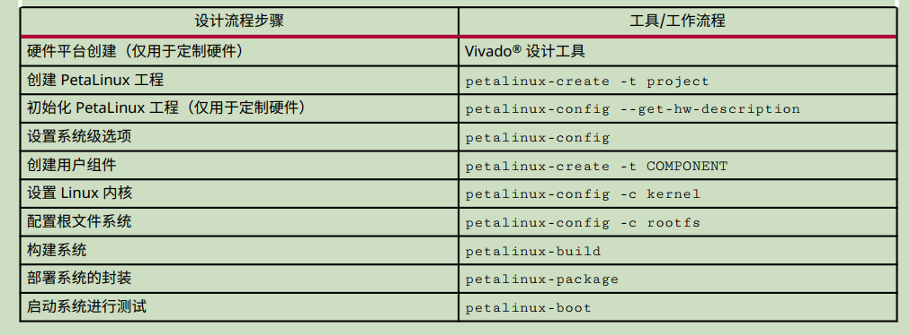

通过Windows cmd窗口控制linux

    连接：在cmd中输入 ssh [hwusr@192.168.3.175](mailto:hwusr@192.168.3.175)

    切换为root：su root 退出：exit


安装自动补全：

sudo apt install fish

# petalinux安装：

## 1、安装依赖项

```shell
sudo apt install build-essential vim tofrodos

sudo apt install iproute2 gawk gcc git make net-tools zlib1g-dev

sudo apt install libssl-dev flex bison libselinux1 libncurses5-dev

sudo apt install tftpd lib32z1 lib32ncurses5 libbz2-1.0:i386

sudo apt install lib32stdc++6 xvfb chrpath socat autoconf libtool

sudo apt install texinfo gcc-multilib libsdl1.2-dev libglib2.0-dev zlib1g:i386

sudo apt-get install -y gcc git make net-tools libncurses5-dev tftpd zlib1g-dev libssl-dev flex bison libselinux1 gnupg wget diffstat chrpath socat xterm autoconf libtool tar unzip texinfo zlib1g-dev gcc-multilib build-essential zlib1g:i386 screen pax gzip

sudo apt-get install tofrodos iproute2 gawk make net-tools libncurses5-dev tftpd zlib1g libssl-dev flex bison libselinux1 gnupg wget diffstat chrpath socat xterm autoconf libtool tar unzip texinfo zlib1g-dev gcc-multilib build-essential screen pax gzip python 2.7.5 zlib1g:i386
```


## 2、修改.run文件的属性

chmod a+x ppetalinux-v2019.2-final-installer.run

## 3、安装petalinux安装到当前文件夹下的v2019.2里面

./petalinux-v2019.2-final-installer.run ./petalinux

> 安装过程会弹出协议，按“q” 跳
>
> 过详情，然后输入“y” 表示同意协议内容

## 4、修改到bash

        查看：ls -lh /bin/sh （初始为dash）

        修改：sudo dpkg-reconfigure dash 然后跳出对话框，点击No即可

## 5、运行环境变量

        一次生效：在刚刚安装目录下面 source settings.sh

        永久生效：在home目录下打开.bashrc文件（如果没有Ctrl+H），在最后一行添加 source /home/ （你的目录） /settings.sh

## 6、petalinux设计流程




# vivado安装和vivado卸载

## 安装

直接运行./xsetup

## 卸载

进入下面目录：

/2019.2/.xinstall/Vivado_2019.2

然后卸载

sudo ./xsetup -b Uninstall


