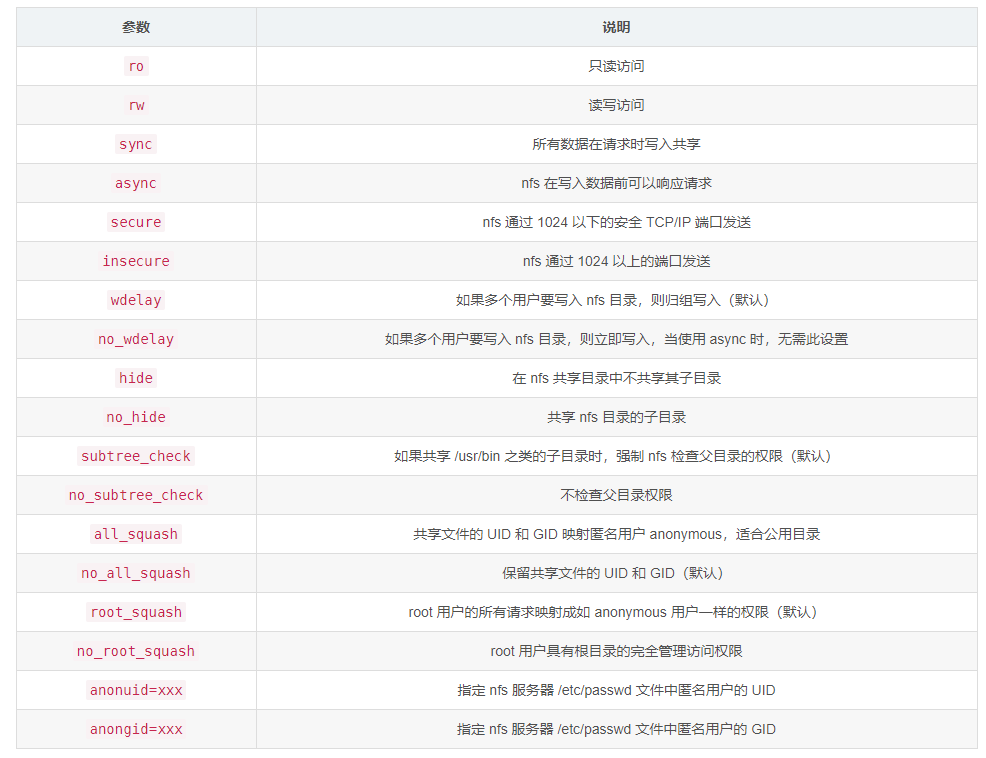
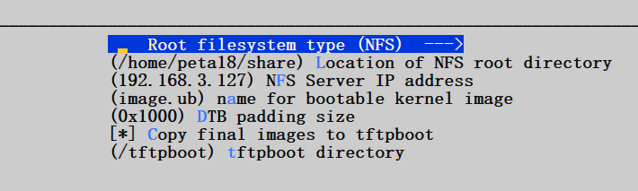
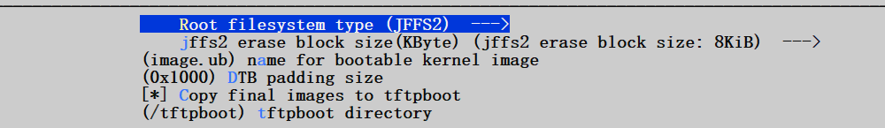
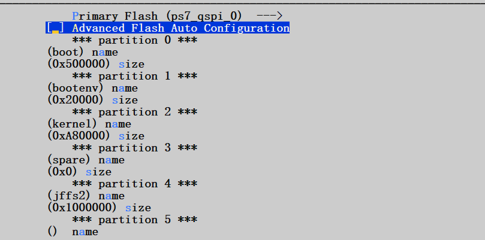

# BSP封装：

​	BSP 对于团队和客户之间的分发非常有用。自定义的 PetaLinux 工程可以通过 BSP 交付给下一个级别的团队或外部客户。

​		1、进入petalinux工程目录外部运行petalinux-package命令

​		2、\$ petalinux-package --bsp -p \<plnx-proj-root\> --output MY_BPS， \<plnx-proj-root\> ：为petalinux工程目录位置   MY_BPS ：为生成的BSP文件名

​		这将生成 MY.BSP， 包括来自指定工程的下列要素：  
​			• \<plnx-proj-root\>/project-spec/  
​			• \<plnx-proj-root\>/config.project  
​			• \<plnx-proj-root\>/.petalinux/

​			• \<plnx-proj-root\>/pre-built/  
​			• \<plnx-proj-root\>/.gitignore  
​			• \<plnx-proj-root\>/components

​		例子：\$ petalinux-package --bsp -p ./my-zed/ --output my-bsp


​		3、拓展（bsp包含硬件工程）

​			\$ petalinux-package --bsp -p \<plnx-proj-root\> --hwsource \<hw-projectroot\> --output MY.BSP

​				<plnx-proj-root\> ：petalinux工程目录

​				\<hw-projectroot\> ：硬件工程目录（需要写到.hdf文件）

​			例子：\$ petalinux-package --bsp -p ./my-zed/ --hwsource ./design_1_wrapper.hdf --output HW_BPS


# 通过NFS启动rootfs：

## 	1、在ubuntu安装nfs

​		**安装**

​			$ sudo apt-get install nfs-kernel-server  
​			\$ sudo apt-get install nfs-common

​		**配置**

​			\$ sudo vim /etc/exports

​			文件末尾加：/home/peta18/share \*(rw,sync,no_root_squash,no_subtree_check)

​				/home/peta18/share ： NFS文件系统目录（记得给目录加666权限）

​				\* ：表示任意客户端都可以连接

​				（192.168.3.1/24表示连接指定的ip和端口，192.168.3.\*表示192.168.3下的任意设备）



​	**更新配置**

​		\$ sudo exportfs -r

​	**导出配置目录**

​		\$ sudo showmount localhost -e

​	**导出成功信息：**

​		Export list for localhost:

​		/home/peta18/share \*

​	**重启nfs：**

​		\$ sudo /etc/init.d/nfs-kernel-server restart

​	**重启成功：**

​		[ ok ] Restarting nfs-kernel-server (via systemctl): nfs-kernel-server.service.


## 	2、在petalinux设置为NFS启动

​		\$ petalinux-config

​			选择“Image Packaging Configuration → Root File System Type” 。  
​			选择 “NFS” 作为 RootFS 类型。

​			选择“Location of NFS root directory”并将其设置到 /home/peta18/share

​		\$ petalinux-config -c kernel

​			选择“Networking support → IP: kernel level configuration” 。

​			• “IP:DHCP support”  
​			• “IP:BOOTP support”  
​			• “IP:RARP support”

## 	3、构建系统镜像

​		\$ petalinux build

## 	4、NFS启动

​		把生成的BOOT.bin、image.ub拷贝到SD卡

​		然后把rootfs.tar.gz解压到/home/peta18/share

​		\$ sudo tar -xf rootfs.tar.gz -C /home/peta18/share


# tftp启动image.ub

## 1、安装tftp服务器

​	**安装服务器**

​		\$ sudo apt-get install tftpd-hpa

​	**配置**

​		\$ sudo vim /etc/default/tftpd-hpa

​		TFTP_USERNAME="tftp"  
​		TFTP_DIRECTORY="/tftpboot"

​		TFTP_ADDRESS="0.0.0.0:69"  
​		TFTP_OPTIONS="-l -c -s"

​	**在根目录创建一个tftpboot目录，并赋予权限**

​		\$ sudo mkdir /tftpboot

​		\$ sudo chmod 777 /tftpboot

​	**重启网络服务**

​		\$ sudo service tftpd-hpa restart

## 2、安装客户端

​	**安装客户端**

​		\$ sudo apt-get install xinetd

​		\$ sudo apt-get install tftp-hpa

​	**配置**

​		\$ vim /etc/xinetd.d/tftp

```
    service tftp

    {

    socket_type = dgram

    protocol = udp

    wait = yes

    user = peta18

    server = /usr/sbin/in.tftpd

    server_args = -s /tftpboot

    disable = no

    per_source = 11

    cps = 100 2

    flags = IPv4

    }
```

​	**重启tftp服务**

​		\$ vsudo service xinetd restart


## 3、配置petalinux

​	\$ petalinux-config 进入Image Packaging Configuration



## 4、构建系统镜像

​	1、把image.ub放到/tftpboot目录下

​	2、把rootfs.tar.gz解压到/home/peta18/share

​	这样就实现了从NFS启动rootfs，从TFTP启动image.ub，SD卡只需要存放BOOT.bin文件即可，然后输入命令run netboot即可加载tftp下的image.ub和nfs下的rootfs


# 通过QEMU仿真petalinux镜像：

​	**1、生成镜像**

​		通过BSP生成petalinux镜像文件

​	**2、生成BOOT.bin**

​		petalinux packge –boot

​	**3、启动镜像**

​		启动内核kernel（相当于启动zImage文件）

​			\$ petalinux-boot --qemu –kernel

​		启动指定的zImage文件

​			\$ petalinux-boot --qemu --image ./images/linux/zImage

​	**4、退出QEMU**

​		若要退出 QEMU， 同时按下 “Ctrl+A” ， 然后按下 “X” 。


# 通过FLASH/JFFS2启动linux

​	**1、生成镜像**

​		通过BSP生成petalinux镜像文件，并把image文件夹下的文件全部拷贝到tftp文件夹

​	**2、设置rootfs 启动方式为jffs2**

​		同时在本地建立好tftp



​	**3、对FLASH内存进行分配**

​	这里解释一下：

​	name：表示这个区间的名字

​	size：表示这个区间的大小，并不是起始地址

​	例如：

​		bootenv：起始地址为0x500000，大小为0x20000

​		kernel：起始地址为0x520000，大小为0xA80000

​	启动linux的放置顺序为：BOOT.BIN、image.ub、rootfs（在此为rootfs.jffs2）



​	**4、把BOOT.BIN放到SD卡，或者用jtag启动u-boot**

​	**5、把启动linux的文件烧写到flash**（前提有网口）

​		（1）进入u-boot环境，设置好ipaddr（开发板ip），server（tftp/mac ip）

```shell
        setenv ipaddr 192.168.0.232 \# U-Boor IP 地址

        setenv ethaddr 00:aa:bb:cc:dd:ef \# MAC 地址

        setenv gatewayip 192.168.0.1 \# 网关地址

        setenv netmask 255.255.255.0 \# 子网掩码

        setenv serverip 192.168.0.120 \# 服务器 IP 地址

        saveenv \# 保存环境变量
```

​		（2）通过tftp下载文件，并烧写到flash

​			检测flash：

​				zynq\> sf probe 0 0 0

​			擦除整片flash：

​				zynq\> sf erase 0 \<size of flash\> ：根据flash大小确定\<size of flash\>

​				实例：flash大小为32M，zynq\> sf erase 0 0x2000000

​			读取BOOT.BIN

​				zynq\> tftpboot 0x80000 BOOT.BIN

​			写入BOOT.BIN

​				zynq\> sf write 0x80000 0 \<size of BOOT.BIN\> 注：写入的起始地址为0

​			读取image.ub

​				zynq\> tftpboot 0x80000 image.ub

​			写入image.ub

​				zynq\> sf write 0x80000 \<base address of kernel\> \<size of image.ub\>

​				注：根据第3步确定base address of kernel

​			读取rootfs.jffs2

​				zynq\> tftpboot 0x80000 rootfs.jffs2

​		写入rootfs.jffs2

​				zynq\> sf write 0x80000 \<base address of rootfs\> \<size of rootfs.jffs2\>

​				注：根据第3步确定base address of rootfs

​	**6、然后把开发板设置为QSPI启动模式**

​		启动开发板，按一下复位按键，即可启动linux


# 通过QSPI FLASH启动

​	**petalinux2021.2版本**

## 1、分配FLASH内存


这里面的size，只是表示分区的存储大小，而不是起始地址

## 2、修改kernel在FLASH的位置

petalinux-config→ u-boot Configuration→ u-boot script configuration→ QSPI/OSPI image offsets


0x1940000：0x1900000 + 0x40000  （根据第一步分区，进行计算），表示kernel的起始地址

## 3、配置boot.scr的地址

petalinux-config -c u-boot → ARM architecture → Boot script offset


0x3240000：0x1900000 + 0x4000 + 0x1900000  ，表示boot.scr文件在FLASH中的位置

## 4、打包生成BOOT.bin

根据上述设置好的地址，打包成BOOT.bin （包含bit文件）


```
petalinux-package --boot --force --format BIN --fsbl --fpga --pmufw --u-boot --kernel images/linux/Image --offset 0x1940000 --cpu a53-0 --boot-script --offset 0x3240000
```

```
--boot：指定要创建的镜像类型为引导镜像。
--force：强制执行操作，即覆盖现有的输出文件。
--format BIN：指定输出镜像的格式为二进制格式。
--fsbl：将 FSBL（First Stage Boot Loader）添加到镜像中。
--fpga：将 FPGA 位流文件添加到镜像中。
--pmufw：将 PMU 固件添加到镜像中。
--u-boot：将 U-Boot 添加到镜像中。
--kernel images/linux/Image：指定 Linux 内核映像文件的路径。
--offset 0x1940000：指定将内核映像文件添加到镜像时的偏移地址。
--cpu a53-0：指定目标处理器核心。
--boot-script：将引导脚本（boot script）添加到镜像中。
--offset 0x3240000：指定将引导脚本添加到镜像时的偏移地址。
```


## 5、下板操作

（1）首先用ramdisk版本，进入linux，把rootfs文件解压到emmc的ext4分区，（创建分区，参考petalinux_learning）

```
 tar xvf rootfs.tar.gz -C /media/rootfs
```


（2）把生成的BOOT.bin通过vitis，烧入到FLASH，（烧写之前，可以通过u-boot模式先把FLASH给擦除）

​	擦除指令：sf erase 0 0x4000000	// 64MB内存

## 参考文献：

https://support.xilinx.com/s/article/000033588?language=en_US
