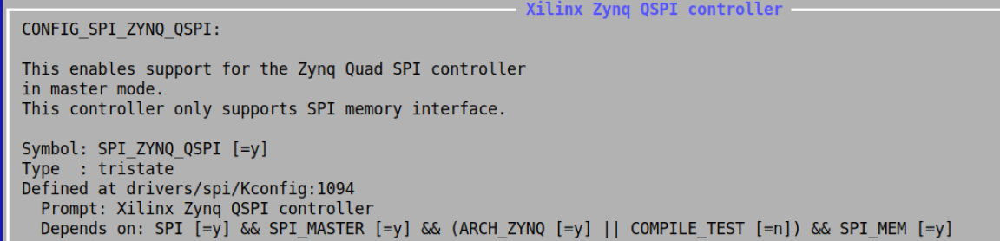
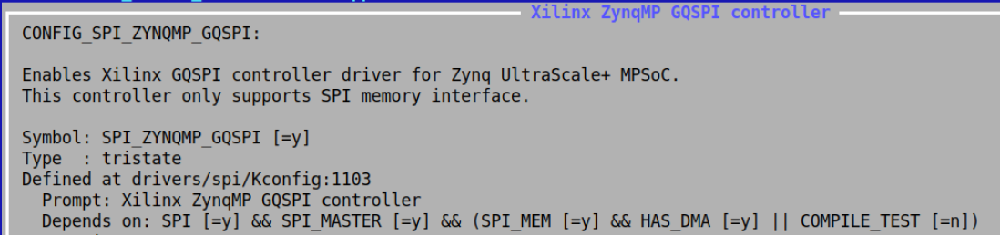

# petalinux常用指令

## 	1、创建petalinux工程

```shell
## 创建一个名字为LED-ZYNQ的，ZYNQ模板的工程 （通过hdf文件 模板zynqMP）  
petalinux-create -t project --template zynq -n LED-ZYNQ 

##（通过bsp）
petalinux-create -t project -s avnet-digilent-zedboard-v2018.3-final.bsp -n my_zed
```


## 	2、导入hdf文件

```shell
## （.xsa文件路径的上级目录）导入.xsa文件，.xsa文件位置在xsa文件夹里面
petalinux-config --get-hw-description /home/hwusr/test/

## 如果想单独打开配置petalinux界面
petalinux-config
```

## 3、制作BOOT.bin

```shell
## zynq
petalinux-package --boot --fsbl --fpga --u-boot --force
## zynqMP
petalinux-package --boot --format BIN --fsbl --u-boot --pmufw --fpga --force

## **FLASH启动的时候**：把内核和boot.src如果都放到BOOT里面的话，需要对地址进行分配
petalinux-package --boot --force --format BIN --fsbl --fpga --pmufw --u-boot --kernel images/linux/Image --offset 0x1940000 --cpu a53-0 --boot-script --offset 0x3240000

## **FLASH启动ramdisk**：（即根文件系统也在FLASH）（需要修改根文件位置为INRD并配置地址）
petalinux-package --boot --force --format BIN --fsbl --pmufw --u-boot --kernel images/linux/Image --offset 0x240000 --cpu a53-0 --boot-script --offset 0x1740000 --add images/linux/rootfs.cpio.gz.u-boot --offset 0x1780000 --cpu a53-0 --file-attribute partition_owner=uboot
```


## 4、单独编译其他组件

1. u-boot:

   ```shell
   petalinux-build -c u-boot
   ```

   编译 U-Boot 引导程序。

2. linux:

   ```shell
   petalinux-build -c linux
   ```

   编译 Linux 内核。

3. device-tree:

   ```shell
   petalinux-build -c device-tree
   ```

   编译设备树。

4. rootfs:

   ```shell
   petalinux-build -c rootfs
   ```

   编译根文件系统。

5. apl:

   ```shell
   petalinux-build -c apl
   ```

   编译应用程序层。

6. bootloader:

   ```shell
   petalinux-build -c bootloader
   ```

   编译引导加载程序(包括 FSBL 和 U-Boot)。


## 5、离线包配置

<mark>Yocto Settings ---\> （petalinux的底层就是Yocto ）（主要设置离线包）</mark>

Add pre-mirror url ---\> （离线编译包download）

修改为file://\<path\>/downloads，\<path\>为sstate下载包解压后的地址。

```tcl
## downloads
file:///home/peta19/sstate_2019.2/downloads

file:///home/peta18/sstate2018/downloads

file:///home/peta21/sstate_petalinux/downloads

原本：http://petalinux.xilinx.com/sswreleases/rel-v\${PETALINUX_VER%%.\*}/downloads
```

    Local sstate feeds settings ---\> （离线下载包sstate，zynq是arm，zynqMP是aach64）

```tcl
## sstate
/home/peta18/sstate2018/arm

/home/peta19/sstate_2019.2/aarch64

/home/peta21/sstate_petalinux/aarch64
```


Enable Debug Tweaks ：这一项如果使能，那么板子启动时，在串口就不需要输入账号、密码

Enable Network sstate feeds ：选择不使能，如果使能就会在网上下载资源

Enable BB NO NETWORK ：选择不使能。如果使能有些编译会出错，经验之谈


## 6、BSP封装

BSP 对于团队和客户之间的分发非常有用。自定义的 PetaLinux 工程可以通过 BSP 交付给下一个级别的团队或外部客户。

**1、进入petalinux工程目录外部运行petalinux-package命令**

```shell
petalinux-package --bsp -p ./my-zed/ --output my-bsp
```

**2、拓展（bsp包含硬件工程）**

```shell
petalinux-package --bsp -p ./my-zed/ --hwsource ./design_1_wrapper.hdf --output HW_BPS
```


## 7、清除生成的文件（导入xsa之前可以清除一下）

petalinux-build -x mrproper -f	

# petalinux根文件系统

## 1、设置固态网络IP

1.编辑`/etc/network/interfaces`文件

```shell
sudo vim /etc/network/interfaces
```

2.注释掉`iface eth0 inet dhcp`这行，注意要和电脑主机保持同一网段，比如我的电脑主机网口IP地址是：`192.168.137.1`，子网掩码是`255.255.255.0`，修改对应网口的配置如下

```shell
auto eth0
iface eth0 inet static
address 192.168.137.10
gateway 192.168.137.1
netmask 255.255.255.0
# iface eth0 inet dhcp
```

3.配置DNS

```shell
mkdir -p /etc/resolvconf/resolv.conf.d/ & vim /etc/resolvconf/resolv.conf.d/head

domain mshome.net
nameserver 192.168.137.1
nameserver 8.8.8.8
```

修改完其实不会起作用，这个文件只是用来备份，修改了`/etc/resolv.conf`才会起作用，我们需要将它复制到`/etc/resolv.conf`文件中：

```shell
cp /etc/resolvconf/resolv.conf.d/head /etc/resolv.conf 
```

为什么这样做呢？因为每次系统重启以后，`/etc/resolv.conf`这个文件会被自动清空，因此我们要将这个复制命令作为开机自启命令，使系统每次启动都会执行。如何设置开机自启会在下一小节介绍。

4.重启网络

```shell
sudo /etc/init.d/networking restart
```

5.测试是否生效

```shell
ifconfig
```

如果看到IP地址已经变为我们设置的静态IP，说明静态IP修改成功。

再看看是否能上网：

```shell
ping www.baidu.com
```


## 2、设置开机自启脚本

我们先在`/etc/init.d`目录下添加我们想开机自启动的脚本，我们将上面说的`cp /etc/resolvconf/resolv.conf.d/head /etc/resolv.conf `文件复制命令放在这个脚本中。

```shell
sudo vim /etc/init.d/<your_startup_script>.sh 
sudo chmod +x /etc/init.d/<your_startup_script>.sh
```

再将这个脚本做一个软链接到`/etc/rcS.d`目录中，并在链接文件名前附上优先级`S99`（这个很重要），代表这个脚本会优先执行：

```shell
ln -s /etc/init.d/<your_startup_script>.sh /etc/rcS.d/S99<your_startup_script>.sh
```

还有一种每次进入终端就会执行一次脚本的方式，将写好的脚本（.sh文件）放到目录`/etc/profile.d/`下，进入终端后就会自动执行该目录下的所有shell脚本，要和上面的方式区分开，有的只需要开机启动一次的脚本就不需要用这种方式了。


## 3、在线更新FLASH

（zynq）

The following config options need to be enabled
CONFIG_ZYNQ_SPI_QSPI
It depends on SPI_MEM, SPI_MASTER and ARCH_ZYNQ



If required, enable MTD block devices support - MTD_BLKDEVS

（zynqMP）

Kernel Configuration Options

The following config options need to be enabled
CONFIG_SPI_ZYNQMP_GQSPI
It depends on SPI_MASTER, SPI_MEM and HAS_DMA


If required, enable MTD block devices support - MTD_BLKDEVS

**QSPI设备树**

zynqMP

```dtd
&qspi {
        status = "okay";
        flash@0 {
        compatible = "n25q512a", "jedec,spi-nor";
        reg = <0x0>;
        spi-tx-bus-width = <4>;
        spi-rx-bus-width = <4>;
        spi-max-frequency = <10000000>;
        #address-cells = <1>;
        #size-cells = <1>;
        partition@0x00000000 {
                label = "boot";
                reg = <0x0 0x1E00000>;
        };

        partition@0x1E40000 {
                label = "bootenv";
                reg = <0x1E400000 0x40000>;
        };
  };
};
```

**Linux指令**

```shell
## 查询FLASH分区：
cat /proc/mtd

dev:    size   erasesize  name
mtd0: 00400000 00020000 "qspi-fsbl-uboot"
mtd1: 01a00000 00020000 "qspi-linux"
mtd2: 00010000 00020000 "qspi-device-tree"
mtd3: 00500000 00020000 "qspi-rootfs"
mtd4: 005e0000 00020000 "qspi-bitstream"

## 写入FLASH （包含擦除、写入、校验）
flashcp -v ./smaple.bin /dev/mtd0

Erasing block: 32/32 (100%)
Writing kb: 4088/4096 (99%)
Verifying kb: 4088/4096 (99%)
```

**参考文献：**

ZYNQ QSPI驱动：https://xilinx-wiki.atlassian.net/wiki/spaces/A/pages/18841901/Linux+ZynqMP+GQSPI+Driver#LinuxZynqMPGQSPIDriver-Device-tree

https://xilinx-wiki.atlassian.net/wiki/spaces/A/pages/18842262/Zynq+QSPI+Driver


## 4、rootfs大包内容

 /components/yocto/source/aarch64/layers/meta-petalinux/recipes-core/packagegroups/packagegroup-petalinux-gstreamer.bb  


## 5、根文件系统彩色目录

修改user目录下的.barch文件，把里面的内容取消注释掉

**配置 Bash 或其他 shell**： 如果使用的是 Bash，可以通过编辑 `~/.bashrc` 或 `/etc/profile` 文件，添加以下内容来启用彩色输出：

```shell
# 启用 ls 彩色输出
alias ls='ls --color=auto'
```

