# zynq及zynqMP系列启动流程

启动所需文件和顺序

Boot ROM → **fsbl（fsbl.elf） → bitstream（system.bit）→ u-boot（u-boot.elf）** → bootscr（boot.scr）→ kernel（Image）→ device tree（system.dtb）→ rootfs 

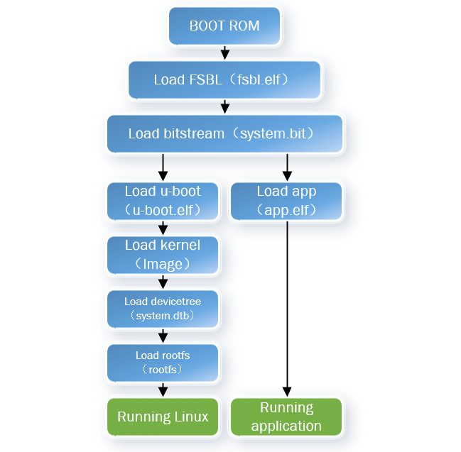

​	Boot ROM：直接固化在zynq硬件，开发者无法修改，启动模式是在这里设置（QSPI，SD，JTAG）

​	fsbl（first stage boot loader）：第一阶段加载程序，运行了这个，系统才能够运行裸机程序或者是引导操作系统的u-boot

​	bitstream：PL端硬件加载文件

​	u-boot：U-Boot引导加载程序的可执行映像文件

​		*注：fsbl（fsbl.elf） → bitstream（system.bit）→ u-boot（u-boot.elf）：这三个可以合称为一个BOOT.bin*

​	bootscr：加载下面文件的脚本	

​	kernel：内核加载可执行镜像文件，操作系统的核心组件

​	device tree：设备树文件，用于嵌入式系统中的设备驱动和操作系统内核之间的通信

​	rootfs ：根文件系统，包含了操作系统运行所需的文件和目录结构

展开介绍

Zynq 是通过片上CPU完成对芯片的配置，也就是PS和PL的配置是通过 PS 处理器 ARM 核来实现的。需要注意的是，与传统的 Xilinx 7 系列 FPGA 芯片不同，Zynq 是不支持从 PL 端进行直接启动配置的，一定要通过 PS 部分来完成。

Zynq 的具体启动配置是分级进行的，一共可以分为3个阶段，可以用0~2来表示：

- Stage 0： BootROM 阶段

- Stage 1： FSBL （First Stage Boot loader）阶段

- Stage 2： SSBL （Second Stage Boot loader）阶段

**BootROM 阶段：**

读取启动方式的MIO引脚（JTAG、QSPI、SD）

​	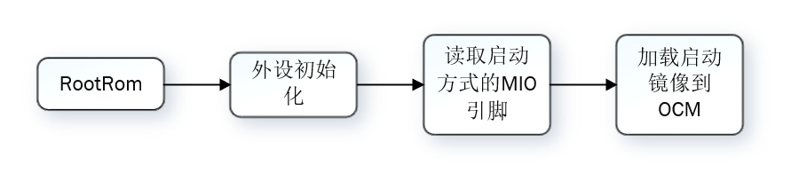

**全程在PS端完成！**

**FSBL （First Stage Boot loader）阶段：**

1. 完成 PS 的初始化

2. 加载 PL 的bit流文件，完成 PL 配置

3. 加载 SSBL 引导程序或是ARM的裸跑程序到 DDR

4. 跳转执行 SSBL 或裸跑程序

   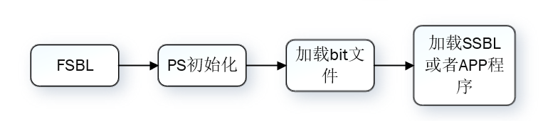

**SSBL （Second Stage Boot loader）阶段：**

裸机不需要到这一步，这一步主要是用来运行操作系统

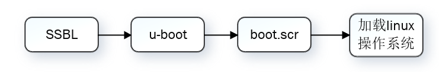

# 1、SD卡启动

**1、格式化SD卡分区**

​	把SD卡格式化为两个分区：

​		（1）FAT32分区：主要存储启动必须的文件

​			-- BOOT.bin   （fsbl、bit、u-boot）

​			-- iamge.ub	fix版的内核文件（kernel，设备树、rootfs（一般存放到ext4分区））

​			-- Image，system.dtb 	（如果不用fix版本，即需要把这两个文件放到FAT分区）

​		**注：image.ub和{Image system.dtb} 选择一个即可**

​		（2）ext4分区：主要存储根文件系统

​			-- rootfs.tar.gz （需要把这个文件解压到此分区）

​			解压命令：\$ sudo tar xvf rootfs.tar.gz -C /media/rootfs   （{/media/rootfs}为ext4分区名）

​		（3）petalinux设置部分

​			选择根文件系统的类型：SD

​			选择设备名称：/dev/sdblk0p1   （根据自己的情况填写）

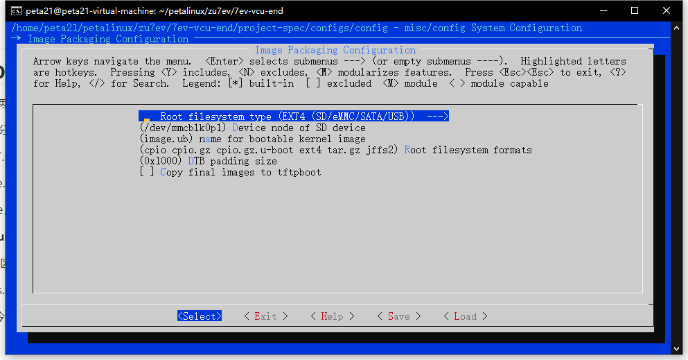


# 2、QSPI FLASH启动

​	**petalinux2021.2版本**

**1、分配FLASH内存**

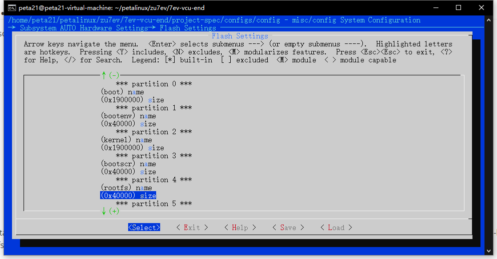

这里面的size，只是表示分区的存储大小，而不是起始地址

**2、修改kernel在FLASH的位置**

petalinux-config→ u-boot Configuration→ u-boot script configuration→ QSPI/OSPI image offsets

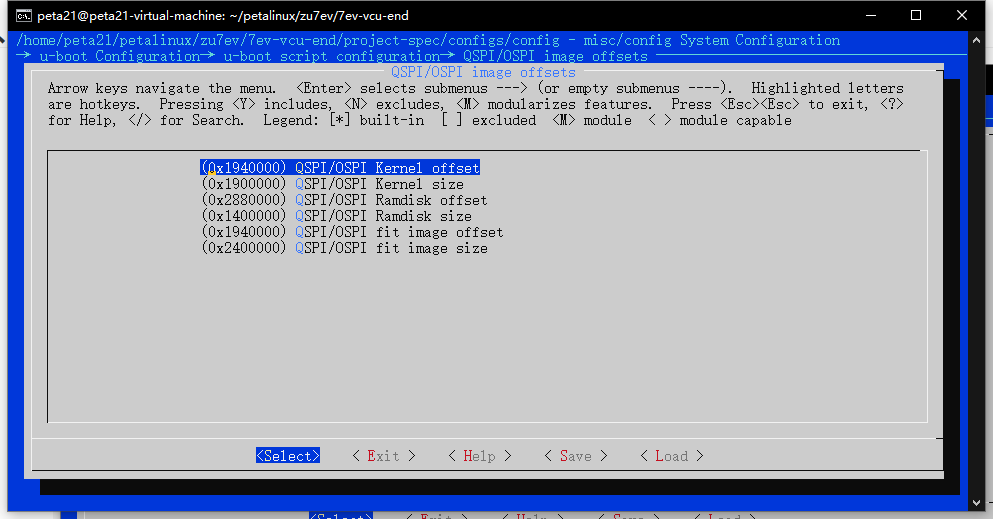

0x1940000：0x1900000 + 0x40000  （根据第一步分区，进行计算），表示kernel的起始地址

**3、配置boot.scr的地址**

petalinux-config -c u-boot → ARM architecture → Boot script offset

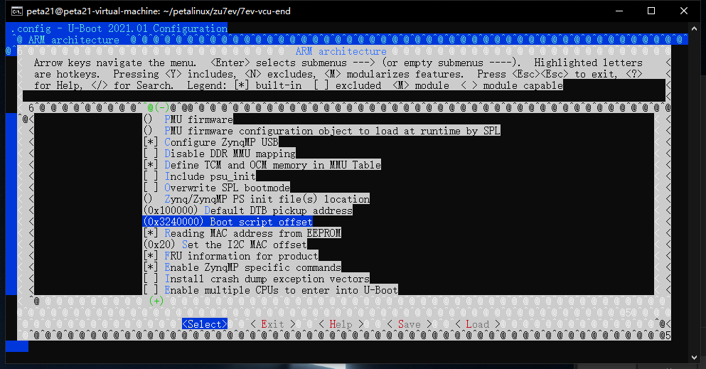

0x3240000：0x1900000 + 0x4000 + 0x1900000  ，表示boot.scr文件在FLASH中的位置

**4、打包生成BOOT.bin**

根据上述设置好的地址，打包成BOOT.bin （包含bit文件）

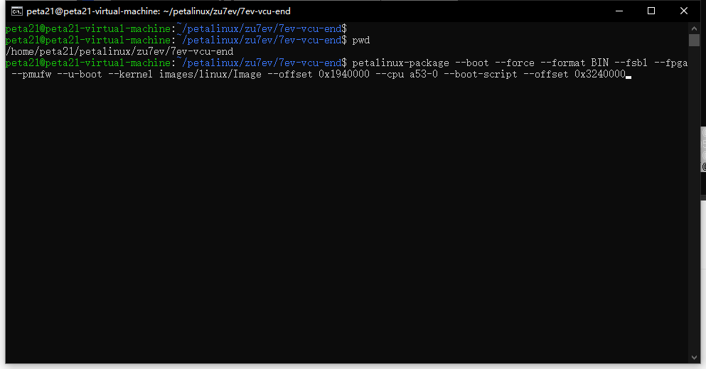

```
petalinux-package --boot --force --format BIN --fsbl --fpga --pmufw --u-boot --kernel images/linux/Image --offset 0x1940000 --cpu a53-0 --boot-script --offset 0x3240000
```

```
--boot：指定要创建的镜像类型为引导镜像。
--force：强制执行操作，即覆盖现有的输出文件。
--format BIN：指定输出镜像的格式为二进制格式。
--fsbl：将 FSBL（First Stage Boot Loader）添加到镜像中。
--fpga：将 FPGA 位流文件添加到镜像中。
--pmufw：将 PMU 固件添加到镜像中。
--u-boot：将 U-Boot 添加到镜像中。
--kernel images/linux/Image：指定 Linux 内核映像文件的路径。
--offset 0x1940000：指定将内核映像文件添加到镜像时的偏移地址。
--cpu a53-0：指定目标处理器核心。
--boot-script：将引导脚本（boot script）添加到镜像中。
--offset 0x3240000：指定将引导脚本添加到镜像时的偏移地址。
```


**5、下板操作**

（1）首先用ramdisk版本，进入linux，把rootfs文件解压到emmc的ext4分区，（创建分区，参考petalinux_learning）

```
 tar xvf rootfs.tar.gz -C /media/rootfs
```


（2）把生成的BOOT.bin通过vitis，烧入到FLASH，（烧写之前，可以通过u-boot模式先把FLASH给擦除）

​	擦除指令：sf erase 0 0x4000000	// 64MB内存

**参考文献：**

FLASH分区配置：https://support.xilinx.com/s/article/000033588?language=en_US

# 3、ramdisk启动

petalinux-config配置：

​	配置FLASH内存：

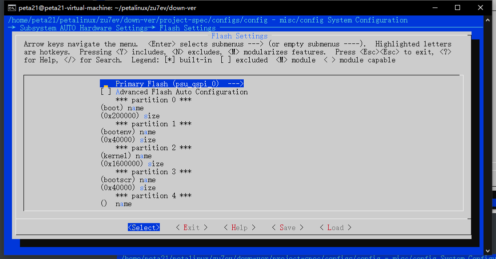

​	配置根文件类型和地址：

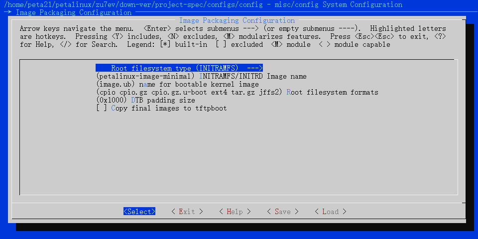

同时还要修改boot.scr地址（FLASH启动有介绍）

然后petalinux-build

打包BOOT.bin  （boot、iamge.ub、boot.scr）

```shell
petalinux-package --boot --force --format BIN --fsbl --pmufw --u-boot --kernel images/linux/image.ub --offset 0x240000 --cpu a53-0 --boot-script --offset 0x1840000
```

然后把BOOT.bin 存储到FLASH即可

**说明：**此时的image.ub是包含了一个简单的根文件系统的，所以不需要再进行打包根文件系统

# 4、FLASH  EMMC启动

ramdisk启动一个最简单的系统（主要做mmc配置）：[ramdisk启动](#ramdisk启动（INITRAMFS）：)

​	然后把mmc分为两个区并把内核和根文件系统存进去

​		FAT32：存储image.ub，system.dtb

​		ext4：存储根文件系统

存储完之后，然后再修改rootfs的类型为SD卡，并且指向mmc的ext4分区

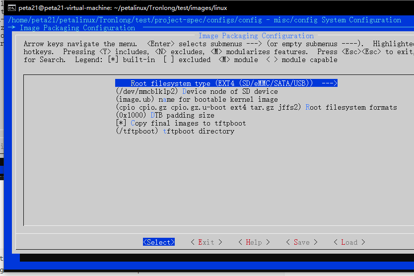

同时SD卡也要切换为MMC的sd1：

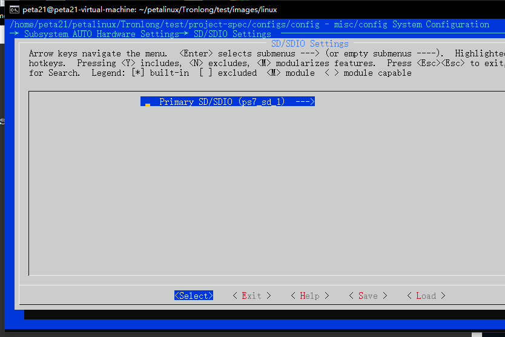

然后打包BOOT.bin，并烧写到FLASH

```
petalinux-package --boot --fsbl ./zynq_fsbl.elf --fpga ./system.bit --u-boot ./u-boot.elf --force
```

然后在执行到U-BOOT倒计时的时候按任意键暂停，进入u-boot

**修改启动指令变量：**

查看当前的启动变量：

```cobol
print bootcmd
```

原本的变量：

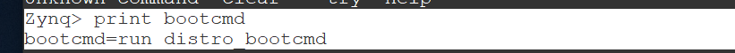

查看iamge.ub文件

```cobol
ls emm 1:1
```


挂载emmc1

```cobol
mmc dev 1
```

修改启动内核环境变量

```cobol
setenv my_emmc_boot "mmc dev 0:1 && load mmc 0:1 0x10000000 /image.ub && bootm 0x10000000"
setenv run_emmc_bit "mmc dev 0:1 && load mmc 0:1 ${loadbit_addr} system.bit && fpga loadb 0 ${loadbit_addr} ${filesize}"
```

将bootcmd的命令修改成my_emmc_boot

```cobol
setenv bootcmd "run my_emmc_boot" 
```

保存环境变量

```cobol
saveenv
```

 重启开发板即可查看到，从emmc的FAT32分区中读取iamge.ub，从ext4分区读取rootfs


# 5、JTAG启动petalinux

`petalinux-boot` 是一个用于在硬件上加载和引导 PetaLinux 镜像的工具，支持 JTAG 和 QEMU 两种模式。常见的使用场景包括通过 JTAG 下载比特流到 FPGA，并加载 FSBL、PMUFW、U-Boot 或 Linux 内核等。

**基本用法**

- **--jtag | --qemu**: 必选参数，用于指定引导模式。`--jtag` 通过 JTAG 引导，`--qemu` 通过 QEMU 仿真引导。
  - `1`: 下载 FPGA 比特流和 FSBL (Zynq)，FSBL 和 PMUFW (ZynqMP)。
  - `2`: 仅引导 U-Boot。
  - `3`: 仅引导 Linux 内核。

**可选参数**

- **--boot-addr <BOOT_ADDR>**: 指定引导地址。
- **--image <IMAGE>**: 指定要引导的镜像文件。
- **--pmufw [<PMUFW_ELF>]**: 指定 PMUFW 的路径，仅适用于 ZynqMP。也可以通过 `--pmufw no` 跳过加载 PMUFW。
- **--u-boot**: 引导 U-Boot 镜像。如果指定了 `--kernel`，则 `--u-boot` 无效。
- **--kernel**: 引导 Linux 内核镜像（zImage、Image 或 image.elf）。
- **--fpga**: 下载并配置 FPGA 比特流。
- **--bitstream <BITSTREAM>**: 使用指定的比特流文件配置 FPGA。
- **--tcl <TCL_OUTPUT>**: 生成用于 XSDB 的 Tcl 脚本文件。
- **--verbose**: 输出调试信息。
- **--hw_server-url <URL>**: 指定硬件服务器的 URL，默认连接到本地服务器 (`localhost:3121`)。

**使用示例**

1. **下载比特流和 FSBL**:

   ```shell
   petalinux-boot --jtag --prebuilt 1
   ```

2. **引导 U-Boot**:

   ```shell
   petalinux-boot --jtag --prebuilt 2
   ```

3. **引导 Linux 内核**:

   ```shell
   petalinux-boot --jtag --prebuilt 3
   ```

4. **生成用于 XSDB 的 Tcl 脚本**:

   ```shell
   petalinux-boot --jtag --kernel --fpga --tcl mytcl
   ```


**下载指定文件**

如果您的设计包含 FPGA 配置，需要首先下载比特流到 FPGA。

**命令：**

```shell
petalinux-boot --jtag --fpga
```

**说明：**

- 该命令将在 FPGA 上配置位于 `<project-root>/images/linux/` 目录下的默认比特流文件（通常为 `*.bit` 文件）。

**指定自定义比特流：**

```shell
petalinux-boot --jtag --bitstream path/to/your.bit
```

**说明：**

- 使用 `--bitstream` 选项可以指定自定义的比特流文件路径。

**步骤 2：加载 FSBL**

FSBL 是系统引导的第一阶段，引导过程需要将 FSBL 加载到目标设备。

**命令：**

```shell
petalinux-boot --jtag --u-boot
```

**说明：**

- 该命令将加载 FSBL 和 U-Boot，FSBL 会初始化硬件并加载 U-Boot。

**如果只想加载 FSBL：**

```shell
petalinux-boot --jtag --u-boot --fsbl path/to/your_fsbl.elf
```

**说明：**

- 使用 `--fsbl` 选项可以指定自定义的 FSBL 文件。

**步骤 3：加载 U-Boot 引导加载程序**

U-Boot 是一个灵活的引导加载程序，负责加载并启动内核。

**命令：**

```shell
petalinux-boot --jtag --u-boot
```

**说明：**

- 该命令将在加载 FSBL 后继续加载 U-Boot。

**步骤 4：启动内核并挂载根文件系统**

**方法一：使用预构建的镜像**

如果您已经有预构建的完整镜像，可以使用以下命令：

```shell
petalinux-boot --jtag --prebuilt 3
```

**说明：**

- `--prebuilt 3` 表示加载预构建的内核和根文件系统。
- 预构建的镜像通常位于 `<project-root>/pre-built/linux/images/` 目录。

# 6、通过QEMU仿真

**1、生成镜像**

通过BSP生成petalinux镜像文件

**2、生成BOOT.bin**

```shell
petalinux packge –boot
```

**3、启动镜像**

启动内核kernel（相当于启动zImage文件）

```shell
$ petalinux-boot --qemu –kernel
```

启动指定的zImage文件

```shell
$ petalinux-boot --qemu --image ./images/linux/zImage
```

**4、退出QEMU**

若要退出 QEMU， 同时按下 “Ctrl+A” ， 然后按下 “X” 。


# 7、tftp启动image.ub

**1、安装tftp服务器**

**安装服务器**

```shell
sudo apt-get install tftpd-hpa
```

**配置**

```shell
sudo vim /etc/default/tftpd-hpa
```

TFTP_USERNAME="tftp"  
TFTP_DIRECTORY="/tftpboot"

TFTP_ADDRESS="0.0.0.0:69"  
​TFTP_OPTIONS="-l -c -s"

**在根目录创建一个tftpboot目录，并赋予权限**

```shell
sudo mkdir /tftpboot

sudo chmod 777 /tftpboot
```

**重启网络服务**

```shell
sudo service tftpd-hpa restart
```

**2、安装客户端**

**安装客户端**

```shell
sudo apt-get install xinetd

sudo apt-get install tftp-hpa
```

**配置**

\$ vim /etc/xinetd.d/tftp

```shell
    service tftp

    {

    socket_type = dgram

    protocol = udp

    wait = yes

    user = peta18

    server = /usr/sbin/in.tftpd

    server_args = -s /tftpboot

    disable = no

    per_source = 11

    cps = 100 2

    flags = IPv4

    }
```

**重启tftp服务**

```shell
sudo vsudo service xinetd restart
```


## 3、配置petalinux

​	\$ petalinux-config 进入Image Packaging Configuration

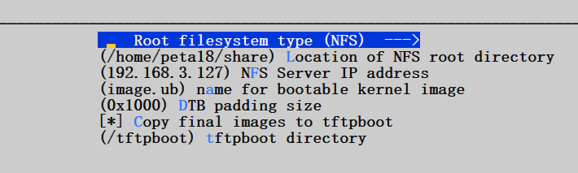

## 4、构建系统镜像

​	1、把image.ub放到/tftpboot目录下

​	2、把rootfs.tar.gz解压到/home/peta18/share

​	这样就实现了从NFS启动rootfs，从TFTP启动image.ub，SD卡只需要存放BOOT.bin文件即可，然后输入命令run netboot即可加载tftp下的image.ub和nfs下的rootfs


