# linux下 vivado安装和卸载

## 安装

直接运行./xsetup

## 卸载

进入下面目录：

/2019.2/.xinstall/Vivado_2019.2

然后卸载

sudo ./xsetup -b Uninstall


# linux检测不到JTAG

关闭这个，重新打开

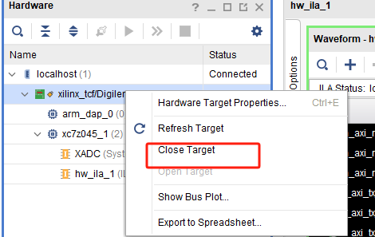


# vivado烧写FLASH

## 一、通过BIN文件

**1、生成BIN文件**

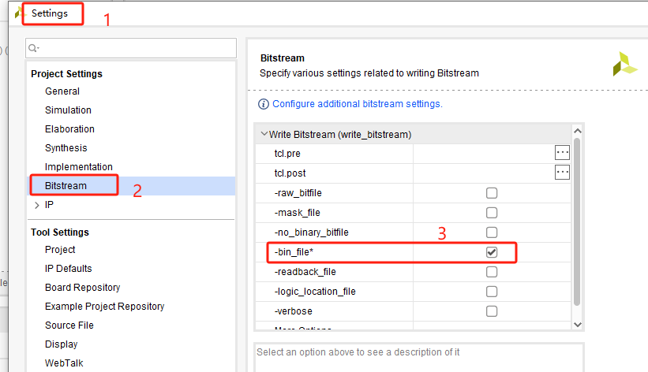

**2、烧写BIN文件**

添加FLASH器件

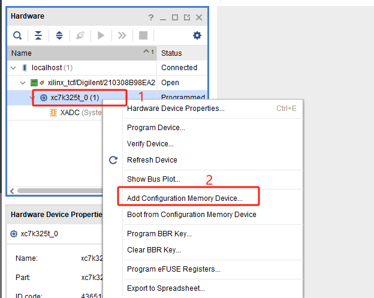

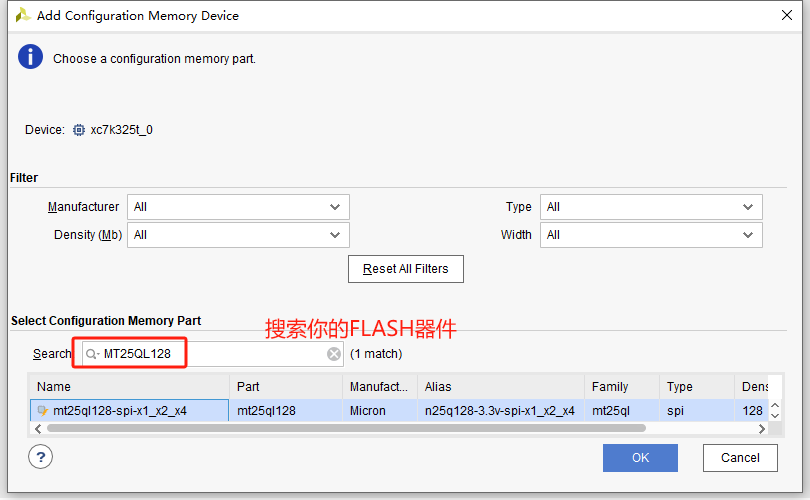

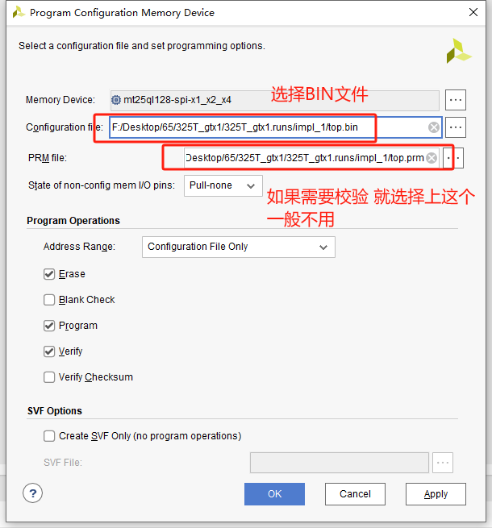


## 二、通过MCS文件

**1、生成MCS文件**

打开创建存储配置文件窗口

Tools -> Generate Memory Configuration File…

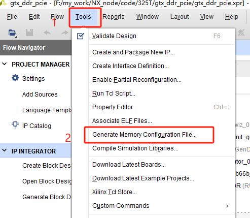

配置生成文件

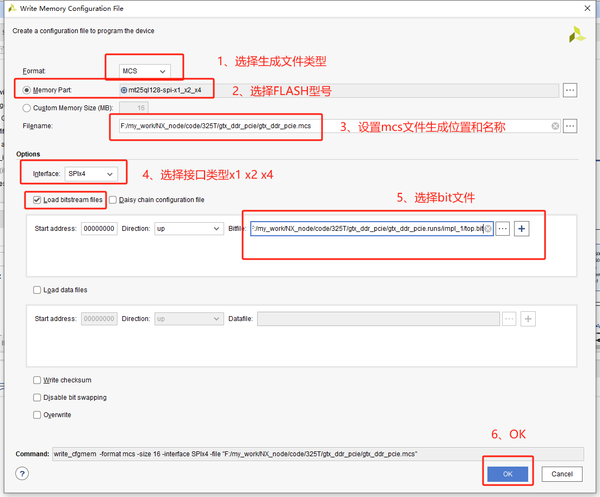


**2、烧写MCS文件**

同烧写BIN文件，只不过把BIN文件换成MCS文件


# 修改fsbl源码强制为JTAG模式

因为有时候zynq是QSPI启动的，但是切换为JTAG很麻烦，就需要借助外力来强制切换为JTAG启动模式（FSBL认为的，但实际上还是QSPI模式，只解决了烧写FLASH问题）

**错误截图：**

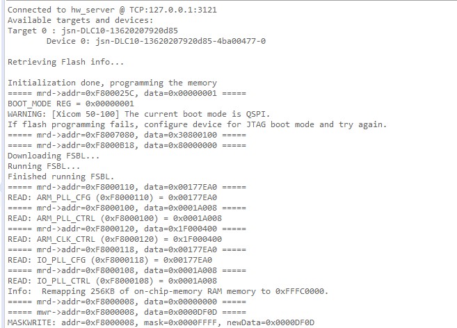

**解决：**

通过SDK或者VITIS创建fsbl工程，在main.c代码中找到一下内容

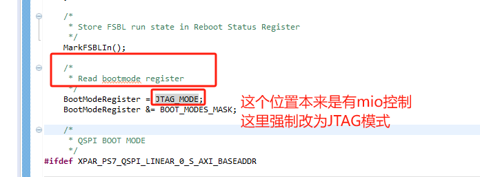


# ubuntu没网

Ubuntu上不了网：ifconfig查看只有lo,没有ens33问题解决参考方法

重新配置并启动ens33网卡，这样就可以找到了

```bash
sudo dhclient ens33
sudo ifconfig ens33
```


参考文献

https://blog.csdn.net/qq_41969790/article/details/103222251?spm=1001.2014.3001.5506


# modelsim关闭信号路径

modelsim一键关闭信号路径

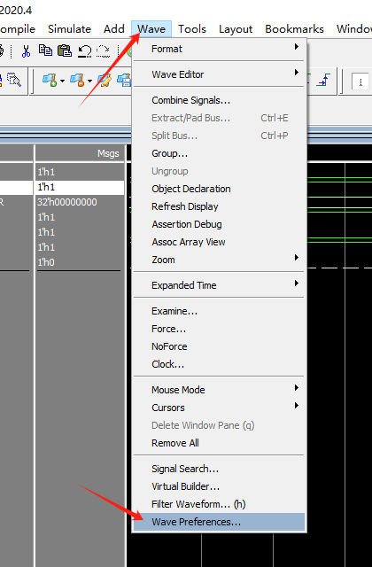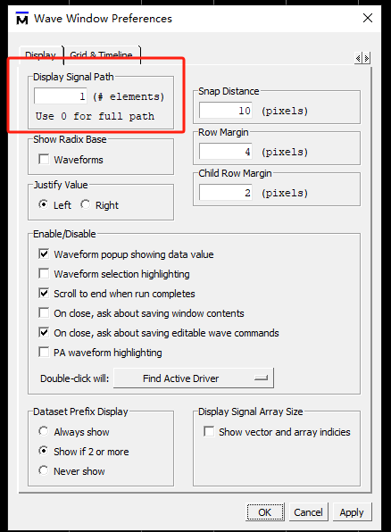


