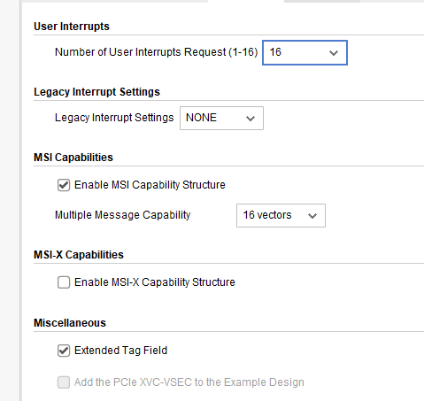
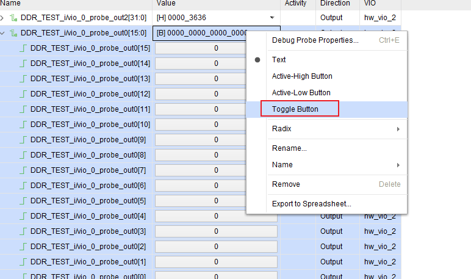

# xdma中断

## FPGA配置

XDMA IP配置



外部可以由按键进行触发16位



## PC软件代码

```bash
## 检查中断号
cat /proc/interrupts | grep xdma
285:   11197285          0          0          0          0          0          0          0   PCI-MSI 537395200 Edge      xdma
## 解释
285：中断号（IRQ 285）。
8855271：该中断已触发的次数（说明 FPGA 已经成功发送了中断）。
PCI-MSI 537395200 Edge：中断类型为 PCIe MSI（边缘触发）。

xdma：驱动名称（Xilinx DMA 驱动）。

## 查看中断的触发次数
watch -n 1 "cat /proc/interrupts | grep xdma"
```

扫描中断触发c程序

```c
#include <stdio.h>
#include <fcntl.h>
#include <unistd.h>
#include <sys/select.h>
#include <stdint.h>

#define MAX_EVENTS 16  // 假设最多 16 个中断通道

int main() {
    int event_fds[MAX_EVENTS];
    char dev_path[64];
    fd_set read_fds;
    int max_fd = 0;
    int i, ret;

    // 1. 打开所有 event 设备文件
    for (i = 0; i < MAX_EVENTS; i++) {
        snprintf(dev_path, sizeof(dev_path), "/dev/xdma0_events_%d", i);
        event_fds[i] = open(dev_path, O_RDONLY | O_NONBLOCK);
        if (event_fds[i] < 0) {
            perror("Failed to open event device");
            continue;
        }
        if (event_fds[i] > max_fd) {
            max_fd = event_fds[i];
        }
    }

    // 2. 使用 select() 监听所有 event 文件
    while (1) {
        FD_ZERO(&read_fds);
        for (i = 0; i < MAX_EVENTS; i++) {
            if (event_fds[i] > 0) {
                FD_SET(event_fds[i], &read_fds);
            }
        }

        ret = select(max_fd + 1, &read_fds, NULL, NULL, NULL);
        if (ret < 0) {
            perror("select failed");
            break;
        }

        // 3. 检查哪个 event 触发了中断
        for (i = 0; i < MAX_EVENTS; i++) {
            if (event_fds[i] > 0 && FD_ISSET(event_fds[i], &read_fds)) {
                uint32_t event_count;
                if (read(event_fds[i], &event_count, sizeof(event_count)) > 0) {
                    printf("Interrupt on event %d, count=%u\n", i, event_count);
                }
            }
        }
    }

    // 4. 关闭所有文件描述符
    for (i = 0; i < MAX_EVENTS; i++) {
        if (event_fds[i] > 0) {
            close(event_fds[i]);
        }
    }

    return 0;
}
```


# AXI LITE寄存器

## FPGA配置

通过XDMA的AXI LITE接口连接寄存器模块，代码在`"F:\my_work\verilog_commonModule\src\regfile模块\axi_lite_regfile.v"`

## PC软件代码

1、直接通过/dev/xdma0_user 映射地址

读取0x50地址的内容

```c
#include <stdio.h>
#include <stdlib.h>
#include <fcntl.h>
#include <unistd.h>
#include <sys/mman.h>
#include <stdint.h>

#define XDMA_DEVICE "/dev/xdma0_user"
#define TARGET_ADDR  0x50  // 要读取的寄存器地址（16进制）
#define MAP_SIZE     4096  // 映射大小（通常 4KB）

int main() {
    int fd;
    volatile uint32_t *mapped_regs;
    uint32_t value;

    // 1. 打开 XDMA 用户设备
    fd = open(XDMA_DEVICE, O_RDWR);
    if (fd < 0) {
        perror("Failed to open XDMA device");
        return -1;
    }

    // 2. 将寄存器空间映射到用户内存
    mapped_regs = mmap(NULL, MAP_SIZE, PROT_READ | PROT_WRITE, MAP_SHARED, fd, 0);
    if (mapped_regs == MAP_FAILED) {
        perror("mmap failed");
        close(fd);
        return -1;
    }

    // 3. 读取 0x50 地址的数据（32位）
    value = mapped_regs[TARGET_ADDR / sizeof(uint32_t)];
    printf("Value at 0x%08x: 0x%08x\n", TARGET_ADDR, value);

    // 4. 解除映射并关闭设备
    munmap((void*)mapped_regs, MAP_SIZE);
    close(fd);

    return 0;
}
```

2、通过udma驱动进行读取

具体代码为：https://github.com/FPGAmaster-wyc/libudma 


# 不断电重新扫描PCIE

建立一个脚本文件：rescan_pcie.sh

```bash
vim rescan_pcie.sh

## 内容如下

#!/bin/sh

echo "Stop PCIE bus-0"
echo 14160000.pcie | sudo tee /sys/bus/platform/drivers/tegra194-pcie/unbind

echo "Rescan PCIE bus-0"
echo 14160000.pcie | sudo tee /sys/bus/platform/drivers/tegra194-pcie/bind

echo "Listing Xilinx PCIe devices"
lspci -v -d10ee:

#添加权限
chmod +x rescan_pcie.sh

##运行即可
sudo ./rescan_pcie.sh
```


