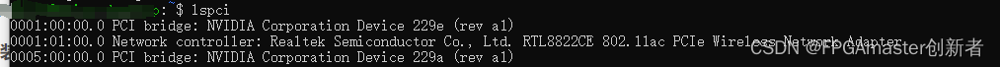
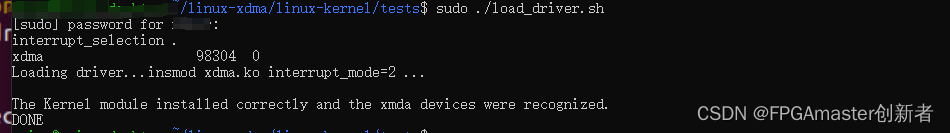
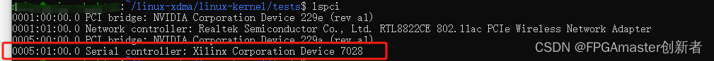
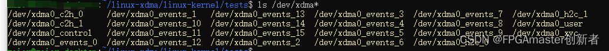
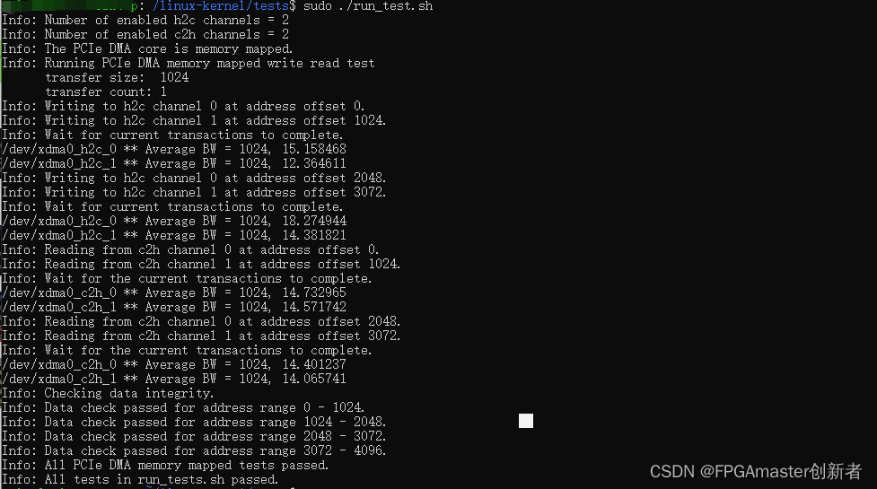
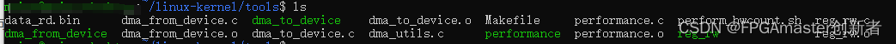

# xdma中断

## FPGA配置

XDMA IP配置


**User Interrupts:**用户中断， XDMA提供16条中断线给用户逻辑， 这里面可以配置使用几条中断线。
**Legacy Interrupt:**XDMA 支持 Legacy 中断,我们这么不选 （此中断会一直触发）
**MSI Capabilities:**选择支持MSI中断 ,支持16个中断消息向量
	注意： MSI 中断和 MSI-X 中断只能选择一个， 否则会报错， 如果选择了 MSI 中断， 则可以选择 Legacy 中断， 如果选择了 MSI-X 中断， 那么 MSI 必须取消选择， 同时 Legacy 也必须选择 None。 此 IP 对于 7 系列设置有这个问题， 如果使用 Ultrascale 系列， 则可以全部选择
**MSI-X Capabilities:**不选
**Miscellaneous:**选 Extended Tag Field
**Link Status Register:**选 Enable Slot Clock Configuration  


## xdma中断说明

1)、 Legacy Interrupts：

对于 Legacy Interrupts 中断， 当 user_irq_ack 第一次为 1 的时候 usr_irq_req 可以清 0， 当 user_irq_ack 第二次为 1，的时候， 可以重新设置 usr_irq_req 发起中断。

外部可以由按键进行触发16位

## PC软件代码

```bash
## 检查中断号
cat /proc/interrupts | grep xdma
285:   11197285          0          0          0          0          0          0          0   PCI-MSI 537395200 Edge      xdma
## 解释
285：中断号（IRQ 285）。
8855271：该中断已触发的次数（说明 FPGA 已经成功发送了中断）。
PCI-MSI 537395200 Edge：中断类型为 PCIe MSI（边缘触发）。

xdma：驱动名称（Xilinx DMA 驱动）。

## 查看中断的触发次数
watch -n 1 "cat /proc/interrupts | grep xdma"
```

扫描中断触发c程序

```c
#include <stdio.h>
#include <fcntl.h>
#include <unistd.h>
#include <sys/select.h>
#include <stdint.h>

#define MAX_EVENTS 16  // 假设最多 16 个中断通道

int main() {
    int event_fds[MAX_EVENTS];
    char dev_path[64];
    fd_set read_fds;
    int max_fd = 0;
    int i, ret;

    // 1. 打开所有 event 设备文件
    for (i = 0; i < MAX_EVENTS; i++) {
        snprintf(dev_path, sizeof(dev_path), "/dev/xdma0_events_%d", i);
        event_fds[i] = open(dev_path, O_RDONLY | O_NONBLOCK);
        if (event_fds[i] < 0) {
            perror("Failed to open event device");
            continue;
        }
        if (event_fds[i] > max_fd) {
            max_fd = event_fds[i];
        }
    }

    // 2. 使用 select() 监听所有 event 文件
    while (1) {
        FD_ZERO(&read_fds);
        for (i = 0; i < MAX_EVENTS; i++) {
            if (event_fds[i] > 0) {
                FD_SET(event_fds[i], &read_fds);
            }
        }

        ret = select(max_fd + 1, &read_fds, NULL, NULL, NULL);
        if (ret < 0) {
            perror("select failed");
            break;
        }

        // 3. 检查哪个 event 触发了中断
        for (i = 0; i < MAX_EVENTS; i++) {
            if (event_fds[i] > 0 && FD_ISSET(event_fds[i], &read_fds)) {
                uint32_t event_count;
                if (read(event_fds[i], &event_count, sizeof(event_count)) > 0) {
                    printf("Interrupt on event %d, count=%u\n", i, event_count);
                }
            }
        }
    }

    // 4. 关闭所有文件描述符
    for (i = 0; i < MAX_EVENTS; i++) {
        if (event_fds[i] > 0) {
            close(event_fds[i]);
        }
    }

    return 0;
}
```


# AXI LITE寄存器

## FPGA配置

通过XDMA的AXI LITE接口连接寄存器模块，代码在`"F:\my_work\verilog_commonModule\src\regfile模块\axi_lite_regfile.v"`

## PC软件代码

1、直接通过/dev/xdma0_user 映射地址

读取0x50地址的内容

```c
#include <stdio.h>
#include <stdlib.h>
#include <fcntl.h>
#include <unistd.h>
#include <sys/mman.h>
#include <stdint.h>

#define XDMA_DEVICE "/dev/xdma0_user"
#define TARGET_ADDR  0x50  // 要读取的寄存器地址（16进制）
#define MAP_SIZE     4096  // 映射大小（通常 4KB）

int main() {
    int fd;
    volatile uint32_t *mapped_regs;
    uint32_t value;

    // 1. 打开 XDMA 用户设备
    fd = open(XDMA_DEVICE, O_RDWR);
    if (fd < 0) {
        perror("Failed to open XDMA device");
        return -1;
    }

    // 2. 将寄存器空间映射到用户内存
    mapped_regs = mmap(NULL, MAP_SIZE, PROT_READ | PROT_WRITE, MAP_SHARED, fd, 0);
    if (mapped_regs == MAP_FAILED) {
        perror("mmap failed");
        close(fd);
        return -1;
    }

    // 3. 读取 0x50 地址的数据（32位）
    value = mapped_regs[TARGET_ADDR / sizeof(uint32_t)];
    printf("Value at 0x%08x: 0x%08x\n", TARGET_ADDR, value);

    // 4. 解除映射并关闭设备
    munmap((void*)mapped_regs, MAP_SIZE);
    close(fd);

    return 0;
}
```

2、通过udma驱动进行读取

具体代码为：https://github.com/FPGAmaster-wyc/libudma 


# 不断电重新扫描PCIE

建立一个脚本文件：rescan_pcie.sh

```bash
vim rescan_pcie.sh

## 内容如下

#!/bin/sh

echo "Stop PCIE bus-0"
echo 14160000.pcie | sudo tee /sys/bus/platform/drivers/tegra194-pcie/unbind

echo "Rescan PCIE bus-0"
echo 14160000.pcie | sudo tee /sys/bus/platform/drivers/tegra194-pcie/bind

echo "Listing Xilinx PCIe devices"
lspci -v -d10ee:

#添加权限
chmod +x rescan_pcie.sh

##运行即可
sudo ./rescan_pcie.sh
```


# Linux命令读写xdma

## 安装xdma驱动（linux版）

### 驱动下载

可以从官方下载驱动，也可以从我这里下载我使用的版本

官方驱动下载：[GitHub - Xilinx/dma_ip_drivers: Xilinx QDMA IP Drivers](https://github.com/Xilinx/dma_ip_drivers)

本设计使用的驱动：[xdma_linux驱动下载](https://download.csdn.net/download/w18864443115/89504072?spm=1001.2014.3001.5503)

### 驱动安装

### 1、检查pci驱动

打开 Linux 终端，输入“lspci”命令并执行， 如下图所示：



可以看到，没有 Xilinx 相关的信息，这是因为没有安装 XDMA 的 Linux 系统驱动。

###  2、驱动安装

下载好的驱动，存放到Linux上面

由于提供的都是源码，需要编译安装然后才能使用。打开终端，输入如下命令：

```bash
cd ./dma_ip_drivers/XDMA/linux-kernel/xdma/
sudo apt install gcc make build-essential #（如果之前没有安装过 build-essential，需要安装）
sudo make install
```

驱动安装完成后，重启 Linux 系统主机。

### 3、加载驱动

现在打开终端，输入如下命令进入 xdma 驱动目录下的 tests 目录：

```bash
cd ./dma_ip_drivers/XDMA/linux-kernel/tests
```

该目录提供了驱动加载脚本及应用测试脚本，其中的 load_driver.sh 即为 XDMA 的驱动加载脚本。执行该脚本前需要先给该脚本赋予可执行权限，然后以 root 身份执行，命令如下：

```bash
chmod +x load_driver.sh
sudo ./load_driver.sh
```



可以看到 XDMA 驱动已正确加载。

###  4、检测XDMA设备

在终端中输入“lspci”命令



在终端中输入“ls /dev”命令并执行，可以在/dev 目录下看到以 xdma0 开头的设备文件，如下图所示：



以下是每个设备文件的简要说明：

> 1. `/dev/xdma0_control`：用于控制和配置DMA设备。
> 2. `/dev/xdma0_user`：用于用户自定义用途。
> 3. `/dev/xdma0_xvc`：用于虚拟JTAG功能。
> 4. `/dev/xdma0_events_*`：用于处理DMA事件（中断）。
> 5. `/dev/xdma0_c2h_*`：用于从卡到主机（Card to Host，简称C2H）的DMA数据传输。
> 6. `/dev/xdma0_h2c_*`：用于从主机到卡（Host to Card，简称H2C）的DMA数据传输。

这表明Linux系统已正确安装 XDMA 驱动并检测到了 XDMA 设备。

## 官方测试

打开终端，输入如下命令进入 xdma 目录下的tests 目录：

```bash
cd ./dma_ip_drivers/XDMA/linux-kernel/
cd tests/
```

需要给他们添加可执行权限：输入如下命令以执行 run_test.sh 脚本：

```bash
chmod +x run_test.sh
chmod +x dma_memory_mapped_test.sh
sudo ./run_test.sh
```

> run_test.sh 脚本用于测试基本的 XDMA 传输，并具有如下功能：
>  ✓ 检测设计是基于 AXI-MM 接口还是 AXI_ST 接口，并查看启用了多少个通道；
>  ✓ 对所有启用的通道进行基本传输测试；
>  ✓ 检查数据完整性；
>  ✓ 报告通过或失败



测试结果的最后两行 passed 表明我们搭建的基于 XDMA 的 PCIe 通信子系统正确，且 XDMA 驱动安装和驱动示例程序运行正常。


Linux 的 XDMA 测试应用是源码提供的，需要先编译。打开终端，输入如下命令进入 xdma 目录下的tools 目录并编译：

```bash
cd ./dma_ip_drivers/XDMA/linux-kernel/
cd tools/
make
```

编译后， tools 目录下有四个 XDMA 相关的测试应用，如下图所示：（第一次进来没有data_rd.bin文件）

编辑

> **dma_to_device**
>
> - 这是一个可执行文件，用于将数据从主机内存写入到 FPGA 设备。
>
> **dma_from_device**
>
> - 这是一个可执行文件，用于从 FPGA 设备读取数据到主机内存。
>
> **performance**
>
> - 这是一个可执行文件，可能用于测试和评估 DMA 性能
>
> **reg_rw**
>
> - 这是一个可执行文件，可能用于读取和写入 FPGA 寄存器

## 写入数据

打开终端，进入tools目录，然后输入以下指令（首先准备好一个测试数据datafile4K.bin）：

```bash
sudo ./dma_to_device -d /dev/xdma0_h2c_0 -a 0x00000000 -s 2048 -f datafile4K.bin
```

这个命令将 data_to_write.bin 文件中的数据写入到 /dev/xdma0_h2c_0 设备的地址 0x00000000，长度为 2048 字节。

## 读取数据

打开终端，进入tools目录，然后输入以下指令

```bash
sudo ./dma_from_device -d /dev/xdma0_c2h_0 -a 0x00000000 -s 2048 -f data_rd.bin
```

这个命令从 /dev/xdma0_c2h_0 设备开始的地址 0x00000000 读取 2048 字节的数据，并保存到 data_rd.bin 文件中。


# Linux程序读写XDMA

需要安装libaio-dev库

 ```bash
  sudo apt-get install libaio-dev
  
 ```

## linux发送数据给FPGA


通过io_uring高速读写xdma

io_uring读写循环逻辑图（完整版）

```pgsql
┌──────────────────┐
│ 初始化 io_uring  │
│  io_uring_queue_init / setup │
└─────────┬────────┘
          │
          ▼
┌─────────────────────────────┐
│ 创建和注册文件 / 缓冲区等资源 │
│  open, malloc, io_uring_register │
└─────────┬───────────────┘
          │
          ▼
┌──────────────────────────────┐
│ 提交读请求（READ）到 SQ（提交队列） │
│  io_uring_get_sqe             │
│  io_uring_prep_read / readv   │
│  io_uring_submit              │
└─────────┬─────────────────┘
          │
          ▼
┌───────────────────────────┐
│ 内核接收请求，放入 CQ（完成队列） │
│  内核完成 read 操作后，填充 cqe   │
└─────────┬──────────────┘
          │
          ▼
┌─────────────────────────────┐
│ 从 CQ 中获取完成事件（CQE）      │
│  io_uring_wait_cqe / peek_cqe │
└─────────┬────────────────┘
          │
          ▼
┌──────────────────────────┐
│ 处理读取的数据（业务逻辑）     │
│  比如写到文件、打印、处理等     │
└─────────┬─────────────┘
          │
          ▼
┌────────────────────────────┐
│ 提交写请求（WRITE）到 SQ        │
│  io_uring_get_sqe            │
│  io_uring_prep_write / writev│
│  io_uring_submit             │
└─────────┬────────────────┘
          │
          ▼
┌─────────────────────────────┐
│ 内核完成写入并放入 CQ（完成队列） │
└─────────┬────────────────┘
          │
          ▼
┌───────────────────────────┐
│ 获取写完成事件（CQE）        │
│ io_uring_wait_cqe / seen   │
└─────────┬──────────────┘
          │
          ▼
┌──────────────────────┐
│ 释放资源、关闭文件等     │
│ free, close, io_uring_queue_exit │
└──────────────────────┘

```


# XDMA寄存器映射表

**方向是站在软件端定义**

| 地址/偏移量 | 名称          | 方向 | 功能                                                         |
| ----------- | ------------- | ---- | ------------------------------------------------------------ |
| 0x00        | CONTROL       | W    | 控制寄存器，包括使能、复位等                                 |
| 0x04        | STATUS        | R    | 状态寄存器，包括复位状态、时钟状态等                         |
| 0x08        | IER           | W    | 中断控制寄存器，预留                                         |
| 0x0C        | ISR           | R    | 中断状态寄存器，预留                                         |
| 0x10~0x3C   | 保留          |      |                                                              |
| 0x40        | RX_START      | R    | 接收缓冲区起始地址。目前作为FPGA的静态参数(parameter)，对软件是只读的。将来要考虑可通过软件设置。 |
| 0x44        | RX_END        | R    | 接收缓冲区结束地址，该地址为最大写入地址+1，例如起始地址0x00000000，结束地址0x10000000，则可写入地址范围0x00000000~0x0FFFFFFF，即256MB。 |
| 0x48        | RX_BUF_SIZE   | R    | 接收缓冲区的每一帧大小，单位为字节。例如0x400000，表示每帧缓冲区4MB，这也是允许的最大图像尺寸。 |
| 0x4C        | RX_PC_NEXT    | W    | 接收数据读指针，表示软件下一次要读的帧的起始地址。软件每次读取一帧数据后，将C2H_RD_NEXT的新值写入。目前FPGA程序不使用这个指针，将来要考虑利用这个指针判断缓冲区是否已满，数据是否有溢出。 |
| 0x50        | RX_FPGA_NEXT  | R    | 接收数据写指针，表示FPGA下一次要写入的帧的起始地址。FPGA每接收完一帧数据，将C2H_WR_NEXT的最新值更新。软件通过判断C2H_WR_NEXT的值，可以知道缓冲区中有多少数据。 |
| 0x54        | RX_FRM_SIZE   | R    | 接收数据帧大小。单位为字节。FPGA将实际接收到的图像帧的大小更新到这个寄存器。软件可以读出，从而知道帧缓存中的实际数据大小。目前FPGA的帧大小采用静态参数，将来要考虑支持动态帧大小。 |
| 0x58        | RX_FRM_WIDTH  | R    | 接收数据帧的宽度，单位为字节。                               |
| 0x5C        | RX_FRM_HEIGHT | R    | 接收数据帧的高度，单位为行数。                               |
| 0x60~0x7C   | 保留          |      |                                                              |
| 0x80        | TX_START      | R    | 发送缓冲区起始地址。                                         |
| 0x84        | TX_END        | R    | 发送缓冲区结束地址。                                         |
| 0x88        | TX_BUF_SIZE   | R    | 发送缓冲区每帧大小，单位为字节。                             |
| 0x8C        | TX_FPGA_NEXT  | R    | 发送数据读指针。表示FPGA写一次要读取并发送的数据帧的起始地址。FPGA每发送一帧后，将H2C_RD_NEXT的值更新。 |
| 0x90        | TX_PC_NEXT    | W    | 发送数据写指针。表示软件下一次要写入的帧的起始地址。FPGA通过比较软件写入的H2C_WR_NEXT和H2C_RD_NEXT，如果H2C_RD_NEXT != H2C_WR_NEXT，则读取一帧发送。 |
| 0x94        | TX_FRM_SIZE   | W    | 发送数据帧大小，单位为字节。由软件将要发送的数据帧大小写入这个寄存器。其实FPGA程序仅使用FRM_WIDTH和FRM_HEIGHT就可以了，这里的FRM_SIZE预留用作以后实现动态数据位宽。 |
| 0x98        | TX_FRM_WIDTH  | W    | 发送数据帧的宽度，单位为字节。由软件将要发送的行长度写入这个寄存器，FPGA按照这里给出的大小将数据组成AXI-Stream的一个个Packet。 |
| 0x9C        | TX_FRM_HEIGHT | W    | 发送数据帧的高度，单位为行数。由软件将要发送的行数写入这个寄存器，FPGA按照这里给出的数值发送给定数量的Packet。 |
| 0xA0~0xBC   | 保留          |      |                                                              |

# 基本操作流程

FPGA和软件驱动之间使用DDR中的缓冲区进行数据交换。DDR存储区域划分成两个部分，分别是接收缓冲区和发送缓冲区。缓冲区的起始和结束地址分别用BUF_START和BUF_END表示，每个缓冲区的大小是缓冲帧大小BUF_SIZE的整数倍。

FPGA提供regfile，软件通过XDMA的user端口经AXI-lite读写regfile，通过XDMA的C2H和H2C端口读写DDR。

FPGA程序通过regfile的输入输出信号和软件之间传递寄存器的数值。

寄存器方向标注为W的，是软件从AXI-lite写入，FPGA程序从regfile的output获取寄存器值。寄存器方向标注为R的，是FPGA程序从regfile的input给出值，由软件经AXI-lite读取。

FPGA和软件驱动之间主要通过RD_NEXT和WR_NEXT实现缓冲队列的管理，接收时FPGA是写入方（负责维护C2H_WR_NEXT），软件是读取方（负责维护C2H_RD_NEXT）；发送时软件是写入方(负责维护H2C_WR_NEXT)，FPGA是读取方（负责维护H2C_RD_NEXT）。

## 图像接收流程：

### FPGA端的操作

以接收为例，FPGA接收到数据时，从C2H_BUF_START开始，按照C2H_BUF_SIZE为步进，依次写入每帧数据。每写入一帧后，将C2H_WR_NEXT的地址增加：

```verilog
if (C2H_WR_NEXT + C2H_BUF_SIZE == C2H_BUF_END)
	C2H_WR_NEXT = C2H_BUF_START;
else
	C2H_WR_NEXT = C2H_WR_NEXT+C2H_BUF_SIZE;
```

 

### 软件端的操作

软件自己维护C2H_RD_NEXT的值，在读取到C2H_WR_NEXT变化后，发现C2H_WR_NEXT!=C2H_RD_NEXT，就认为缓冲区中存在有效数据。

```c
if (C2H_WR_NEXT != C2H_RD_NEXT)
//发起XDMA从C2H_RD_NEXT地址读取一帧，然后增加C2H_RD_NEXT
	if (C2H_RD_NEXT+C2H_BUF_SIZE == C2H_BUF_END)
		C2H_RD_NEXT = C2H_BUF_START;
	else
		C2H_RD_NEXT = C2H_RD_NEXT + C2H_BUF_SIZE;
else
//没有数据，啥也不做
```

 

## 图像发送流程

对于发送，情况类似，只是操作角色互换。软件负责写入H2C_WR_NEXT，FPGA负责更新H2C_RD_NEXT。

### 软件端的操作

软件在写入数据前先检测H2C_RD_NEXT和H2C_WR_NEXT，判断是否还有空间。如果有空，则向H2C_WR_NEXT地址写入一帧图像，之后增加H2C_WR_NEXT。

```c
if (H2C_WR_NEXT+H2C_BUF_SIZE == H2C_RD_NEXT || (H2C_WR_NEXT+H2C_BUF_SIZE==H2C_BUF_END && H2C_RD_NEXT == H2C_BUF_START))
	//向H2C_WR_NEXT地址写入一帧图像，然后增加H2C_WR_NEXT
	if (H2C_WR_NEXT+H2C_BUF_SIZE == H2C_BUF_END)
		H2C_WR_NEXT = H2C_BUF_START;
    else
		H2C_WR_NEXT = H2C_WR_NEXT + H2C_BUF_SIZE;
```

 

### FPGA端的操作

FPGA在检测到H2C_WR_NEXT != H2C_RD_NEXT时，认为缓存区中有新的数据，从H2C_RD_NEXT地址读取一帧发送，然后增加H2C_RD_NEXT。不断循环直到H2C_WR_NEXT==H2C_RD_NEXT，这代表缓冲区中没有数据了。

```verilog
while(H2C_WR_NEXT != H2C_RD_NEXT) {
	//从H2C_RD_NEXT地址读取一帧并发送，然后更新H2C_RD_NEXT
	if (H2C_RD_NEXT+H2C_BUF_SIZE == H2C_BUF_END)
		H2C_RD_NEXT = H2C_BUF_START;
	else
		H2C_RD_NEXT = H2C_RD_NEXT+H2C_BUF_SIZE;
}
```


