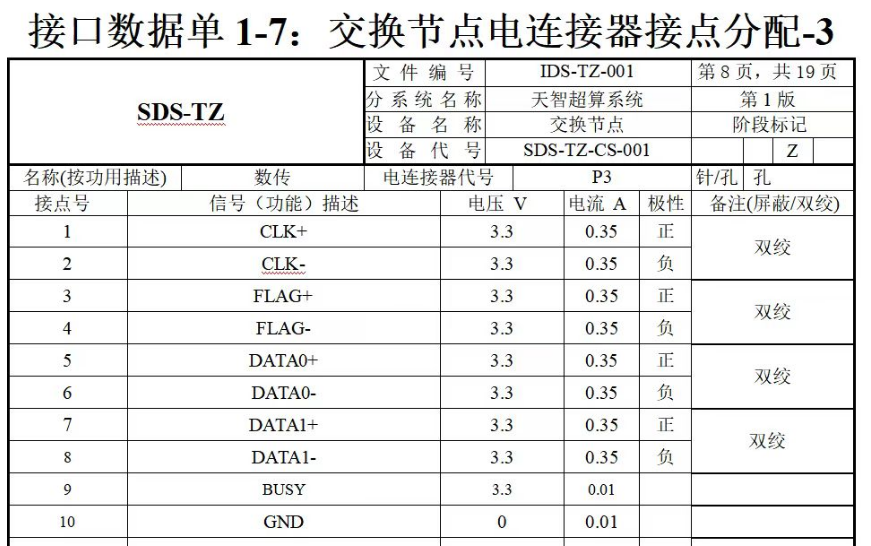
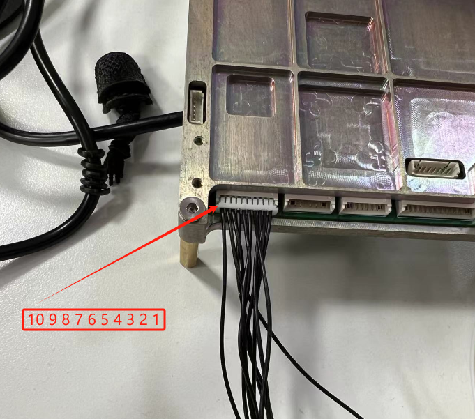

# 客户开发板

**启动模式**

QSPI + EMMC

**系统文件存储**

| 存储位置  | 存储文件           | 说明                  |
| :-------- | ------------------ | --------------------- |
| FLASH：   | BOOT.bin           | fsbl、u-boot.elf、bit |
| mmcblk0p1 | uImage、system.dtb | 内核、设备树          |
| mmcblk0p2 | 根文件系统         | 解压rootfs.tar.gz     |


## 启动petalinux系统

1、首先通过JTAG把BOOT_uboot.bin烧写到FLASH

2、启动u-boot，并配置u-boot网络

```shell
setenv ipaddr 192.168.0.10
setenv serverip 192.168.0.1
saveenv
```

3、通过TFTP下载内核文件

```shell
## 下载rmdisk(INITRD)
tftpboot 0x10000000 image.ub

## 指定地址传输
tftpboot 0x10000000 192.168.3.110:image.ub

## 写入FLASH （前提：地址下有文件）
sf write 0x10000000 0 ${filesize}

## 启动rmdisk
bootm 0x10000000
```

4、配置linux网络

```shell
ifconfig eth0 192.168.0.10 netmask 255.255.255.0
```

5、烧录根文件系统、内核、设备树

```shell
## 下载内核
tftp -g -r uImage 192.168.0.1

## 下载根文件系统
tftp -g -r rootfs.tar.gz 192.168.0.1

## 下载设备树
tftp -g -r system.dtb 192.168.0.1
```

**说明：**

mmcblk0p1：uImage、system.dtb

mmcblk0p2：rootfs.tar.gz

6、配置启动指令

首先换新的BOOT.BIN，然后设置如下指令

```shell
## 添加指令
setenv my_emmc_boot "mmc dev 0:1 && load mmc 0:1 0x10000000 /uImage && load mmc 0:1 0x11000000 system.dtb && bootm 0x10000000 - 0x11000000"

## 将bootcmd的命令修改成my_emmc_boot
setenv bootcmd "run my_emmc_boot" 

## 保存环境变量
saveenv

## 重新加载u-boot
reset
```


# zc706开发板

## ubuntu点亮LED

### **使用 `libgpiod` 工具**

```shell
sudo apt-get update
sudo apt-get install gpiod
```

**使用 `gpiod` 控制 GPIO**

通过 `gpiodetect` 命令查看系统中可用的 `gpiochip`

```shell
gpiodetect

##输出
root@ubuntu-arm-zynq:/home/user# gpiodetect
gpiochip0 [zynq_gpio] (118 lines)
gpiochip1 [/amba_pl/gpio@41200000] (2 lines)
```

设置 GPIO 为输出并输出高电平

```shell
## 控制gpiochip1的引脚1为高电平
sudo gpioset gpiochip1 0=1
```

查询引脚状态

```shell
gpioget gpiochip1 0
```


### 传统方法

1、导出 GPIO 引脚

首先需要将要操作的 GPIO 引脚“导出”到用户空间。例如，要导出 GPIO 引脚 10：

```shell
echo 904 > /sys/class/gpio/export
```

**设置方向为输出**

设定 GPIO 引脚为输出模式：

```shell
echo out > /sys/class/gpio/gpio904/direction
```

**设置高电平**

将 GPIO 引脚 10 设置为高电平：

```shell
echo 1 > /sys/class/gpio/gpio904/value
```

**恢复 GPIO 引脚为输入**

如果想恢复 GPIO 引脚为输入模式：

```shell
echo in > /sys/class/gpio/gpio904/direction
```

**取消导出**

完成操作后，可以通过以下命令取消导出 GPIO 引脚：

```shell
echo 904 > /sys/class/gpio/unexport
```


### 使用C代码实现闪烁

实现具体步骤

**导出GPIO引脚：** 首先需要将GPIO引脚导出到用户空间，这可以通过将GPIO编号写入 `/sys/class/gpio/export` 文件来实现。

**设置引脚方向：** 导出后，需要将引脚的方向设置为输出，写入 `out`。

**控制引脚值：** 通过向引脚的值文件写入 `1` 或 `0` 来设置高低电平，实现闪烁效果。

```c
#include <stdio.h>
#include <unistd.h>
#include <fcntl.h>
#include <string.h>

#define GPIO_PIN "904" // 将此替换为实际的GPIO编号 (gpiochip1的0号引脚，根据基地址计算得出)
#define GPIO_PATH "/sys/class/gpio/gpio" GPIO_PIN "/"
#define EXPORT_PATH "/sys/class/gpio/export"
#define DIRECTION_PATH GPIO_PATH "direction"
#define VALUE_PATH GPIO_PATH "value"

void writeToFile(const char *file, const char *value) {
    int fd = open(file, O_WRONLY);
    if (fd == -1) {
        perror("无法打开文件");
        return;
    }
    write(fd, value, strlen(value));
    close(fd);
}

int main() {
    // 步骤1：导出GPIO
    writeToFile(EXPORT_PATH, GPIO_PIN);

    // 步骤2：将GPIO方向设置为输出
    usleep(100000); // 等待GPIO准备好
    writeToFile(DIRECTION_PATH, "out");

    // 步骤3：让GPIO引脚闪烁
    while (1) {
        // 设置GPIO为高电平
        writeToFile(VALUE_PATH, "1");
        usleep(500000); // 延迟500毫秒

        // 设置GPIO为低电平
        writeToFile(VALUE_PATH, "0");
        usleep(500000); // 延迟500毫秒
    }

    return 0;
}
```


## CAN接口

为了使用CAN，需要下载CAN的 [工具包](https://xilinx-wiki.atlassian.net/wiki/spaces/A/pages/18842496/Linux+CAN+driver?preview=/18842496/18848715/zynq_canutils.rar)，将canutils_install目录复制到开发板，libskt_install文件夹中的libsocketcan.so.2.2.0复制到开发板的lib目录下，并建立软链接:ln -s libsocketcan.so.2.2.0 libsocketcan.so.2;

### 配置CAN

在发行版Linux中可以使用以下一些命令：

```shell
## 设置can0的波特率，这里设置为100kbps
sudo ip link set can0 type can bitrate 100000

## 设置波特率并打开can
sudo ip link set can0 up type can bitrate 100000

## 设置can0为回环模式，自发自收
sudo ip link set can0 up type can loopback on

## 设置完成后可以通过以下命令查询can0设备的参数
sudo ip -details link show can0

## 在设备工作中，可以使用下面的命令来查询工作状
sudo ip -d -s link show can0

## 打开can设备
ifconfig can0 up

## 关闭can0设备
fconfig can0 down
```

### CAN测试程序：

**CAN发送程序**

```c++
#include "unistd.h"
#include "net/if.h"
#include "sys/ioctl.h"
#include "linux/can/raw.h"
#include "linux/can.h"
#include "sys/socket.h"
#include <iostream>
#include <stdlib.h>
#include <string.h>
#include <stdio.h>
 
using namespace std;
 
int main()
{
	cout<<"test for can socket send!"<<endl;
 
	int s, nbytes;
	struct sockaddr_can addr;
	struct ifreq ifr;
	struct can_frame frame[2];
	s = socket(PF_CAN, SOCK_RAW, CAN_RAW);//create CAN socket
	strcpy(ifr.ifr_name, "can0");
	ioctl(s, SIOCGIFINDEX, &ifr);	//can0 device
	addr.can_family = AF_CAN;
	addr.can_ifindex = ifr.ifr_ifindex;
	bind(s, (struct sockaddr*)&addr, sizeof(addr));//bind socket to can0
 
	//disable filter
	setsockopt(s, SOL_CAN_RAW, CAN_RAW_FILTER, NULL, 0);
	//two frame
	frame[0].can_id = 0x11;
	frame[0].can_dlc = 1;
	frame[0].data[0] = 'A';
	frame[1].can_id = 0x22;
	frame[1].can_dlc = 1;
	frame[1].data[0] = 'B';
	for(int i = 0; i<10; i++)
	{
        cout<<"send can frame"<<endl;
        nbytes = write(s, &frame[0], sizeof(frame[0]));//send frame[0]
        if(nbytes != sizeof(frame[0]))
        {
            cout<<"Send error frame[0]"<<endl;
        }
        sleep(1);//wait 1s
        nbytes = write(s, &frame[1], sizeof(frame[1]));//send frame[0]
        if(nbytes != sizeof(frame[1]))
        {
            cout<<"Send error frame[1]"<<endl;
        }
        sleep(1);//wait 1s
	}
	close(s);
	cout<<"send can frame over!!!"<<endl;
 
	return 0;
}
```

**CAN接收**

```c++
#include "unistd.h"
#include "net/if.h"
#include "sys/ioctl.h"
#include "linux/can/raw.h"
#include "linux/can.h"
#include "sys/socket.h"
#include <iostream>
#include <stdlib.h>
#include <string.h>
#include <stdio.h>
 
using namespace std;
 
int main()
{
	cout<<"test for can socket!"<<endl;
 
	int s, nbytes;
	struct sockaddr_can addr;
	struct ifreq ifr;
	//receive frame which id==0x11
	struct can_filter rfilter;
	struct can_frame frame;
	s = socket(PF_CAN, SOCK_RAW, CAN_RAW);
	strcpy(ifr.ifr_name, "can0");
	ioctl(s, SIOCGIFINDEX, &ifr);
	addr.can_family = AF_CAN;
	addr.can_ifindex = ifr.ifr_ifindex;
	bind(s, (struct sockaddr *)&addr, sizeof(addr));
 
	rfilter.can_id = 0x11;
	rfilter.can_mask = CAN_SFF_MASK;
	setsockopt(s, SOL_CAN_RAW, CAN_RAW_FILTER, &rfilter, sizeof(rfilter));
	while(1)
	{
        nbytes = read(s, &frame, sizeof(frame));
        if(nbytes > 0)
        {
        printf("ID=0x%0x DLC=%d data[0]=0x%x\n", frame.can_id,
        	frame.can_dlc,frame.data[0]);
        }
	}
 
	return 0;
}
```

**CAN回环测试**

```c
#include <stdio.h>
#include <string.h>
#include <stdlib.h>
#include <unistd.h>
#include <fcntl.h>
#include <sys/ioctl.h>
#include <net/if.h>
#include <linux/can.h>
#include <linux/can/raw.h>

#define DEBUG    1

#define ERR_MSG(fmt, args...)    fprintf(stderr, fmt, ##args)
#ifdef DEBUG
    #define DBG_MSG(fmt, args...)    fprintf(stdout, fmt, ##args)
#else
    #define DBG_MSG(fmt, args...)
#endif

#ifndef PF_CAN
    #define PF_CAN 29
#endif

#ifndef AF_CAN
    #define AF_CAN PF_CAN
#endif

int main(int argc, char *argv[])
{
    int fd, ret, flag, len;
    char senddata[32] = "test";
    struct sockaddr_can addr;
    struct ifreq ifr;
    struct can_frame frame;
    socklen_t socket_len = sizeof(struct sockaddr_can);

    /* Create a socket with PF_CAN family, SOCK_RAW and CAN_RAW protocol */
    fd = socket(PF_CAN, SOCK_RAW, CAN_RAW); 
    if (fd < 0) {
        ERR_MSG("Open socket failed!\n");
        return fd;
    }

    /* Use can0 */
    strcpy((char *)(ifr.ifr_name), "can0");
    
    /* Get information */
    ret = ioctl(fd, SIOCGIFINDEX, &ifr);
    if (ret != 0) {
        ERR_MSG("SIOCGIFINDEX failed! ret:%d\n", ret);
        close(fd);
        return ret;
    }
    DBG_MSG("can0 can_ifindex = %x\n",ifr.ifr_ifindex);

    /* Disable loopback */
    flag = 0;
    ret = setsockopt(fd, SOL_CAN_RAW, CAN_RAW_LOOPBACK, &flag, sizeof(flag));
    if (ret != 0) {
        ERR_MSG("Set loopback disable failed! ret:%d\n", ret);
        close(fd);
        return ret;
    }
    DBG_MSG("Set can0 loopback disable\n");

    /* Disable receiving own message */
    flag = 0;
    ret = setsockopt(fd, SOL_CAN_RAW, CAN_RAW_RECV_OWN_MSGS, 
               &flag, sizeof(flag));
    if (ret != 0) {
        ERR_MSG("Disable receiving own message failed! ret:%d\n", ret);
        close(fd);
        return ret;
    }
    DBG_MSG("Disable receiving own message\n");

    /* Use AF_CAN protocol family */
    addr.can_family = AF_CAN;
    addr.can_ifindex = ifr.ifr_ifindex;
    
    /* Binding socket */
    ret = bind(fd, (struct sockaddr*)&addr, sizeof(addr));
    if (ret != 0) {
        ERR_MSG("Bind socket failed! ret:%d\n", ret);
        close(fd);
        return ret;
    }
    DBG_MSG("Bind can0 socket\n");

    frame.can_id = 0x123;
    len = strlen(senddata);
    
    while (1) {
        strncpy((char *)frame.data, senddata, len);
        frame.can_dlc = len;
        ret = sendto(fd, &frame, sizeof(struct can_frame), 0, (struct sockaddr*)&addr, sizeof(addr));
        if (ret > 0) {
            DBG_MSG("Send success: [%s], ret=%d\n", senddata, ret);
            ret = recvfrom(fd, &frame, sizeof(struct can_frame), 0, (struct sockaddr *)&addr, &socket_len);
            if (ret > 0) {
                DBG_MSG("Recv message: [%s], ret=%d\n", frame.data, ret);
            }
        }
        usleep(500000);
    }

    return 0;
}
```


在ramdisk文件系统中，复制canutils_install到系统目录中，进入canutils_install目录，使用sbin目录下的工具:

设置can0的波特率:./canconfig can0 bitrate 100000
启动can0:./canconfig can0 start
关闭can0: ./canconfig can0 stop
设置回环模式: ./canconfig can0 ctrlmode loopback on
发送can数据: ./cansend can0 -i 0x14
接收can数据: ./candump can0


## PL与PS数据交互

在ubuntu使用devmem指令

```shell
## 安装 devmem（如果未安装）
sudo apt-get install busybox -y

## 创建符号连接
sudo ln -s /bin/busybox /usr/bin/devmem

## 使用 devmem 读取特定物理地址
sudo devmem <物理地址> <数据大小>
```

安装gcc编译器

```shell
sudo apt-get update

sudo apt-get install gcc -y
```

发送和接收都是16字节数据


**地址分配：**

PL写入数据到PS   0x1000_0000

PS反馈数据到PL  0x1000_1000	


指令tab补全 （需要在开发板操作）

```shell
## 安装bash-completion
sudo apt install bash-completion

## 启用 bash-completion
vim ~/.bashrc

if [ -f /etc/bash_completion ]; then
    . /etc/bash_completion
fi

## 重新加载 .bashrc 配置文件
source ~/.bashrc
```


**修改vim显示中文**

```shell
# 修改vimrc文件，文件路径：/etc/vim/vimrc
cd /etc/vim
vim vimrc

# 在vimrc文件末尾处添加
set fileencodings=utf-8,ucs-bom,gb18030,gbk,gb2312,cp936
set termencoding=utf-8
set encoding=utf-8
```


## LVDS验证

接线方式





| DATA0 | RO4  |
| ----- | ---- |
| FLAG  | RO3  |
| CLK   | RO2  |

写入DDR地址段：0x2000_0000 --- 0x2001_0000

使用data1进行测试


## Xenomai库安装

 安装make工具

sudo apt-get install build-essential -y


sudo apt-get install autoconf automake libtool -y


sudo apt-get install pkg-config libfuse-dev -y


./configure CFLAGS="-march=armv7-a -mtune=cortex-a8 -mfloat-abi=hard -mfpu=neon -ffast-math" --host=arm-linux-gnueabihf --with-core=cobalt --enable-smp 

————————————————

                            本文为博主原创文章，转载请注明出处https://blog.csdn.net/qq_22654551。如有问题，欢迎指正。

原文链接：https://blog.csdn.net/qq_22654551/article/details/106038163

# 问题


