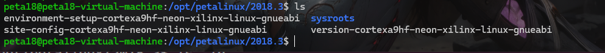
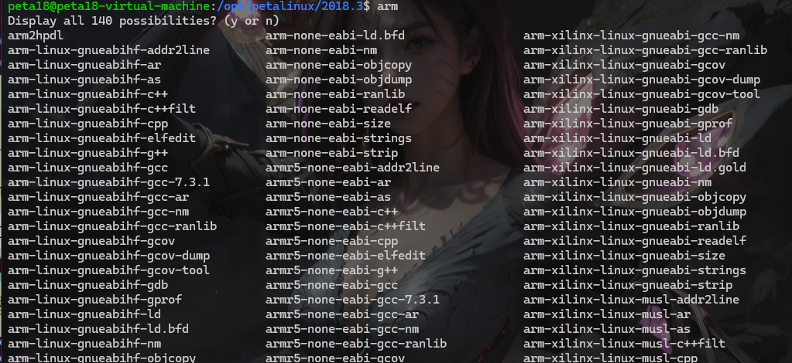
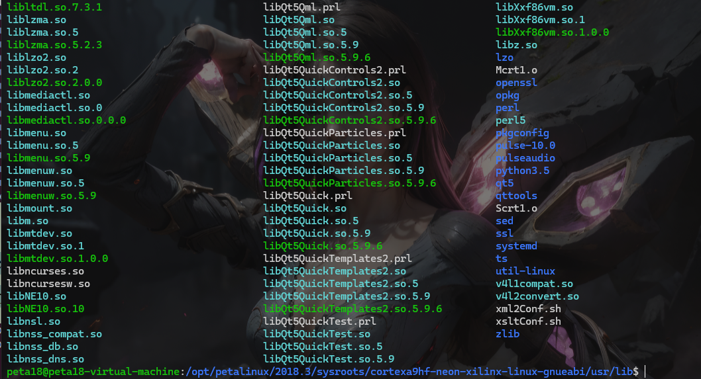
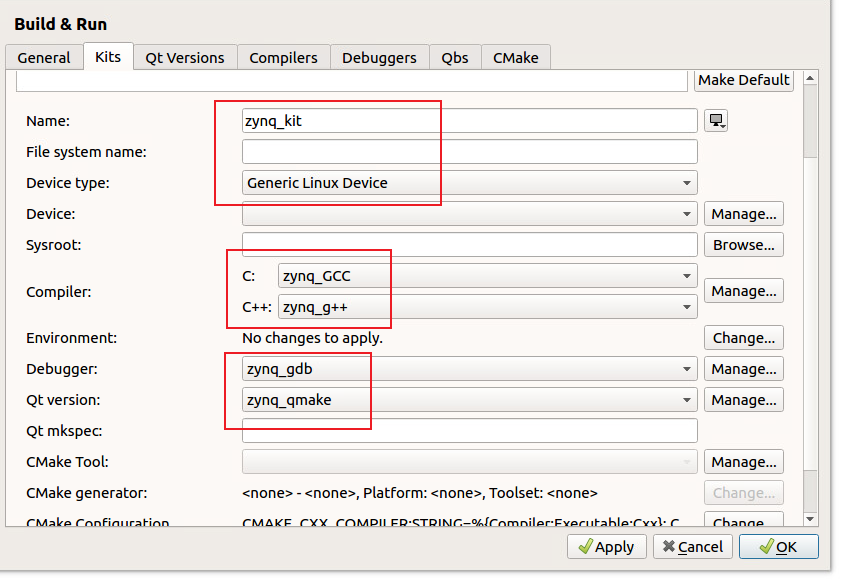

**zynq开发总结**

# 搭建QT开发环境

## 1、安装QT SDK

QT源码下载地址：http://download.qt.io/archive/qt/  

现成的包：路 径 [ 启 明 星 | 领 航 者 ]ZYNQ 开 发 板 资 料 盘 (A
盘)\4_SourceCode\ZYNQ_7010\3_Embedded_Linux\Qt&OpenCV\sdk  

安装完成之后，我们进入到安装目录下/opt/petalinux/2018.3 ，有以下几个文件

该目录下有一个环境变量配置文件 environment-setup-cortexa9hf-neon-xilinx-linux-gnueabi，每次使用之
前都需要使用 source 来运行这个配置文件，例如：
`source environment-setup-cortexa9hf-neon-xilinx-linux-gnueabi`  

当 Qt SDK 环境变量配置完成之后，我们可以在终端输入 arm，然后连按两次 TAB 键查看交叉编译相关的命令  

在 sysroots/cortexa9hf-neon-xilinx-linux-gnueabi/usr/lib 目录下有很多的库文件，其中就包含了 Qt 相关的链接库以及 OpenCV 相关的链接库文件  

## 2、安装QT Creator

安装包位置：`/home/peta18/QTqt-opensource-linux-x64-5.9.6.run`  

### 注意：

如果编译提醒make: c:command not found 以下一般可以解决

在QT文件夹下创建一个qt.sh文件，文件内容如下

```sh
source /opt/petalinux/2018.3/environment-setup-cortexa9hf-neon-xilinx-linux-gnueabi
/home/peta18/Qt5.9.6/Tools/QtCreator/bin/qtcreator.sh
```

使用 `sudo ./qt.sh`，来运行QT Creator

## 3、配置 Qt Creator

为了使用 Qt Creator 开发 ZYNQ 嵌入式 Linux Qt 程序，我们需要对其进行配置， 找到菜单栏 Tools-->Options，

### 3.1 配置 Compilers  

然后在点击左侧栏中的“build & Run”菜单栏，并且切换至“Compilers”配置项，  

为 Qt Creator 配置交叉编译工具；选择右边菜单 Add-->GCC-->C 配置 gcc 交叉编译工具  

在“Name”栏设置一个名字，例如“Zynq_gcc”，在“Compiler path”栏选择 gcc 交叉编译工具的路径  

路径为：`/opt/petalinux/2018.3/sysroots/x86_64-petalinuxlinux/usr/bin/arm-xilinx-linux-gnueabi/arm-xilinx-linux-gnueabi-gcc`  

配置完成之后点击下边的“Apply”按钮，接下来再次选择右边菜单 Add-->GCC-->C++配置 g++交叉编译工具 

路径为： `/opt/petalinux/2018.3/sysroots/x86_64-petalinuxlinux/usr/bin/arm-xilinx-linux-gnueabi/arm-xilinx-linux-gnueabi-g++`

### 3.2 配置 Debuggers

点击上边的 Debuggers 选项卡切换到该页面  

该配置项用于配置 Qt 程序的调试工具， 点击右边菜单 Add 添加新的 debugger  

路径为：`/opt/petalinux/2018.3/sysroots/x86_64-petalinuxlinux/usr/bin/arm-xilinx-linux-gnueabi/arm-xilinx-linux-gnueabi-gdb`

### 3.3 配置 Qt Versions

点击上边的 Qt Versions 选项卡切换到该页面，

点击右边 Add 按钮添加一个 qmake 工具，配置其名字以及路径等信息，当我们点击 Add 按钮的时候就会弹出 qmake 路径配置对话框  

路径为：`sdk 安装目录/sysroots/x86_64-petalinuxlinux/usr/bin/qt5/qmake`  

### 3.4 配置 Kits

点击上边的 Kits 选项卡切换到该页面

点击右边 Add 按钮添加新的 Kit  

在 Name 栏为 Kit 套件命名，例如 Zynq_kit  


# QT显示 控制LED

1、通过正点原子自带的vivado工程，导出的hdf文件，创建petalinux工程

2、内核和u-boot全部换为正点原子官方，修正过的源码

3、设置rootfs从SD启动，然后勾选上以下软件包

```shell
Filesystem Packages --->
	libs --->
		opencv --->
			[*] opencv // opencv
Filesystem Packages --->
	misc --->
		qtbase --->
			[*] qtbase // qt
			[*] qtbase-plugins // qt 相关插件
```

4、进入系统，后添加QT中文显示包

```bash
# 检查现有字体
ls /usr/share/fonts/ttf

# 下载字体包
下载网站：https://sourceforge.net/projects/wqy/files/wqy-microhei/0.2.0-beta/wqy-microhei-0.2.0-beta.tar.gz/

# 将下载好的字体，解压缩后放到以下目录
cp -rf wqy-microhei.ttc /usr/share/fonts/ttf

# 更新字体缓存
fc-cache -fv
```

5、设置 Qt 运行的环境变量  

```bash
export QT_QPA_PLATFORM=linuxfb
```

6、将生成的QT可执行文件，拷贝到开发板，然后执行

```bash
chmod +x Flowing_LED
./Flowing_LED
```


## 参考文档

【正点原子】ZYNQ Qt &amp;amp; OpenCV开发环境搭建.pdf


  