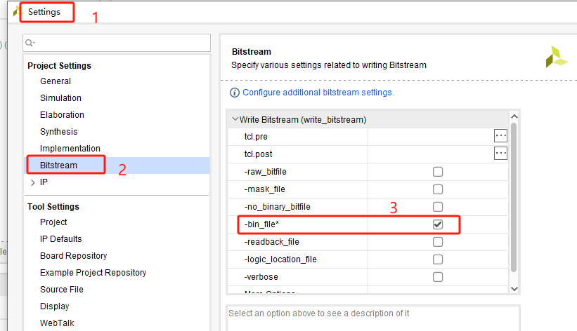
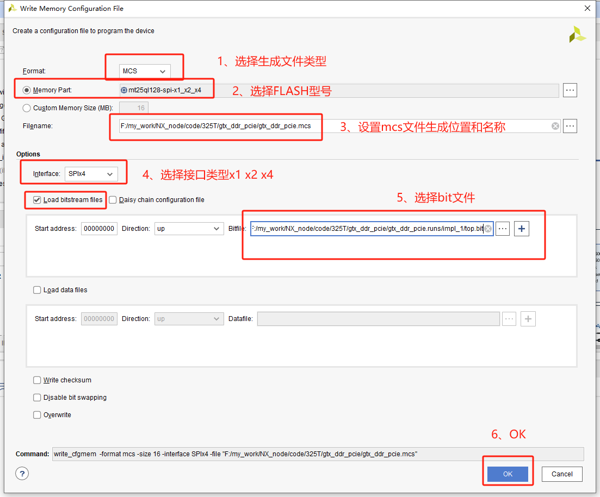
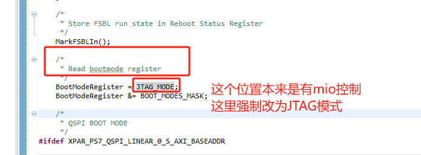
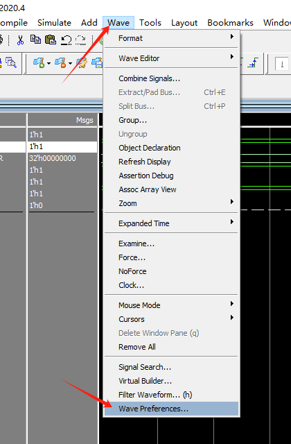
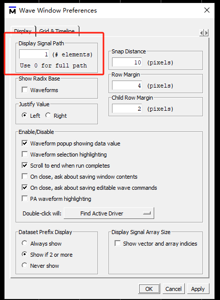
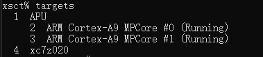

# petalinux安装：

**1、安装依赖项**

```shell
sudo apt-get install -y gcc git make net-tools libncurses5-dev tftpd zlib1g-dev libssl-dev flex bison libselinux1 gnupg wget diffstat chrpath socat xterm autoconf libtool tar unzip texinfo zlib1g-dev gcc-multilib build-essential zlib1g:i386 screen pax gzip
```

**2、修改.run文件的属性**

chmod a+x ppetalinux-v2019.2-final-installer.run

**3、安装petalinux安装到当前文件夹下的v2019.2里面**

./petalinux-v2019.2-final-installer.run ./petalinux

> 安装过程会弹出协议，按“q” 跳
>
> 过详情，然后输入“y” 表示同意协议内容

**4、修改到bash**

        查看：ls -lh /bin/sh （初始为dash）

        修改：sudo dpkg-reconfigure dash 然后跳出对话框，点击No即可

**5、运行环境变量**

        一次生效：在刚刚安装目录下面 source settings.sh

        永久生效：在home目录下打开.bashrc文件（如果没有Ctrl+H），在最后一行添加 source /home/ （你的目录） /settings.sh

# linux下vivado安装 卸载

**安装**

直接运行./xsetup

**卸载**

进入下面目录：

/2019.2/.xinstall/Vivado_2019.2

然后卸载

sudo ./xsetup -b Uninstall

**web安装**

linux安装vivado的时候需要提前安装好 ncurses库

打开终端

```shell
sudo apt install libncurses5
```


# vivado远程下载程序

**连接开发板的主机设置**

打开vivado安装路径， {vivado安装路径}\bin\hw_server.bat

**远程的主机设置**

打开Hardware Target，

选择Connect to Remote server，然后输入Host name：（目标主机ip），port：3121


# vivado烧写FLASH

## 一、通过BIN文件

**1、生成BIN文件**



**2、烧写BIN文件**

添加FLASH器件


## 二、通过MCS文件

**1、生成MCS文件**

打开创建存储配置文件窗口

Tools -> Generate Memory Configuration File…


配置生成文件




**2、烧写MCS文件**

同烧写BIN文件，只不过把BIN文件换成MCS文件


# 修改fsbl源码强制为JTAG模式

因为有时候zynq是QSPI启动的，但是切换为JTAG很麻烦，就需要借助外力来强制切换为JTAG启动模式（FSBL认为的，但实际上还是QSPI模式，只解决了烧写FLASH问题）

**错误截图：**


**解决：**

通过SDK或者VITIS创建fsbl工程，在main.c代码中找到一下内容




# ubuntu没网

Ubuntu上不了网：ifconfig查看只有lo,没有ens33问题解决参考方法

重新配置并启动ens33网卡，这样就可以找到了

```bash
sudo dhclient ens33
sudo ifconfig ens33
```


参考文献

https://blog.csdn.net/qq_41969790/article/details/103222251?spm=1001.2014.3001.5506


# modelsim关闭信号路径

modelsim一键关闭信号路径




# 更新powershell7

在powershell7终端，输入以下命令进行更新

```shell
winget upgrade --id Microsoft.PowerShell --source winget
```


# Github问题

**Github ping不通**

在本地hosts文件中加入IP地址。

hosts文件位于C:\Windows\System32\drivers\etc\hosts，打开hosts文件，在末尾添加如下IP：

```
140.82.112.4 github.com
140.82.114.4 www.github.com
199.232.5.194 github.global.ssl.fastly.net
54.231.114.219 github-cloud.s3.amazonaws.com
```


**Github不能clone**

```bash
# 设置 Git 使用本地代理
git config --global http.proxy http://127.0.0.1:7890
```


# 命令行下载zynq程序

1、打开对应版本的Xilinx Software Command Line Tool命令行


2、输入 connect 连接开发板


3、输入 targets 查找器件



可以看到能查到两大类器件：

​	1：代表PS端 

​		2：代表 ARM的0核

​		3：代表 ARM的1核

​	4：代表PL端

4、输入 targets 4 选择器件，首先下载bit文件

选择哪个器件之后，他的后面就会有一个星星  *


5、加载bit文件 

```bash
fpga F:/PS_PL_RW_wrapper.bit
```


6、加载elf文件

```bash
# 首先切换到PS的ARM0器件：	
targets 2

#加载PS相关的初始化文件
source ps7_init.tcl

#然后初始化PS
ps7_init

# 加载elf文件
dow ddr_rw.elf

# 运行程序
con 
```


7、其余命令

```bash
# 进行一些复位和初始化之类的操作
ps7_init

after 1000

psu_ps_pl_isolation_removal

after 1000

psu_ps_pl_reset_config

# 软复位命令
rst -processor
```


# 双系统设置默认启动项

在 GRUB 配置文件中，默认启动的系统可以通过菜单项编号来指定。步骤如下：

启动 Ubuntu 并打开终端：使用 Ctrl + Alt + T 打开终端。
编辑 GRUB 配置文件：在终端中输入以下命令：

```bash
sudo vim /etc/default/grub
```

修改 GRUB_DEFAULT：找到 GRUB_DEFAULT=0 这一行，将 0 修改为你希望默认启动项的编号。菜单项从 0 开始编号，例如 1 代表第二个选项。
更新 GRUB 配置：保存并关闭文件后，运行以下命令：

```bash
sudo update-grub
```


重启电脑，检查是否成功。

```bash
sudo reboot 
```


# 获取wallpaper壁纸

**1、进入github下载RePKG.zip**

```bash
## Github地址
https://github.com/notscuffed/repkg/releases/tag/v0.4.0-alpha
```


