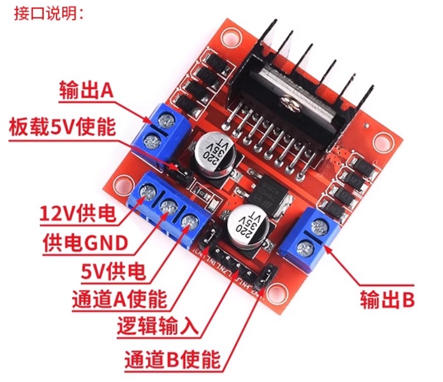
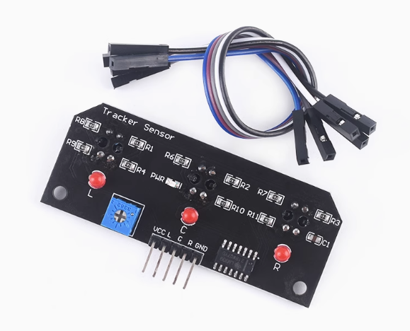
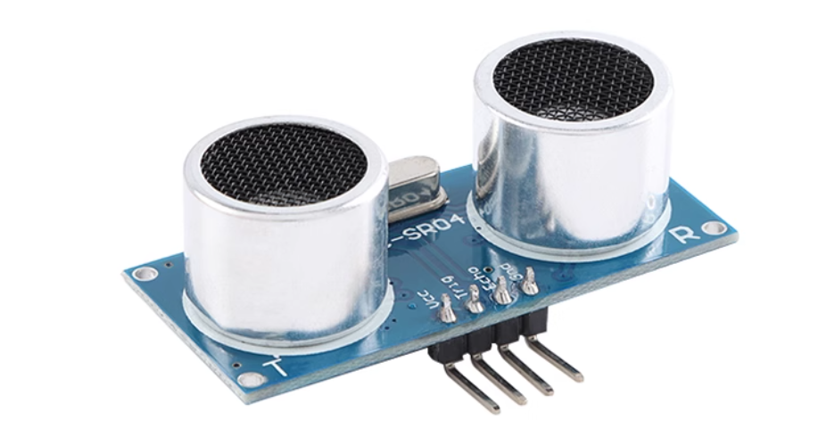
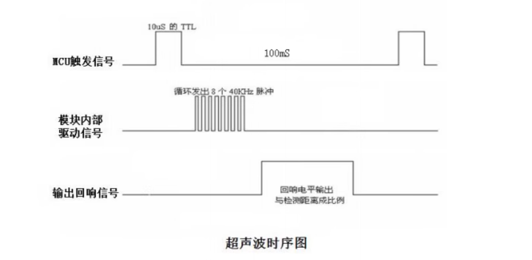
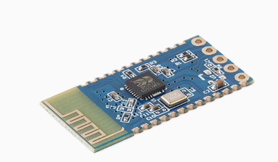
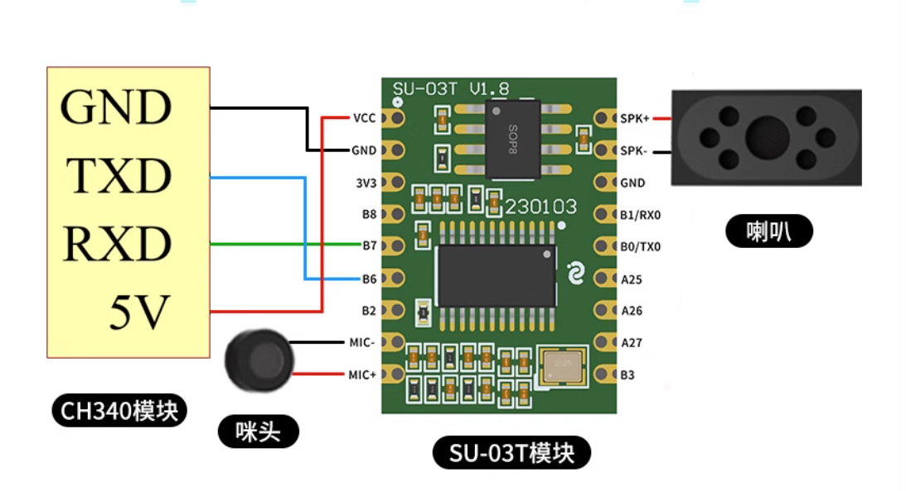
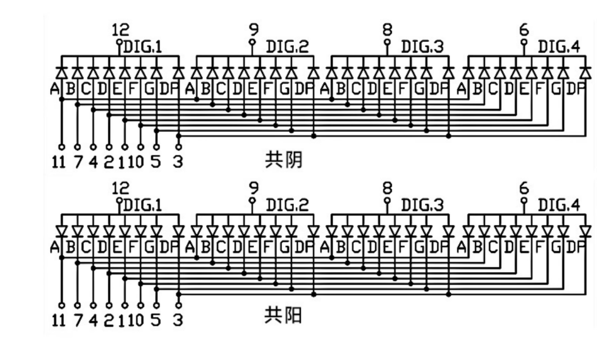

# 硬件清单

最初版本，后期可能更换

| 设备名称                            | 数量 | 价格 | 购买连接                                                     |
| ----------------------------------- | ---- | ---- | ------------------------------------------------------------ |
| FPGA Altera EP4CE6F17C8核心板开发板 | x1   | 85   | https://item.taobao.com/item.htm?_u=g2thtj1sf94a&id=821637015352&spm=a1z09.2.0.0.57422e8dzqTxxx |
| 电池模块                            | x1   | 21   | https://item.taobao.com/item.htm?_u=g2thtj1s2d49&id=673000296111&spm=a1z09.2.0.0.57422e8dzqTxxx |
| 红外寻迹模块                        | x3   | 10   | https://detail.tmall.com/item.htm?_u=g2thtj1s32c9&id=41251109967&spm=a1z09.2.0.0.57422e8dzqTxxx |
| 超声波测距模块                      | x1   | 5    | https://detail.tmall.com/item.htm?_u=g2thtj1sdb0c&id=41248598447&spm=a1z09.2.0.0.57422e8dzqTxxx |
| 电机驱动模块                        | x1   | 9    | https://detail.tmall.com/item.htm?_u=g2thtj1s4384&id=620782058816&spm=a1z09.2.0.0.57422e8dzqTxxx |
| 马达+轮胎                           | x4   | 13   | https://item.taobao.com/item.htm?id=610659174284&spm=tbpc.tborder.item.d_title610659174284.283c6bdbt21a7K |
| 蓝牙模块                            | x1   | 7    | https://item.taobao.com/item.htm?_u=g2thtj1s7083&id=583522167815&spm=a1z09.2.0.0.43432e8dlVu20m |


# 电机驱动模块

要想使马达和轮胎转动，不能只给电机高低电平，而是需要使用电机驱动模块去连接FPGA开发板和马达

本设计采用的电机驱动模块为：L298N直流电机驱动，此电机可以驱动两个马达，但是咱们使用的是四个马达，所以需要将一边的两个马达串联到一起接到电机驱动上，然后就可以实现控制四个马达了



**电机驱动模块原理：**

L298N是一款经典的双H桥电机驱动芯片，能够驱动两个直流电机或一个步进电机

**模块引脚说明**

**一、电源部分**

1. **12V/VCC**：电机驱动电压输入(5-35V)
2. **GND**：电源地
3. **5V**：输出5V(当使能跳线帽连接时)或5V输入(当断开跳线帽时)

**二、控制部分**

1. **ENA/ENB**：电机A/B使能端(PWM调速)
2. **IN1-IN4**：电机控制输入端：
   - IN1/IN2控制电机A
   - IN3/IN4控制电机B

**三、输出部分**

1. **OUT1-OUT4**：电机输出端：
   - OUT1/OUT2接电机A
   - OUT3/OUT4接电机B

通过控制Q1-Q4的通断组合（IN1-4），可以实现：

- 正转(Q1和Q4导通)
- 反转(Q2和Q3导通)
- 制动(Q1和Q2或Q3和Q4导通)
- 停止(所有Q断开)

**电机驱动模块使用说明：**

1、将5V电源接到电机驱动的12V供电和GND

2、将小车一边的电机交叉并联在一起，然后分别插到输出A的两个口，另一边类同

3、然后将FPGA的四个输出（flag1-4），分别接到逻辑输入的四个接口

**注意事项：**

- [x] 因为本次是5V供电，所以需要把板载5V使能打开
- [x] 5V电源的正极接到，12V供电的接口，负极接GND
- [x] 注意开发板需要和电机驱动共地

# 红外寻迹模块

本次红外寻迹模块采用的是一个三路红外寻组，并没有单独的使用红外寻迹模块，这样节省了一些线的连接，使我们的设计看起来更加精简和美观。



**红外寻迹原理：**

一个典型的红外寻迹模块由以下几部分组成：

1. **红外发射管(IR LED)**：发射红外光
2. **红外接收管(光电晶体管或光电二极管)**：接收反射的红外光
3. **比较器电路**：将接收信号转换为数字信号
4. **输出接口**：将检测结果输出给控制器
5. 通过多个传感器的输出组合可以判断轨迹线的位置和方向

**工作原理示意图：**

[红外发射管] → 发射红外光 → 地面反射 → [红外接收管] → 信号处理 → 数字输出

- 当反射光强(白色表面)→输出低电平(0)

- 当反射光弱(黑色表面)→输出高电平(1)

**红外寻迹模块使用方法：**

1、给红外寻迹模块3.3V供电和GND

2、分别将L、G、R接到FPGA的输出端口，en1-3上

3、将红外寻迹模块，固定到小车的前方第一层的下面，带针脚的朝向开发板

**注意事项：**

- [x] 将红外寻迹模块，放到小车上的时候，尽量离地面近一点，保证采集的更加准确
- [x] 红外寻迹模块的GDN要与开发板共地
- [x] 小车测试地图的黑条宽度不能超过L和R的距离，但是也不要太短


# 超声波测距模块

本次设计的超声波测距模块采用的是HC-SR04，然后外接一个自己设计的超声波测距模块支架，放到第二层的前面，用胶枪固定即可。



**超声波模块工作原理：**

**模块引脚说明**

1. **VCC**：2.8-5.5V电源输入
2. **Trig**：触发控制信号输入
3. **Echo**：回响信号输出
4. **GND**：地线

**工作原理图解**

```
[FPGA] --Trig脉冲--> [HC-SR04] --超声波发射--> 物体
                     ↑
[FPGA] <--Echo脉冲-- [HC-SR04] <--超声波反射-- 物体
```

**详细工作流程**

1. **触发阶段**：
   - 微控制器向Trig引脚发送至少10μs的高电平脉冲
   - 模块内部自动发出8个40kHz的超声波脉冲
2. **发射阶段**：
   - 超声波换能器发射一束40kHz的声波
   - 声波在空气中传播（声速约343m/s，25℃时）
3. **接收阶段**：
   - 如果前方有障碍物，声波会被反射
   - 模块接收器检测返回的声波
4. **信号输出**：
   - 模块通过Echo引脚输出高电平
   - 高电平持续时间与距离成正比：`距离 = (高电平时间 × 声速)/2`
   - 如果没有检测到回波，Echo会在约38ms后返回低电平（表示超出量程）

**时序图**



**超声波测距模块使用说明：**

1、将5V或者3.3V电源接到超声波模块的VCC和GND

2、Trig和Echo端口，分别接到FPGA的两个端口（名字一样）

3、将超声波模块安装到超声波模块支架，然后放到小车的第二层前方位置固定

**注意事项：**

- [x] 超声波模块必须和小车平行放置，保证测量距离最准确
- [x]  超声波模块的GDN要与开发板共地

# 蓝牙模块

本次设计的蓝牙模块采用的是蓝牙3.0模块 SPP透传 兼容HC-05的JDY-31，其采用的是六线制，支持蓝牙3.0，可以使用安卓手机和Windows电脑进行通信，暂时不支持和苹果手机进行通信



**蓝牙模块原理：**

**模块引脚说明**

1. **VCC**：3.3V电源输入(2.4-3.6V)
2. **GND**：电源地
3. **TXD**：模块串口发送端(接FPGA的RXD)
4. **RXD**：模块串口接收端(接FPGA的TXD)
5. **STATE**：连接状态指示(可选)
6. **EN**：使能引脚(高电平工作，低电平进入AT模式)

**工作原理图解**

```
[MCU] --UART--> [JDY-31] --BLE无线--> [手机/主机设备]
(TXD/RXD)        (蓝牙射频)
```

详细工作流程

1. **初始化阶段**：
   - 上电后模块自动进入广播状态
   - 默认名称"JDY-31"可被蓝牙设备扫描到
2. **配对连接**：
   - 手机/主机设备扫描并连接模块
   - 建立安全的GATT连接
   - 模块STATE引脚输出高电平(如果连接)
3. **数据传输**：
   - MCU通过UART发送数据→模块通过BLE转发给主机
   - 主机发送数据→模块通过UART转发给FPGA
   - 全双工透明传输，波特率可配置
4. **低功耗模式**：
   - 无连接时自动进入低功耗状态
   - 收到数据或主机连接请求时快速唤醒

**通信协议**

AT指令：

**查询版本指令：**AT+VERSION （可以通过这个指令查询串口连接是否正常，以及波特率是否正常）

**波特率设置指令：**AT+BAUD8，（4:9600,	8:115200）

**设置蓝牙昵称：**AT+NAMExiaoche，（设置蓝牙昵称为xioache）

**其他指令：**https://telesky.yuque.com/bdys8w/01/hao54g0d16drugbe?singleDoc#

与手机进行通信：

**采用串口232协议**进行通信，波特率115200


**蓝牙模块使用说明：**

1、将3.3V电源接到蓝牙模块的VCC和GND

2、串口的TX端口，分别接到FPGA的输入端口（rx_lanya）

3、将蓝牙模块放置到小车外面，使他可以和手机保持有效通信

4、安卓手机下载一个蓝牙调试助手 ，提前设置好指令和动作

**注意事项：**

- [x] 蓝牙模块必须放在小车外面，保证蓝牙正常通信，防止干扰
- [x] 蓝牙的GDN要与开发板共地
- [x] 调试的手机一定要是安卓手机，苹果手机不支持


# 语音模块

本设计采用的语音模块为：SU-03T系列芯片，喇叭采用的是内磁小喇叭扬声器8欧1瓦，拾音器采用的52DB电容式拾音器。

SU-03T是一款基于AI语音识别技术的低成本离线语音识别模块，广泛应用于智能家居、语音控制和物联网设备中，下面主要讲解他的原理和通信协议



**语音模块原理：**

**模块引脚说明**

1. **VCC**：3.3V电源输入(3.3-5V)
2. **GND**：电源地
3. **TXD**：模块串口发送端(接FPGA的RXD)
4. **RXD**：模块串口接收端(接FPGA的TXD)
5. **MIC+ **：外接拾音器正极
6. **MIC-**：外接拾音器负极
7. **SPK+**：外接扬声器正极
8. **SPK-**：外接扬声器负极

**工作流程详解**

1. **声波采集阶段**
   - 通过驻极体麦克风将声波转换为电信号
   - 信号经过低噪声放大器(LNA)放大
   - 24-bit ADC进行模数转换（采样率16kHz）
2. **语音预处理**
   - 自适应降噪算法（ANS）消除环境噪声
   - 回声消除（AEC）处理
   - 语音活动检测（VAD）区分人声与环境音
3. **特征提取**
   - 梅尔频率倒谱系数(MFCC)分析
   - 动态时间规整(DTW)匹配
   - 本地神经网络模型处理（非云端）
4. **指令匹配**
   - 与预烧录的35条指令词进行比对
   - 采用动态时间规整算法提高识别率
5. **输出控制**
   - 通过UART发送识别结果（ASCII格式）
   - 或直接通过GPIO/PWM输出控制信号

**通信方式**

采用串口通信方式，需要提前搭建好语音模块离线包，通过串口烧录进去

**语音包烧录方法：**

通过https://www.smartpi.cn/#/SdkVersionList这个官网下载一个烧录软件，然后烧录生成好的bin文件，一定要注意插上串口后，先烧录，然后再给语音模块上电，显示烧录完成，即可断电重启正常使用

**语音模块使用说明：**

1、将3.3V或者5V电源接到蓝牙模块的VCC和GND

2、串口的TX端口，分别接到FPGA的输入端口（rx_yuying）

3、将蓝牙模块放置到小车外面，使他可以接收语音通畅，但是不要接触到开发板

**注意事项：**

- [x] 语音模块必须放在小车外面，保证语音正常收音，防止干扰
- [x] 语音模块的GDN要与开发板共地
- [x] 调试的时候一定要用普通话，且声音洪亮，人尽量离小车近一点


# 数码管

12：sel[3]

11：seg[7]





# 最终注意事项

1、搬运小车的时候，一定要用双手拖住小车的中间部分

2、充电的时候，开发板不要上电，原理静电的地方，防止损坏小车

3、


# FPGA智能小车使用注意事项（客户指南）

感谢您选择我们的FPGA智能小车产品！为确保最佳使用体验和安全操作，请仔细阅读以下注意事项：

## 一、安全操作须知

1. **电源管理**
   - 使用配套的5V/2A电源适配器
   - 电池充满后请及时断开充电器（锂电池充满约3小时）
   - 禁止短路电源接口或反接极性
2. **运行环境**
   - 适用温度：0℃-40℃（避免阳光直射）
   - 保持地面平整干燥（最大爬坡角度≤15°）
   - 远离水池、楼梯等危险区域

## 二、模块协同工作说明

1. **语音控制模块(SU-03T)**
   - 有效识别距离：1-3米（环境噪音<50dB时）
   - 标准指令列表：
     - 唤醒小车：“你好小车”
     - 小车运动："前进"、"倒车"、"左转"、"右转"、"停车"
     - 模式选择："超声波避障"、"红外寻迹"、"正常模式"
   - 避免同时多人发出指令
2. **超声波避障(L298N驱动)**
   - 自动避障距离：20cm（可软件调节）
   - 最小检测盲区：3cm（此距离内可能无法检测障碍）
3. **蓝牙控制(JDY-31)**
   - 配对名称："FPGA_Car_XXXX"（后四位为设备ID）
   - 有效控制距离：室内8-10米/室外15-20米
   - APP操作需保持蓝牙常连状态

## 三、日常使用建议

1. **启动流程**

   ```
   1. 检查电源开关处于OFF状态
   2. 打开电源开关
   3. 连接充满的电池
   4. 等待语音模块初始化完成（红色LED常亮）
   5. 等待蓝牙模块初始化完成（红色LED常亮）
   6. 等待电机模块初始化完成（红色LED常亮）
   7. 正常使用小车即可
   ```

2. **充电保养**

   - 首次使用前请充满电
   - 每月至少完成一次完整充放电循环
   - 长期不用时保持电池电量在50%左右

3. **故障应急处理**

   | 现象       | 处理措施                             |
   | :--------- | :----------------------------------- |
   | 无响应     | 断电重启                             |
   | 语音不识别 | 查看接线是否松动，或者在其他运行模式 |
   | 异常发热   | 立即断电并联系售后                   |

## 四、FPGA系统特别注意事项

1. **程序更新**
   - 使用FPGA下载器连接JTAG接口
   - 仅支持.sof格式的配置文件
   - 烧录时保持小车静止
2. **硬件保护**
   - 避免静电接触FPGA芯片
   - 散热片温度可能达到60℃（正常工作情况）
   - 禁止私自拆卸核心控制板

## 五、客户支持信息

1. **保修条款**

   - 主机1月保修
   - 不包含人为损坏和私自改装

2. **技术咨询**

   - 服务热线：微信1975670198
   - 技术支持邮箱：[1975670198@qq.com]()
   - 在线文档：[www.fpgacar.com/docs/model-x](http://www.fpgacar.com/docs/model-x)

3. **配件清单确认**

   

   ```
   □ 智能小车主机 ×1
   □ 锂电池 ×1
   □ 充电器 ×1
   □ 使用手册 ×1
   ```

请妥善保管本指南，祝您使用愉快！如有任何异常情况，请立即停止使用并联系我们的客服团队。


