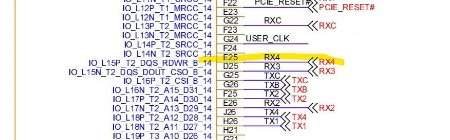

# 中北一号项目MS2612D

# 需求

在xdma_lvds基础上，改出一个这个协议的，帧长度固定896字节，帧内容不用管，由软件填充。只发送。有BUSY输入信号作为反压。

在洁净间中北1号那台机器上测试，BUSY信号从RX4信号上接入

# P701开发板引脚分配

lvds_clk：Yclk+

lvds_data0：X0+  

lvds_data1：X1+

lvds_gate：X2+

# nvidia开发板引脚分配

lvds_clk：13  TXC+  32 TXC-  33 GND

lvds_data0：10  TX1+  29  TX1-  30 GND

lvds_data1：28  TX2+  11  TX2-  12  GND

lvds_gate：31  TXB+  14  TXB-  15  GND

pressure：25  RX4+  8  RX4-  9  GND