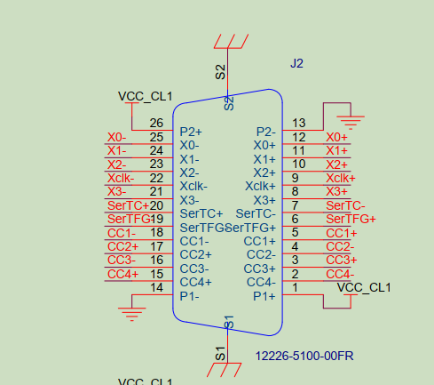

# 中北一号项目MS2612D

# 需求

在xdma_lvds基础上，改出一个这个协议的，帧长度固定896字节，帧内容不用管，由软件填充。只发送。有BUSY输入信号作为反压。

在洁净间中北1号那台机器上测试，BUSY信号从RX4信号上接入


# P701开发板引脚分配

lvds_clk：Yclk+

lvds_data0：X0+  

lvds_data1：X1+

lvds_gate：X2+



# nvidia开发板引脚分配

lvds_clk：13  TXC+  32 TXC-  33 GND

lvds_data0：10  TX1+  29  TX1-  30 GND

lvds_data1：28  TX2+  11  TX2-  12  GND

lvds_gate：31  TXB+  14  TXB-  15  GND


pressure：25  RX4   9  GND


# LVDS发送软件程序说明


在payload下面执行一下sudo ./install.sh


启动发送的步骤：

1. 将要发送的文件目录写入文件/dev/shm/payload_retrieve_params，注意是目录，不是文件。程序默认会发送该目录下最新的那个文件。例如echo "/mnt/data" > /dev/shm/payload_retrieve_params
2. 执行sudo systemctl start payload-retrieve.service。服务自动完成FPGA上电，加载bit，发送数据。结束后自动关闭FPGA。
3. 执行journalctl -u payload-retrieve.service查看过程日志


接收和发送都做成服务了。光纤那个也一眼。光纤的版本在https://gitee.com/maiar/ms2612a-src.git的payload下。安装方法一样。光纤的接收服务启动方式是
sudo systemctl start payload-store.service


安装前把payload/redist/default.bit换成你的bit，安装后也可以直接替换/opt/payload/default.bit文件


xdma驱动要换成最新版，这里面没包含驱动


接收的数据默认放在/var/opt/payload/in/下面。从/dev/shm/payload_store_bytes和/dev/shm/payload_retrieve_bytes分别可以看到已接收和已发送的字节数。


​	

```bash
# 重新加载服务
sudo systemctl stop payload-retrieve.service
sudo systemctl start payload-retrieve.service

# 生成测试数据
./gen_td_frame -h0x1ACFFC1D -s896 -n4194304 data.bin


# 定义目录
echo "/home/nvidia/wycArea/upfile" > /dev/shm/payload_retrieve_params

# 更新bit文件
sudo cp -rf ../top.bit /opt/SatService/payload/default.bit

# 查看日志
journalctl -u payload-retrieve.service -f


```

更新测试

```bash
sudo cp -rf data.bin /var/opt/SatService/DLFile/TDFile
```


测试方法变了，现在只要把文件复制到/var/opt/SatService/DLFile/TDFile/下就自动发送了，不用执行命令


