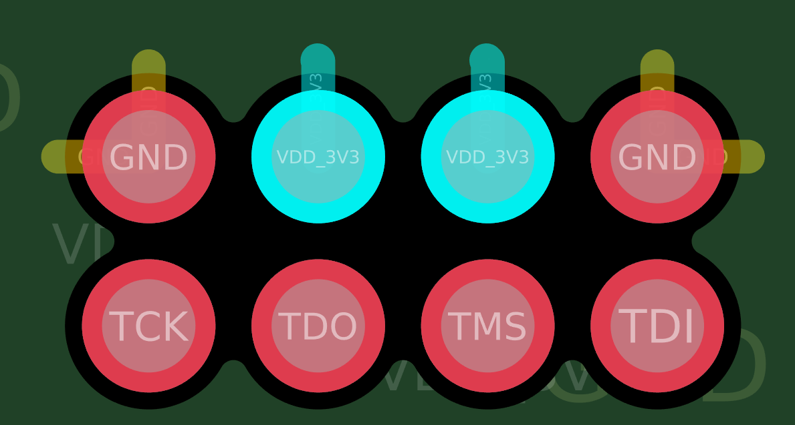
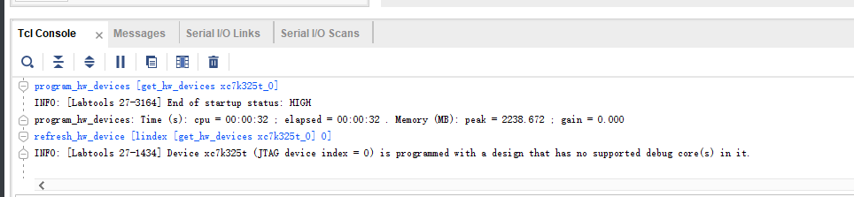

# 2025.2.6

**项目开始**

开发板电源：12V 3A

验证k7开发板，是否能检测到芯片，通过xilinx下载器+下载夹

下载夹子引脚说明：




并且可以成功下载bit文件



硬件连接图


## FTDI编程

通过FTDI软件把usb编程为下载器

首先连接usb到电脑，点击Find Devices，然后选择preset为JTAG-SMT2，然后点击Program，下载即可

然后下载就可以用vivado通过usb下载程序了


# 2025.4.8

## 完整的设备测试XDMA

### 启动下载FPGA

```bash
## 需要启动FPGA时，可通过以下命令执行
sudo systemctl start fpga

## 需要关闭FPGA电源时，通过以下命令
sudo systemctl stop fpga

## 查询是否启动FPGA
sudo systemctl status fpga

## 加载bit文件并运行的命令为
sudo load_fpga <bitstream file name>


```

### 远程调试FPGA

```bash
## 启动remote-jtag服务，以支持上位机远程访问。
sudo systemctl start remote-jtag

## 调试结束时，可关闭remote-jtag服务，解除对JTAG接口的占用：
sudo systemctl stop remote-jtag

## 上位机端（Windows）
## 以管理员运行CMD窗口
## 查询orin上的usbip设备
 ./usbip.exe list -r 192.168.1.151
Exportable USB devices
======================
 - 192.168.1.151
        1-3: Future Technology Devices International, Ltd : FT232H Single HS USB-UART/FIFO IC (0403:6014)
           : /sys/devices/platform/bus@0/3610000.usb/usb1/1-3
           : (Defined at Interface level) (00/00/00)
           :  0 - Vendor Specific Class / Vendor Specific Subclass / Vendor Specific Protocol (ff/ff/ff)

## 挂载设备到Windows
./usbip attach -r 192.168.1.151 -b 1-3

## 释放设备端口
./usbip detach -p 0
```

### XDMA读写数据

```bash
## 从DDR 0地址读取2048个数据到data_rd.bin文件
sudo ./dma_from_device -d /dev/xdma0_c2h_0 -a 0x00000000 -s 2048 -f data_rd.bin

## 存储datafile4K.bin内的数据，到DDR，从0地址开始存储
sudo ./dma_to_device -d /dev/xdma0_h2c_0 -a 0x00000000 -s 2048 -f datafile4K.bin

## 检查中断号
cat /proc/interrupts | grep xdma
285:   11197285          0          0          0          0          0          0          0   PCI-MSI 537395200 Edge      xdma
## 解释
285：中断号（IRQ 285）。
8855271：该中断已触发的次数（说明 FPGA 已经成功发送了中断）。
PCI-MSI 537395200 Edge：中断类型为 PCIe MSI（边缘触发）。

xdma：驱动名称（Xilinx DMA 驱动）。

## 查看中断的触发次数
watch -n 1 "cat /proc/interrupts | grep xdma"

## 查询寄存器状态
 sudo ./test_udma 2> log.log
```


### 测试流程

单独测试 xdma读写DDR  **没问题** ，功能为通过VIO触发读写，触发低有效，测试工程如下

`"F:\my_work\NX_Aruora\code\325T\325T_DDR_XDMA"`

单独测试 光纤 **没问题**，功能为：通过zc706发射光纤数据，进行收发测试，测试工程如下

`"F:\my_work\NX_Aruora\code\325T\325T_gtx2"`

`"F:\my_work\NX_Aruora\code\zc706\zc706_gtx2"`


# 2025.4.9

测试读取XDMA数据，LVDS发射

为了安全起见，不使用DDR，采用64KB的BRAM


