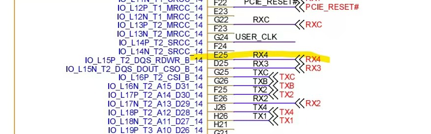
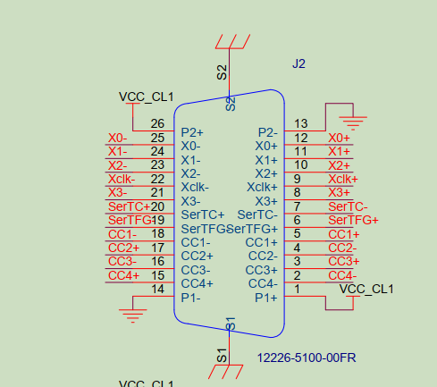

# 中北一号项目MS2612D

# 需求

在xdma_lvds基础上，改出一个这个协议的，帧长度固定896字节，帧内容不用管，由软件填充。只发送。有BUSY输入信号作为反压。

在洁净间中北1号那台机器上测试，BUSY信号从RX4信号上接入




# P701开发板引脚分配

lvds_clk：Yclk+

lvds_data0：X0+  

lvds_data1：X1+

lvds_gate：X2+



# nvidia开发板引脚分配

lvds_clk：13  TXC+  32 TXC-  33 GND

lvds_data0：10  TX1+  29  TX1-  30 GND

lvds_data1：28  TX2+  11  TX2-  12  GND

lvds_gate：31  TXB+  14  TXB-  15  GND


pressure：25  RX4   9  GND


# LVDS发送软件程序说明


在payload下面执行一下sudo ./install.sh


启动发送的步骤：

1. 将要发送的文件目录写入文件/dev/shm/payload_retrieve_params，注意是目录，不是文件。程序默认会发送该目录下最新的那个文件。例如echo "/mnt/data" > /dev/shm/payload_retrieve_params
2. 执行sudo systemctl start payload-retrieve.service。服务自动完成FPGA上电，加载bit，发送数据。结束后自动关闭FPGA。
3. 执行journalctl -u payload-retrieve.service查看过程日志


接收和发送都做成服务了。光纤那个也一眼。光纤的版本在https://gitee.com/maiar/ms2612a-src.git的payload下。安装方法一样。光纤的接收服务启动方式是
sudo systemctl start payload-store.service


安装前把payload/redist/default.bit换成你的bit，安装后也可以直接替换/opt/payload/default.bit文件


xdma驱动要换成最新版，这里面没包含驱动


接收的数据默认放在/var/opt/payload/in/下面。从/dev/shm/payload_store_bytes和/dev/shm/payload_retrieve_bytes分别可以看到已接收和已发送的字节数。


​	

```bash
# 重新加载服务
sudo systemctl restart payload-retrieve.service

# 生成测试数据
./gen_td_frame -h0x1ACFFC1D -s896 -n4194304 data.bin


# 定义目录
echo "/home/nvidia/wycArea/upfile" > /dev/shm/payload_retrieve_params

# 更新bit文件
sudo cp -rf ../top.bit /opt/SatService/payload/default.bit

# 查看日志
journalctl -u payload-retrieve.service -f

# 发送数据
sudo cp -rf data.bin /var/opt/SatService/DLFile/TDFile


```


测试方法变了，现在只要把文件复制到/var/opt/SatService/DLFile/TDFile/下就自动发送了，不用执行命令


# 不能使用Github

```bash
# 生成ssh秘钥  （连续三个回车）
ssh-keygen -t ed25519 -C "1975670198@qq.com"

# 查看秘钥 并添加到Github
cat ~/.ssh/id_ed25519.pub

# 强制 SSH 走 HTTPS 端口（443） 修改 ~/.ssh/config：
vim ~/.ssh/config
# 添加一下内容
Host github.com
  Hostname ssh.github.com
  Port 443
  User git
```


# LVDS回环接收程序


**LVDS的接收要用下降沿接收，发送的时候用上升沿进行发送**


# XDMA寄存器映射表

| 地址/偏移量 | 名称           | 方向 | 功能                                                         |
| ----------- | -------------- | ---- | ------------------------------------------------------------ |
| 0x00        | CONTROL        | W    | 控制寄存器，包括使能、复位等                                 |
| 0x04        | STATUS         | R    | 状态寄存器，包括复位状态、时钟状态等                         |
| 0x08        | IER            | W    | 中断控制寄存器，预留                                         |
| 0x0C        | ISR            | R    | 中断状态寄存器，预留                                         |
| 0x10~0x3C   | 保留           |      |                                                              |
| 0x40        | C2H_START      | R    | 接收缓冲区起始地址。目前作为FPGA的静态参数(parameter)，对软件是只读的。将来要考虑可通过软件设置。 |
| 0x44        | C2H_END        | R    | 接收缓冲区结束地址，该地址为最大写入地址+1，例如起始地址0x00000000，结束地址0x10000000，则可写入地址范围0x00000000~0x0FFFFFFF，即256MB。 |
| 0x48        | C2H_BUF_SIZE   | R    | 接收缓冲区的每一帧大小，单位为字节。例如0x400000，表示每帧缓冲区4MB，这也是允许的最大图像尺寸。 |
| 0x4C        | C2H_PC_NEXT    | W    | 接收数据读指针，表示软件下一次要读的帧的起始地址。软件每次读取一帧数据后，将C2H_RD_NEXT的新值写入。目前FPGA程序不使用这个指针，将来要考虑利用这个指针判断缓冲区是否已满，数据是否有溢出。 |
| 0x50        | C2H_FPGA_NEXT  | R    | 接收数据写指针，表示FPGA下一次要写入的帧的起始地址。FPGA每接收完一帧数据，将C2H_WR_NEXT的最新值更新。软件通过判断C2H_WR_NEXT的值，可以知道缓冲区中有多少数据。 |
| 0x54        | C2H_FRM_SIZE   | R    | 接收数据帧大小。单位为字节。FPGA将实际接收到的图像帧的大小更新到这个寄存器。软件可以读出，从而知道帧缓存中的实际数据大小。目前FPGA的帧大小采用静态参数，将来要考虑支持动态帧大小。 |
| 0x58        | C2H_FRM_WIDTH  | R    | 接收数据帧的宽度，单位为字节。                               |
| 0x5C        | C2H_FRM_HEIGHT | R    | 接收数据帧的高度，单位为行数。                               |
| 0x60~0x7C   | 保留           |      |                                                              |
| 0x80        | H2C_BUF_START  | R    | 发送缓冲区起始地址。                                         |
| 0x84        | H2C_BUF_END    | R    | 发送缓冲区结束地址。                                         |
| 0x88        | H2C_BUF_SIZE   | R    | 发送缓冲区每帧大小，单位为字节。                             |
| 0x8C        | H2C_RD_NEXT    | R    | 发送数据读指针。表示FPGA写一次要读取并发送的数据帧的起始地址。FPGA每发送一帧后，将H2C_RD_NEXT的值更新。 |
| 0x90        | H2C_FPGA_NEXT  | W    | 发送数据写指针。表示软件下一次要写入的帧的起始地址。FPGA通过比较软件写入的H2C_WR_NEXT和H2C_RD_NEXT，如果H2C_RD_NEXT != H2C_WR_NEXT，则读取一帧发送。 |
| 0x94        | H2C_FRM_SIZE   | W    | 发送数据帧大小，单位为字节。由软件将要发送的数据帧大小写入这个寄存器。其实FPGA程序仅使用FRM_WIDTH和FRM_HEIGHT就可以了，这里的FRM_SIZE预留用作以后实现动态数据位宽。 |
| 0x98        | H2C_FRM_WIDTH  | W    | 发送数据帧的宽度，单位为字节。由软件将要发送的行长度写入这个寄存器，FPGA按照这里给出的大小将数据组成AXI-Stream的一个个Packet。 |
| 0x9C        | H2C_FRM_HEIGHT | W    | 发送数据帧的高度，单位为行数。由软件将要发送的行数写入这个寄存器，FPGA按照这里给出的数值发送给定数量的Packet。 |
| 0xA0        | pressure_state | R    | LVDS反压信号标志和计数，其中最高位字节表示反压信号的值，后24位表示反压信号的计数 |
| 0xA0~0xBC   | 保留           |      |                                                              |


