# 2025.2.6

**项目开始**

开发板电源：12V 3A（FPGA），42V 3A（Orin）

验证k7开发板，是否能检测到芯片，通过xilinx下载器+下载夹

下载夹子引脚说明：


并且可以成功下载bit文件


硬件连接图


## FTDI编程

通过FTDI软件把usb编程为下载器

首先连接usb到电脑，点击Find Devices，然后选择preset为JTAG-SMT2，然后点击Program，下载即可

然后下载就可以用vivado通过usb下载程序了

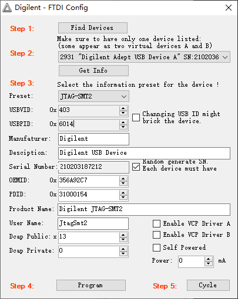


# 2025.2.7

## 测试zc706光口

使用Xilinx官方IP核ibert，**必须那光纤线连接来个光口**

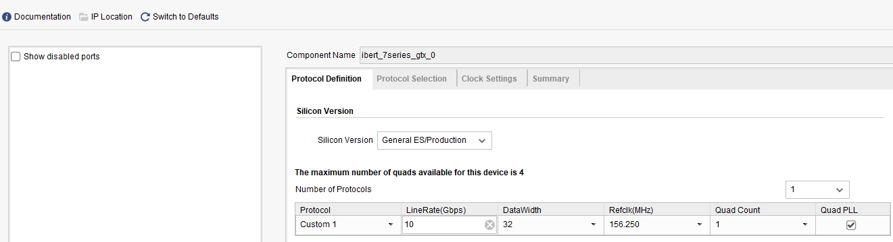

根据原理图查看SFP在BANK111，时钟在BANK112


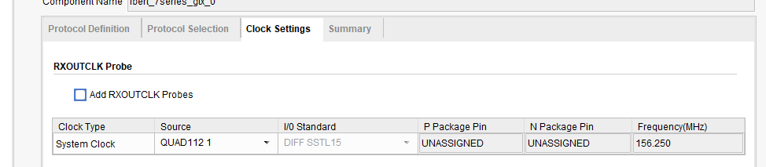

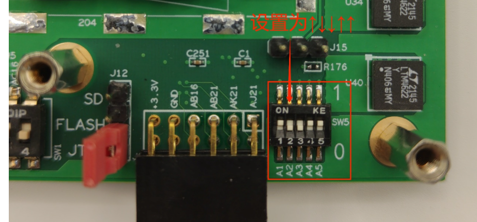

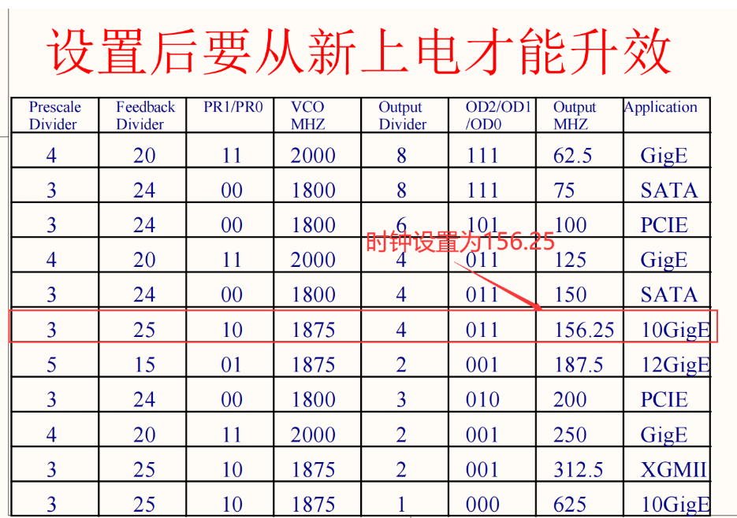


**参考文章：**

https://blog.csdn.net/mcupro/article/details/139740739

《1_【正点原子】Z100 ZYNQ之FPGA开发指南V1.0.pdf》


# 测试325T光口

光口连接方向

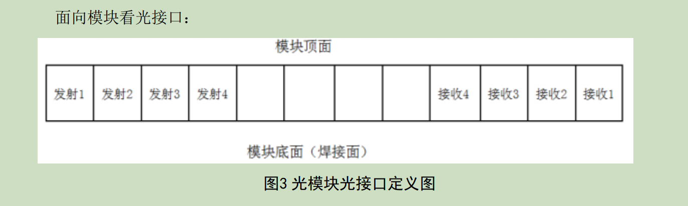


下载完bit后，需要手动添加link，然后把loopback mode改为Near-End PCS模式，然后点reset即可


**参考文献**

https://blog.csdn.net/u013184273/article/details/119136716


# 2025.2.8

测试zc706光纤自回环发射数据

根据之前的Aurora测试工程，需要修改输入时钟为差分时钟，按照如下设置之后，被分出来的时钟AUXCLK和USERCLK时钟频率相同，此处都是156.25M

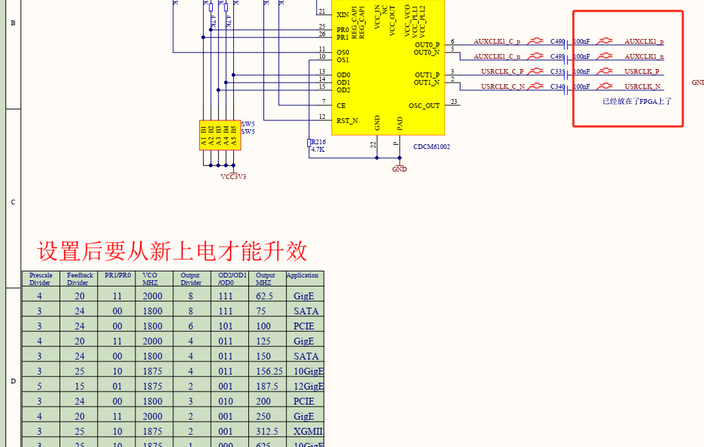

还需要添加SFP使能信号，一般为低电平有效，但是电路上添加了个取反电路，所以给使能信号为1，代表使能这个SFP


测试的发射数据和接收数据（同一个光纤口）


# 2025.2.14

## zc706联合325T测试Aurora

之前一直联不通，原因是光纤连接器，需要**定位针进行连接**才可以，配合zc706开发板进行测试

aurora64B66，5Gbps, x2模式

**连接完测试成功！！**


325T连接器连接方式：

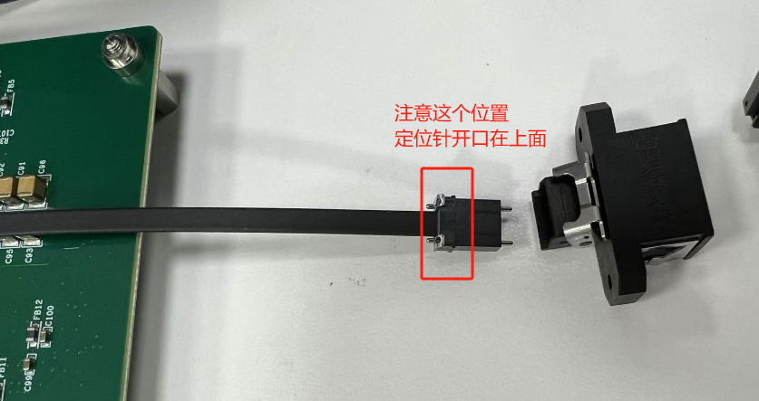


Aurora IP 配置信息如下

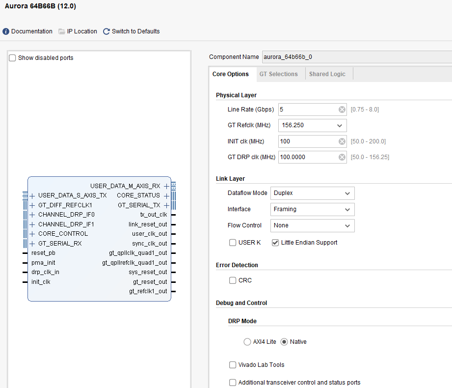

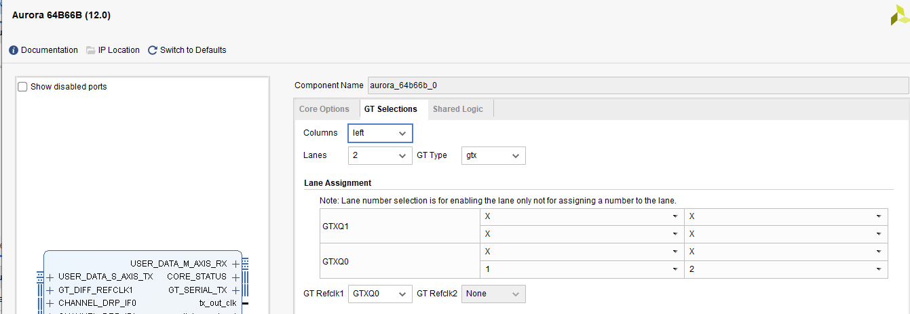

**测试结果**

发送的数据

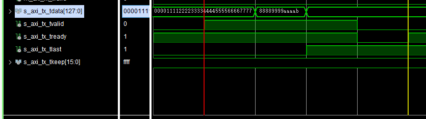

**接受数据**

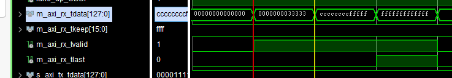

# 2025.2.18

# USBIP使用

使用USBIP对xilinx开发板，实现远程下载调试

配置介绍

**服务端**（orin）

```bash
## 安装usbip
# 解压linux-5.15.zip
# 进入usbip目录
cd linux-5.15/tools/usb/usbip/

#编译代码
sudo ./autogen.sh
sudo ./configure
sudo make install 

# 然后再src目录下就可以找到编译好的usbip和usbipd
# 重启后 就可以直接调用指令
# 创建符号链接
sudo ln -s /home/nvidia/FPGA/linux-5.15/tools/usb/usbip/libsrc/.libs/libusbip.so.0 /usr/lib/libusbip.so.0


## 使用usbip
# 两台机器都加载内核模块

# 加载内核模块:
sudo modprobe usbip-core
sudo modprobe usbip-host
sudo modprobe usbip-vudc  # 服务端非必须
sudo modprobe vhci-hcd
 
#打开服务端监听程序
sudo usbipd -D
 
#列出当前设备上存在的USB设备
sudo usbip list -l
 
#将设备绑定到 USBIP 服务上 -b后的内容 从上一步 list出的内容查看
sudo usbip bind -b 1-2.1      

#取消usb设备的bind挂载  id为bind挂载的usb设备id
sudo usbip unbind --busid=ID  
# 找到进程pid
ps aux | grep usbipd 
#  杀掉usbipd的进程 PID为上面找到的
kill PID   
```


**客户端（Windows）**

```bash
# 下载usbip工具
https://github.com/cezanne/usbip-win/releases
# 解压缩：usbip-win-0.3.6-dev.zip
# 进入文件夹，然后再cmd打开
# windows 初次运行需要执行安装命令：
.\usbip.exe install

# 然后执行挂载命令即可：
./usbip attach -r 192.168.5.49 -b 3-1
# 说明：
# 192.168.5.49：服务端ip
# 3-1：服务端usb端口号
```

**客户端（Linux）**

```bash
# 安装usbip
sudo apt install usbip
# 加载内核模块 （同服务端）

# 使用usbip
# 查询服务端有那些USBIP设备
sudo usbip list -r 192.168.3.145

# 然后执行挂载命令即可：
sudo usbip attach -r 192.168.3.145 -b 1-2.1

# 查看所有连接设备
sudo usbip port  

# 卸载设备 id为上方命令看到的id
sudo usbip detach --port=ID  
```


**遇到错误：**

```bash
## 问题1
nvidia@ubuntu:/usr/share$ sudo usbip list -l
usbip: error: failed to open /usr/share/hwdata//usb.ids

 - busid 1-1 (0bc8:5880)
   unknown vendor : unknown product (0bc8:5880)

 - busid 1-3 (0403:6014)
   unknown vendor : unknown product (0403:6014)
   
# 分析和解决
# hwdata 是一个包含硬件标识符数据库的软件包，主要用于存储和管理硬件设备的标识信息，例如 USB 设备的 Vendor ID 和 Product ID、PCI 设备的 ID 等。这些信息通常以文本文件的形式存储，供系统工具和应用程序使用。
# 安装上hwdata即可
sudo apt-get install hwdata

## 问题2
nvidia@ubuntu:~/FPGA/linux-5.15/tools/usb/usbip/src$ sudo usbipd -D
usbipd: error while loading shared libraries: libusbip.so.0: cannot open shared object file: No such file or directory

# 分析和解决
# 这个错误是因为系统找不到 libusbip.so.0 库文件
# 因为是源码安装的 需要创建一个符号链接 （修改为自己的路径）
sudo ln -s /home/nvidia/FPGA/linux-5.15/tools/usb/usbip/libsrc/.libs/libusbip.so.0 /usr/lib/libusbip.so.0  
```


参考文档：

https://zwc365.com/2024/03/06/usbip%E4%B8%8Evirtualhere%E4%BD%BF%E7%94%A8%E6%8C%82%E8%BD%BD%E8%BF%9C%E7%A8%8Busb%E8%AE%BE%E5%A4%87

https://blog.csdn.net/xiaojinglingfen/article/details/123445829

https://blog.csdn.net/yangbingzhou/article/details/44490239

https://www.cnblogs.com/young525/p/5873758.html

https://pluhuxc.github.io/2018/11/01/usbip.html

# 2025.2.19

今日任务

测试NX开发板DDR

遇到错误：

[Place 30-172] [Place 30-575] Sub-optimal placement for a clock-capable IO pin and PLL pair. If this sub optimal condition is acceptable for this design, you may use the CLOCK_DEDICATED_ROUTE constraint in the .xdc file to demote this message to a WARNING. However, the use of this override is highly discouraged. These examples can be used directly in the .xdc file to override this clock rule.

原因分析：

The IO port and PLL are not in same clock region hence you are seeing the error. 

解决办法：

将IO Ports送入的时钟信号通过IBUFDS，然后送入PLL，即可解决，本工程中因为采用的差分时钟输入，所以原语选用IBUFDS，生成的单端时钟送入PLL，PLL的时钟source选择 Global buffer，解决


# 2025.2.20

继续测试DDR，编写一个读写DDR整个地址块的程序员

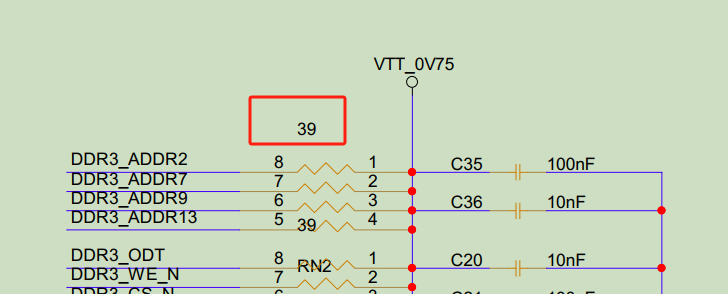

这个地方的39，对应MIG的IP核里面的

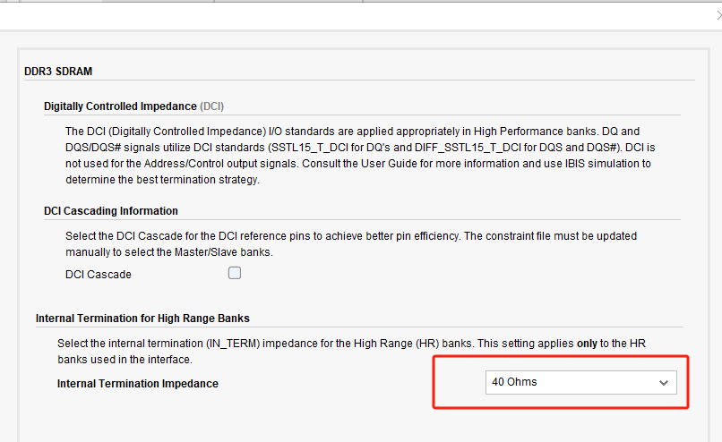

设置端口的差分终端属性DIFF TERM

set_property DIFF_TERM <true> [get_ports <ports>]

**启用差分终端：** 当你在 FPGA 中设计使用差分信号的接口时（例如 LVDS、TMDS 等），这些信号需要差分终端电阻来确保信号完整性，减少反射。使用 `set_property DIFF_TERM true` 可以在端口上启用这一特性。

**改善信号质量：** 对于高速差分信号，启用差分终端可以优化信号传输，减少信号丢失和反射，保证信号到达接收端时的质量。

# 2025.2.21

测试DDR完成，DDR在高速不能使用，只有在MIG为256位宽才可以使用

注意复位高低电平，一定要给对复位信号高电平或者低电平


## DDR总结：

**DDR型号：**

MT41K256M16-107  * 2


**引脚：**

sys_clk_p、sys_clk_n：AA10和AB10  （200Mhz）

其他引脚：F:\my_work\NX_node\code\325T\ddr_pin.ucf

**速度等级：**

MIG 的位宽必须是256


**DDR引脚说明：**

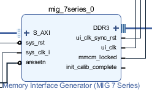

S_AXI：AXI数据总线

sys_rst：DDR系统复位（可以在MIG内设置高低电平有效，3.8节）

sys_clk_i：DDR系统时钟（可以由MIG里面进行配置,3.7节）

aresetn：AXI总线数据的复位

DDR3：DDR引脚接口

ui_clk_sync_rst：MIG输出的复位信号，一般配合ui_clk使用

ui_clk：MIG输出的时钟（可以由MIG进行配置，3.5节介绍，有个比例4:1或者2:1，来计算）

mmcm_locked：MIG内部时钟管理单元（MMCM）是否锁定的信号，为高（`1`）时，表示 MMCM 已经稳定工作并输出一个正确的时钟信号ui_clk。

init_calib_complete：内存控制器初始化是否完成的信号，为高（`1`）时，表示初始化过程已经完成


**测试工程说明：**

325T_DDR：通过vio控制读和写，写满DDR，然后再读DDR，然后进行对比，error表示对比错误，successful表示对比完成，且完全一致

mig_7series_0_ex：使用PLL分频得到的时钟（记得给PLL输入时钟添加buff）

mig_7series_2_ex：使用DDR专用时钟


# 2025.2.24

测试aurora + DDR


# 2025.2.25

继续测试aurora+ddr

zc706通过光纤发送测试数据给325T，325T接受后存到DDR，**测试完毕**

测试工程为："F:\my_work\NX_node\code\325T\gtx2_ddr"

此时功率可达到5W左右


测试aurora+ddr+xdma

工程编写完成，等待测试


# 2025.2.26

## 测试FLASH

FLASH可以烧写成功 并且校验正确

测试工程："F:\my_work\NX_node\code\325T\FLASH_TEST"


# 空天院开会内容

科大 中科卫星（甲方）

数据格式 不确定

不定长格式数据 （每次任务长度不一样）不一定是64B 

科大：张老师 

帧长度最大 64KB （没确定） 

Orin DDR ：16GB 

Aurora：采用stream模式 

数据最大上限 ：64GB 

数据先写到DDR 再向固态里存储 

两种模式 ：

Sar 开机 工作 告诉什么时候开始 什么时候结束  透传传输数据

给开始 给结束  指定参数 平台给 

平台告诉任务指令参数组 一个开始一个结束  他会把数据读出来给我们 会多一个握手信号，保证我们这边数据不会丢失  valid和ready进行握手 

对地数传

平台给任务指令 干什么读什么 会提前30s给，受反压控制，给他们吐数，每次送32KB，来一个反压信号 就给32，然后再判断反压信号  

最大数传带宽900M*2*0.8bps，最小50*0.8Mbps 其中900是不确定的 ，平台给的 

用户给某段数据进行回放，需要支持循环读取 

只需要接受他们的反压 ，不需要给他们反压信号，把我们当做一个磁盘来用


## 4.17内容更新

从空天院那边来的数据，帧大小也不定长，总数据量也不定长


发数据给空天院，就只需要把他当做一个FIFO，反压信号就相当 ~full信号，只要这个反压为1，就可以一直写，为0后，就不要写了


# 2025.2.27

和客户沟通，需要修改aurora ip 为stream模式，并且取消小端支持

设计思路：在zc706 通过一个按键，来触发数据发送，zc706按键一次发送32KB数据，通过Aurora传输到325T，325T接收到数据之后，存储到DDR，然后再从DDR读出来，通过Aurora回传给zc706


# 2025.2.28

zc706发送数据工程完成，"F:\my_work\NX_node\code\zc706\zc706_gtx2"


# 2025.2.28开发板硬件问题总结：

1、DDR不能跑高速时钟，只能在低速模式下进行测试

2、希望增加一个user clk ，方便以后测试，有源晶振50M

3、FLASH可以进行烧写，并校验通过，但是不能从FLASH进行启动

修复：M[2:0]的上拉或下拉电阻需要小于1k

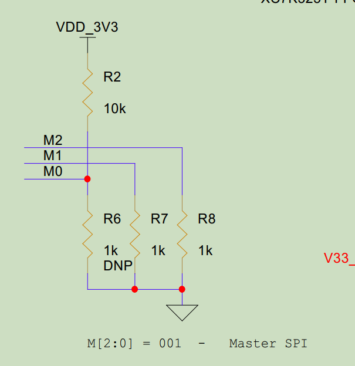

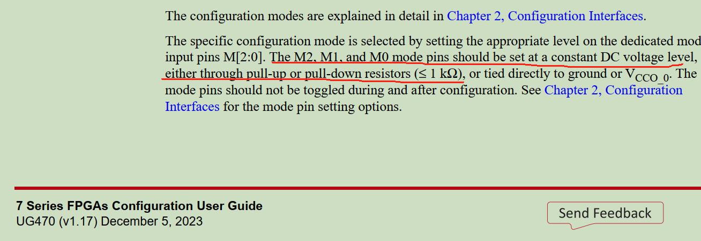

# 2025.3.24

修改High Range Banks为50Ohms也不行

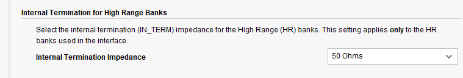


# 2025.3.26

测试光纤连接DDR程序，

由zc706通过光纤发送数据，然后325T接收到之后，存到DDR


# 2025.3.27

## XDMA测试


# 2025.4.8

# 完整的设备测试XDMA

### 启动下载FPGA

```bash
## 需要启动FPGA时，可通过以下命令执行
sudo systemctl start fpga

## 需要关闭FPGA电源时，通过以下命令
sudo systemctl stop fpga

## 查询是否启动FPGA
sudo systemctl status fpga

## 加载bit文件并运行的命令为
sudo load_fpga <bitstream file name>


```

### 远程调试FPGA

```bash
## 启动remote-jtag服务，以支持上位机远程访问。
sudo systemctl start remote-jtag

## 调试结束时，可关闭remote-jtag服务，解除对JTAG接口的占用：
sudo systemctl stop remote-jtag

## 上位机端（Windows）
## 以管理员运行CMD窗口
## 查询orin上的usbip设备
 ./usbip.exe list -r 192.168.1.151
Exportable USB devices
======================
 - 192.168.1.151
        1-3: Future Technology Devices International, Ltd : FT232H Single HS USB-UART/FIFO IC (0403:6014)
           : /sys/devices/platform/bus@0/3610000.usb/usb1/1-3
           : (Defined at Interface level) (00/00/00)
           :  0 - Vendor Specific Class / Vendor Specific Subclass / Vendor Specific Protocol (ff/ff/ff)

## 挂载设备到Windows
./usbip attach -r 192.168.1.151 -b 1-3

## 释放设备端口
./usbip detach -p 0
```

### XDMA读写数据

```bash
## 从DDR 0地址读取2048个数据到data_rd.bin文件
sudo ./dma_from_device -d /dev/xdma0_c2h_0 -a 0x00000000 -s 2048 -f data_rd.bin

## 存储datafile4K.bin内的数据，到DDR，从0地址开始存储
sudo ./dma_to_device -d /dev/xdma0_h2c_0 -a 0x00000000 -s 2048 -f datafile4K.bin
```


### 测试流程

单独测试 xdma读写DDR  **没问题** ，功能为通过VIO触发读写，触发低有效，测试工程如下

`"F:\my_work\NX_Aruora\code\325T\325T_DDR_XDMA"`

单独测试 光纤 **没问题**，功能为：通过zc706发射光纤数据，进行收发测试，测试工程如下

`"F:\my_work\NX_Aruora\code\325T\325T_gtx2"`

`"F:\my_work\NX_Aruora\code\zc706\zc706_gtx2"`


# 325T和zc706测试整体设计


## 一、325T接收客户数据存到Orin磁盘

此过程，采用zc706产生模拟数据，通过vio控制收发

测试完成，利用linux程序进行接收，然后存成.bin文件，发现数据没问题，

缺陷：linux程序，运行第一次，我发送数据，但是他收到第一针 就结束了，第二次运行就好了

 


## 二、325T发送数据给客户，并受客户的反压信号控制

接收Orin的数据，然后根据客户的反压信号，来判断是否通过光纤发给客户，要保证数据帧的完整性


