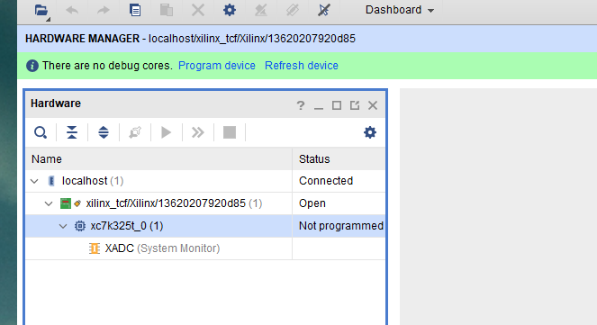
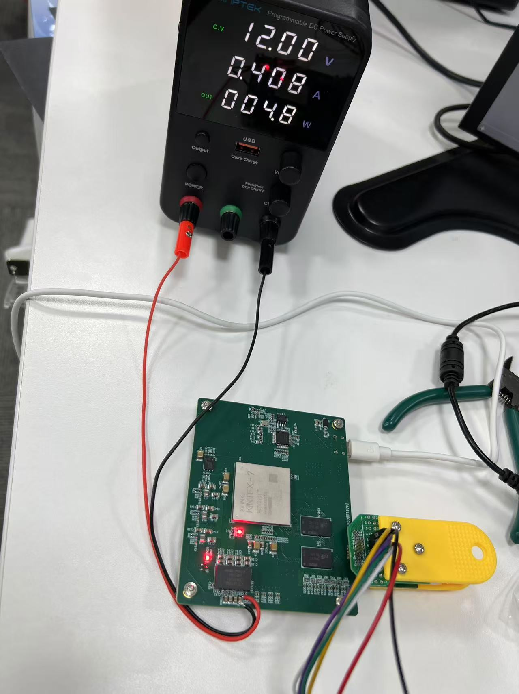
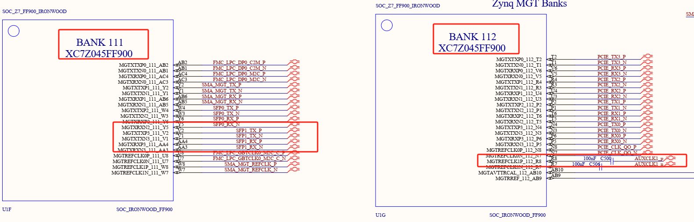
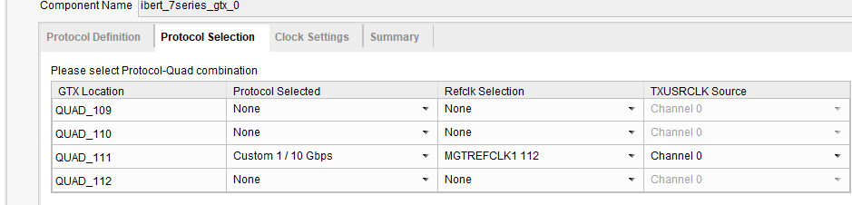
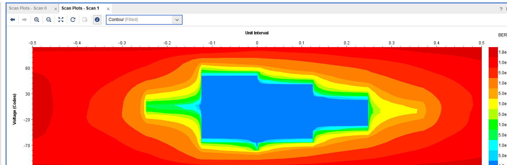
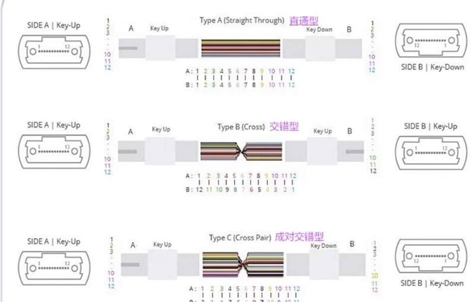
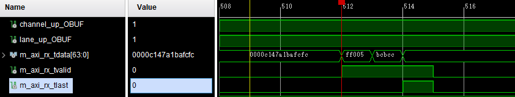
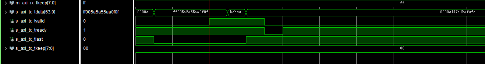

# 2025.2.6

**项目开始**

开发板电源：12V 3A

验证k7开发板，是否能检测到芯片，通过xilinx下载器+下载夹

下载夹子引脚说明：

并且可以成功下载bit文件

硬件连接图

## FTDI编程

通过FTDI软件把usb编程为下载器

首先连接usb到电脑，点击Find Devices，然后选择preset为JTAG-SMT2，然后点击Program，下载即可

然后下载就可以用vivado通过usb下载程序了

# 2025.2.7

## 测试zc706光口

使用Xilinx官方IP核ibert，**必须那光纤线连接来个光口**

根据原理图查看SFP在BANK111，时钟在BANK112

**参考文章：**

https://blog.csdn.net/mcupro/article/details/139740739

《1_【正点原子】Z100 ZYNQ之FPGA开发指南V1.0.pdf》

# 测试325T光口

光口连接方向

下载完bit后，需要手动添加link，然后把loopback mode改为Near-End PCS模式，然后点reset即可

**参考文献**

https://blog.csdn.net/u013184273/article/details/119136716

# 2025.2.8

测试zc706光纤自回环发射数据

根据之前的Aurora测试工程，需要修改输入时钟为差分时钟，按照如下设置之后，被分出来的时钟AUXCLK和USERCLK时钟频率相同，此处都是156.25M

还需要添加SFP使能信号，一般为低电平有效，但是电路上添加了个取反电路，所以给使能信号为1，代表使能这个SFP

测试的发射数据和接收数据（同一个光纤口）

