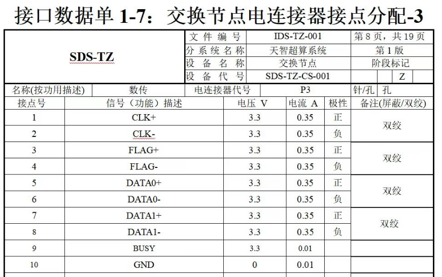

# 客户开发板

供电：5.2V  3A

Xenomai内核版本为4.14.36

**启动模式**

QSPI + EMMC

**系统文件存储**

| 存储位置  | 存储文件           | 说明                  |
| :-------- | ------------------ | --------------------- |
| FLASH：   | BOOT.bin           | fsbl、u-boot.elf、bit |
| mmcblk0p1 | uImage、system.dtb | 内核、设备树          |
| mmcblk0p2 | 根文件系统         | 解压rootfs.tar.gz     |


## 启动petalinux系统

1、首先通过JTAG把BOOT_uboot.bin烧写到FLASH

2、启动u-boot，并配置u-boot网络

```shell
setenv ipaddr 192.168.0.10
setenv serverip 192.168.0.19
saveenv
```

3、通过TFTP下载内核文件

```shell
## 下载rmdisk(INITRD)
tftpboot 0x10000000 image.ub

## 指定地址传输
tftpboot 0x10000000 192.168.0.11:image.ub

## 写入FLASH （前提：地址下有文件）
sf write 0x10000000 0 ${filesize}

## 启动rmdisk
bootm 0x10000000
```

4、配置linux网络

```shell
ifconfig eth0 192.168.0.10 netmask 255.255.255.0
```

5、烧录根文件系统、内核、设备树

```shell
## 下载内核
tftp -g -r uImage 192.168.0.1

## 下载根文件系统
tftp -g -r rootfs.tar.gz 192.168.0.1

## 下载设备树
tftp -g -r system.dtb 192.168.0.1
```

**说明：**

mmcblk0p1：uImage、system.dtb

mmcblk0p2：rootfs.tar.gz

6、配置启动指令

首先换新的BOOT.BIN，然后设置如下指令

```shell
## 添加指令
setenv my_emmc_boot "mmc dev 0:1 && load mmc 0:1 0x10000000 /uImage && load mmc 0:1 0x11000000 system.dtb && bootm 0x10000000 - 0x11000000"

## 将bootcmd的命令修改成my_emmc_boot
setenv bootcmd "run my_emmc_boot" 

## 保存环境变量
saveenv

## 重新加载u-boot
reset
```

```shell
## EXT4

mkfs.ext4 /dev/mmcblk0p2

## FAT32

mkfs.vfat /dev/mmcblk0p1
```


# UART-422 重构


# zc706开发板

## ubuntu点亮LED

### **使用 `libgpiod` 工具**

```shell
sudo apt-get update
sudo apt-get install gpiod
```

**使用 `gpiod` 控制 GPIO**

通过 `gpiodetect` 命令查看系统中可用的 `gpiochip`

```shell
gpiodetect

##输出
root@ubuntu-arm-zynq:/home/user# gpiodetect
gpiochip0 [zynq_gpio] (118 lines)
gpiochip1 [/amba_pl/gpio@41200000] (2 lines)
```

设置 GPIO 为输出并输出高电平

```shell
## 控制gpiochip1的引脚1为高电平
sudo gpioset gpiochip1 0=1
```

查询引脚状态

```shell
gpioget gpiochip1 0
```


### 传统方法

1、导出 GPIO 引脚

首先需要将要操作的 GPIO 引脚“导出”到用户空间。例如，要导出 GPIO 引脚 10：

```shell
echo 904 > /sys/class/gpio/export
```

**设置方向为输出**

设定 GPIO 引脚为输出模式：

```shell
echo out > /sys/class/gpio/gpio904/direction
```

**设置高电平**

将 GPIO 引脚 10 设置为高电平：

```shell
echo 1 > /sys/class/gpio/gpio904/value
```

**恢复 GPIO 引脚为输入**

如果想恢复 GPIO 引脚为输入模式：

```shell
echo in > /sys/class/gpio/gpio904/direction
```

**取消导出**

完成操作后，可以通过以下命令取消导出 GPIO 引脚：

```shell
echo 904 > /sys/class/gpio/unexport
```


### 使用C代码实现闪烁

实现具体步骤

**导出GPIO引脚：** 首先需要将GPIO引脚导出到用户空间，这可以通过将GPIO编号写入 `/sys/class/gpio/export` 文件来实现。

**设置引脚方向：** 导出后，需要将引脚的方向设置为输出，写入 `out`。

**控制引脚值：** 通过向引脚的值文件写入 `1` 或 `0` 来设置高低电平，实现闪烁效果。

```c
#include <stdio.h>
#include <unistd.h>
#include <fcntl.h>
#include <string.h>

#define GPIO_PIN "904" // 将此替换为实际的GPIO编号 (gpiochip1的0号引脚，根据基地址计算得出)
#define GPIO_PATH "/sys/class/gpio/gpio" GPIO_PIN "/"
#define EXPORT_PATH "/sys/class/gpio/export"
#define DIRECTION_PATH GPIO_PATH "direction"
#define VALUE_PATH GPIO_PATH "value"

void writeToFile(const char *file, const char *value) {
    int fd = open(file, O_WRONLY);
    if (fd == -1) {
        perror("无法打开文件");
        return;
    }
    write(fd, value, strlen(value));
    close(fd);
}

int main() {
    // 步骤1：导出GPIO
    writeToFile(EXPORT_PATH, GPIO_PIN);

    // 步骤2：将GPIO方向设置为输出
    usleep(100000); // 等待GPIO准备好
    writeToFile(DIRECTION_PATH, "out");

    // 步骤3：让GPIO引脚闪烁
    while (1) {
        // 设置GPIO为高电平
        writeToFile(VALUE_PATH, "1");
        usleep(500000); // 延迟500毫秒

        // 设置GPIO为低电平
        writeToFile(VALUE_PATH, "0");
        usleep(500000); // 延迟500毫秒
    }

    return 0;
}
```


## CAN接口

为了使用CAN，需要下载CAN的 [工具包](https://xilinx-wiki.atlassian.net/wiki/spaces/A/pages/18842496/Linux+CAN+driver?preview=/18842496/18848715/zynq_canutils.rar)，将canutils_install目录复制到开发板，libskt_install文件夹中的libsocketcan.so.2.2.0复制到开发板的lib目录下，并建立软链接:ln -s libsocketcan.so.2.2.0 libsocketcan.so.2;

### 配置CAN

在发行版Linux中可以使用以下一些命令：

```shell
## 设置can0的波特率，这里设置为100kbps
sudo ip link set can0 type can bitrate 100000

## 设置波特率并打开can
sudo ip link set can0 up type can bitrate 100000

## 设置can0为回环模式，自发自收
sudo ip link set can0 up type can loopback on

## 设置完成后可以通过以下命令查询can0设备的参数
sudo ip -details link show can0

## 在设备工作中，可以使用下面的命令来查询工作状
sudo ip -d -s link show can0

## 打开can设备
ifconfig can0 up

## 关闭can0设备
fconfig can0 down
```

### CAN测试程序：

**CAN发送程序**

```c++
#include "unistd.h"
#include "net/if.h"
#include "sys/ioctl.h"
#include "linux/can/raw.h"
#include "linux/can.h"
#include "sys/socket.h"
#include <iostream>
#include <stdlib.h>
#include <string.h>
#include <stdio.h>
 
using namespace std;
 
int main()
{
	cout<<"test for can socket send!"<<endl;
 
	int s, nbytes;
	struct sockaddr_can addr;
	struct ifreq ifr;
	struct can_frame frame[2];
	s = socket(PF_CAN, SOCK_RAW, CAN_RAW);//create CAN socket
	strcpy(ifr.ifr_name, "can0");
	ioctl(s, SIOCGIFINDEX, &ifr);	//can0 device
	addr.can_family = AF_CAN;
	addr.can_ifindex = ifr.ifr_ifindex;
	bind(s, (struct sockaddr*)&addr, sizeof(addr));//bind socket to can0
 
	//disable filter
	setsockopt(s, SOL_CAN_RAW, CAN_RAW_FILTER, NULL, 0);
	//two frame
	frame[0].can_id = 0x11;
	frame[0].can_dlc = 1;
	frame[0].data[0] = 'A';
	frame[1].can_id = 0x22;
	frame[1].can_dlc = 1;
	frame[1].data[0] = 'B';
	for(int i = 0; i<10; i++)
	{
        cout<<"send can frame"<<endl;
        nbytes = write(s, &frame[0], sizeof(frame[0]));//send frame[0]
        if(nbytes != sizeof(frame[0]))
        {
            cout<<"Send error frame[0]"<<endl;
        }
        sleep(1);//wait 1s
        nbytes = write(s, &frame[1], sizeof(frame[1]));//send frame[0]
        if(nbytes != sizeof(frame[1]))
        {
            cout<<"Send error frame[1]"<<endl;
        }
        sleep(1);//wait 1s
	}
	close(s);
	cout<<"send can frame over!!!"<<endl;
 
	return 0;
}
```

**CAN接收**

```c++
#include "unistd.h"
#include "net/if.h"
#include "sys/ioctl.h"
#include "linux/can/raw.h"
#include "linux/can.h"
#include "sys/socket.h"
#include <iostream>
#include <stdlib.h>
#include <string.h>
#include <stdio.h>
 
using namespace std;
 
int main()
{
	cout<<"test for can socket!"<<endl;
 
	int s, nbytes;
	struct sockaddr_can addr;
	struct ifreq ifr;
	//receive frame which id==0x11
	struct can_filter rfilter;
	struct can_frame frame;
	s = socket(PF_CAN, SOCK_RAW, CAN_RAW);
	strcpy(ifr.ifr_name, "can0");
	ioctl(s, SIOCGIFINDEX, &ifr);
	addr.can_family = AF_CAN;
	addr.can_ifindex = ifr.ifr_ifindex;
	bind(s, (struct sockaddr *)&addr, sizeof(addr));
 
	rfilter.can_id = 0x11;
	rfilter.can_mask = CAN_SFF_MASK;
	setsockopt(s, SOL_CAN_RAW, CAN_RAW_FILTER, &rfilter, sizeof(rfilter));
	while(1)
	{
        nbytes = read(s, &frame, sizeof(frame));
        if(nbytes > 0)
        {
        printf("ID=0x%0x DLC=%d data[0]=0x%x\n", frame.can_id,
        	frame.can_dlc,frame.data[0]);
        }
	}
 
	return 0;
}
```

**CAN回环测试**

```c
#include <stdio.h>
#include <string.h>
#include <stdlib.h>
#include <unistd.h>
#include <fcntl.h>
#include <sys/ioctl.h>
#include <net/if.h>
#include <linux/can.h>
#include <linux/can/raw.h>

#define DEBUG    1

#define ERR_MSG(fmt, args...)    fprintf(stderr, fmt, ##args)
#ifdef DEBUG
    #define DBG_MSG(fmt, args...)    fprintf(stdout, fmt, ##args)
#else
    #define DBG_MSG(fmt, args...)
#endif

#ifndef PF_CAN
    #define PF_CAN 29
#endif

#ifndef AF_CAN
    #define AF_CAN PF_CAN
#endif

int main(int argc, char *argv[])
{
    int fd, ret, flag, len;
    char senddata[32] = "test";
    struct sockaddr_can addr;
    struct ifreq ifr;
    struct can_frame frame;
    socklen_t socket_len = sizeof(struct sockaddr_can);

    /* Create a socket with PF_CAN family, SOCK_RAW and CAN_RAW protocol */
    fd = socket(PF_CAN, SOCK_RAW, CAN_RAW); 
    if (fd < 0) {
        ERR_MSG("Open socket failed!\n");
        return fd;
    }

    /* Use can0 */
    strcpy((char *)(ifr.ifr_name), "can0");
    
    /* Get information */
    ret = ioctl(fd, SIOCGIFINDEX, &ifr);
    if (ret != 0) {
        ERR_MSG("SIOCGIFINDEX failed! ret:%d\n", ret);
        close(fd);
        return ret;
    }
    DBG_MSG("can0 can_ifindex = %x\n",ifr.ifr_ifindex);

    /* Disable loopback */
    flag = 0;
    ret = setsockopt(fd, SOL_CAN_RAW, CAN_RAW_LOOPBACK, &flag, sizeof(flag));
    if (ret != 0) {
        ERR_MSG("Set loopback disable failed! ret:%d\n", ret);
        close(fd);
        return ret;
    }
    DBG_MSG("Set can0 loopback disable\n");

    /* Disable receiving own message */
    flag = 0;
    ret = setsockopt(fd, SOL_CAN_RAW, CAN_RAW_RECV_OWN_MSGS, 
               &flag, sizeof(flag));
    if (ret != 0) {
        ERR_MSG("Disable receiving own message failed! ret:%d\n", ret);
        close(fd);
        return ret;
    }
    DBG_MSG("Disable receiving own message\n");

    /* Use AF_CAN protocol family */
    addr.can_family = AF_CAN;
    addr.can_ifindex = ifr.ifr_ifindex;
    
    /* Binding socket */
    ret = bind(fd, (struct sockaddr*)&addr, sizeof(addr));
    if (ret != 0) {
        ERR_MSG("Bind socket failed! ret:%d\n", ret);
        close(fd);
        return ret;
    }
    DBG_MSG("Bind can0 socket\n");

    frame.can_id = 0x123;
    len = strlen(senddata);
    
    while (1) {
        strncpy((char *)frame.data, senddata, len);
        frame.can_dlc = len;
        ret = sendto(fd, &frame, sizeof(struct can_frame), 0, (struct sockaddr*)&addr, sizeof(addr));
        if (ret > 0) {
            DBG_MSG("Send success: [%s], ret=%d\n", senddata, ret);
            ret = recvfrom(fd, &frame, sizeof(struct can_frame), 0, (struct sockaddr *)&addr, &socket_len);
            if (ret > 0) {
                DBG_MSG("Recv message: [%s], ret=%d\n", frame.data, ret);
            }
        }
        usleep(500000);
    }

    return 0;
}
```


在ramdisk文件系统中，复制canutils_install到系统目录中，进入canutils_install目录，使用sbin目录下的工具:

设置can0的波特率:./canconfig can0 bitrate 100000
启动can0:./canconfig can0 start
关闭can0: ./canconfig can0 stop
设置回环模式: ./canconfig can0 ctrlmode loopback on
发送can数据: ./cansend can0 -i 0x14
接收can数据: ./candump can0


## PL与PS数据交互

在ubuntu使用devmem指令

```shell
## 安装 devmem（如果未安装）
sudo apt-get install busybox -y

## 创建符号连接
sudo ln -s /bin/busybox /usr/bin/devmem

## 使用 devmem 读取特定物理地址
sudo devmem <物理地址> <数据大小>
```

安装gcc编译器

```shell
sudo apt-get update

sudo apt-get install gcc -y
```

发送和接收都是16字节数据


**地址分配：**

PL写入数据到PS   0x1000_0000

PS反馈数据到PL  0x1000_1000	


指令tab补全 （需要在开发板操作）

```shell
## 安装bash-completion
sudo apt install bash-completion

## 启用 bash-completion
vim ~/.bashrc

if [ -f /etc/bash_completion ]; then
    . /etc/bash_completion
fi

## 重新加载 .bashrc 配置文件
source ~/.bashrc
```


**修改vim显示中文**

```shell
# 设置 Vim 的编码
# Vim 需要正确识别文件编码并使用合适的显示编码。编辑 Vim 配置文件 ~/.vimrc（如果没有就创建一个）
vim ~/.vimrc
# 添加以下内容
set fileencodings=utf-8,gb2312,gbk,gb18030
set termencoding=utf-8
set encoding=utf-8

# 检查终端编码
echo $LANG
# 通常输出应类似 en_US.UTF-8 或 zh_CN.UTF-8，表示支持 UTF-8。如果不是，临时设置
export LANG=zh_CN.UTF-8
# 或者永久修改（例如在 ~/.bashrc 或 ~/.bash_profile 中添加）
echo "export LANG=zh_CN.UTF-8" >> ~/.bashrc
source ~/.bashrc
```


## LVDS重构

接线方式




| DATA0 | RO4  |
| ----- | ---- |
| FLAG  | RO3  |
| CLK   | RO2  |


### 重构文件

**PS与PL交互地址**

LVDS数据存储地址：0x1000_0000 -- 0x1100_0000

PL端写数据地址：0x4000_0004

PL端读数据完成：0x4000_0000


## JTAG加载

### 1、准备

**1.1、安装驱动**

解压CDM212364_Setup.zip，双击CDM212364_Setup.exe即可安装驱动


此时系统已经多了两个串口。串口号不一定为 COM6 和 COM7。另外：
USB Serial Converter A 对应着 FT2232HL 芯片的 ADBUS。
USB Serial Converter B 对应着 FT2232HL 芯片的 BDBUS。

**1.2、更改bus的接口方式** （好像没啥用）

安装FT_Prog软件

使用jtag方式必须改为D2xxx方式


**1.3、修改驱动类型**

修改 USB Serial Converter B 设备的驱动类型

双击运行UsbDriverTool.exe


**1.4 安装GDB调试器**

双击arm-gnu-toolchain-13.3.rel1-mingw-w64-i686-arm-none-eabi.exe安装

需要把安装路径下的bin目录添加到环境变量的path里面


### 2、测试

**2.1 编写脚本文件**

编写脚本文件ftdi.cfg，并将其到…\OpenOCD-20211118-0.11.0\bin 目录下

```tcl
# 选择适配器驱动
adapter driver ftdi

# 设置 FTDI 的 VID 和 PID
ftdi vid_pid 0x0403 0x6010

# 选择 FTDI 的通道，通常选择通道 1 (BDBUS)（通常用于 JTAG 或 SPI）
ftdi channel 1

# 配置 JTAG TDO（测试数据输出）的采样边沿为 下降沿
ftdi tdo_sample_edge falling

# 设置复位类型
reset_config srst_only

# 选择 JTAG 作为传输协议
transport select jtag

# 设置 JTAG 时钟速度 (可以根据需要调整速度)
adapter speed 30000

# 配置 FTDI GPIO 引脚布局
ftdi layout_init 0x0008 0x004b

# 配置 Zynq 处理器
source [find cpld/numato-zynq.cfg]
source [find cpld/jtagspi.cfg]

jtag newtap auto0 tap -irlen 4 -expected-id 0x4ba00477
```

执行脚本，加载配置文件

```shell
.\openocd.exe -f .\ftdi.cfg
```

执行成功之后，光标不会退出，说明openocd已经将ft232配置为jtag。并开通了telnet 4444端口

然后通过Putty进行telnet连接，Localhost也可以输入当前主机IP。


**2.2、调试指令**

scan_chain  可以查看链上的所有设备和状态

pwd  显示当前安装目录

mdw 读某个地址内容

**下载PL**

不通过telnet下载bit文件

```shell
.\openocd.exe -f .\ftdi.cfg -c "init" -c "pld load 0 F:\\my_work\\openocd\\bit\\system.bit"
```

通过telnet下载PL端程序

```shell
pld load 0 "F:\\my_work\\openocd\\bit\\system.bit"
```

**下载PS**

首先切换到openocd目录，通过命令下载PL程序

```shell
.\openocd.exe -f .\ftdi.cfg
```

然后切换到fsbl.elf目录，新打开一个窗口，启动GDB

```tcl
# 启动GDB
arm-none-eabi-gdb

# 然后连接到 OpenOCD
target remote localhost:3333

# 加载fsbl
file ./hello/fsbl.elf
load ./hello/fsbl.elf

# 在XFsbl_StartApp处打断点
b XFsbl_StartApp

# 输入c或者continue运行程序至断点处
continue
# ctrl+C 暂停运行
# 查看fsbl中当前的断点并且删除，如果不删除可能无法正常跳转到应用程序。
info breakpoints
d 1

# 加载用户程序 u-boot.elf也可以
file ./hello/hello.elf
load ./hello/hello.elf

# 启动hello
continue
```

运行openocd并打印日志

```shell
.\openocd.exe -f .\ftdi.cfg -l down_fsbl.log -d4
```


**疑问：**	下载PS的程序的时候不能下载PL程序，要不然PS起不来


加载fsbl分步处理：


加载hello.elf


```shell
load_image "F:\\my_work\\openocd\\bit\\fsbl.elf" 0x00000000 elf
```


FT2232作为JTAG：https://blog.csdn.net/windyhigh/article/details/128406376

win11使用openocd：https://blog.csdn.net/u012780083/article/details/125489210

openocd源码下载：https://github.com/xpack-dev-tools/openocd-xpack/releases/

openocd说明书：https://openocd.org/doc/html/


## Xenomai库安装

 安装make工具

sudo apt-get install build-essential -y


sudo apt-get install autoconf automake libtool -y


sudo apt-get install pkg-config libfuse-dev -y


./configure CFLAGS="-march=armv7-a -mtune=cortex-a8 -mfloat-abi=hard -mfpu=neon -ffast-math" --host=arm-linux-gnueabihf --with-core=cobalt --enable-smp 


修改


# multiboot加载启动

在FLASH存放多份镜像


因zynq自带multiboot功能，所以不需要进行设置

只需要把在FLASH中放置多份BOOT即可，但是要记住以32K对齐


**参考文献：**

https://blog.csdn.net/weixin_43189165/article/details/97761784

《xapp1175_zynq_secure_boot.pdf》55页

# 对EMMC进行raid1处理

首先在rootfs上勾选mdadm，然后kernel也需要勾选上raid的驱动支持

内核勾选：

```bash
Device Drivers ---> Multiple devices driver support (RAID and LVM) --->
	[*] RAID support                     # 启用 RAID 支持
	[*]   Autodetect RAID arrays during kernel boot  # 自动检测 RAID 阵列
	<*>   RAID-1 (mirroring) mode        # 内置 RAID1 支持（注意选择 <*> 而不是 <M>）
	
	## <M> 表示编译为模块，<*> 表示直接内置到内核
```

**操作步骤**

```bash
## 首先进行磁盘分区 分出1个FAT，两个EXT4
## 磁盘分区完成后，我们可以使用以下命令创建 RAID-1 阵列
mdadm -Cv /dev/md0 -l1 -n2 /dev/mmcblk0p2 /dev/mmcblk0p3

{
-Cv: 创建一个阵列并打印出详细信息。
/dev/md0: 阵列名称。
-l1 (l as in "level"): 指定阵列类型为 RAID-1 。
-n2: 指定我们将两个分区加入到阵列中去，分别为/dev/sdb1 和 /dev/sdc1
}
## 创建完之后 会进行同步
## 使用mdadm命令查看RAID阵列的状态
mdadm --detail /dev/md0

## 可以使用以下命令查看进度
cat /proc/mdstat 

## 等待同步完成 会打印下面的信息
root@zc706-board:~# md: md0: resync done.

## 格式化阵列了，本例中使用ext4格式
mkfs.ext4 /dev/md0

## 现在可以加载阵列并验证其正常挂载
mount /dev/md0 /mnt
## 现在不能挂载/dev/mmcblk0p2和/dev/mmcblk0p3 已经被 RAID 管理器（mdadm）所占用
## 现在存文件或者根文件系统 直接放到/dev/md0挂载的位置即可
```

setenv bootargs 'console=ttyPS0,115200 root=UUID=146813f4-4199-4458-a733-6d1782b5fe8a rootfstype=ext4 rw rootdelay=5'


**RAID阵列状态：**

```yaml
root@zc706-board:~# mdadm --detail /dev/md0
/dev/md0:
           Version : 1.2
     Creation Time : Fri Mar  9 12:49:36 2018
        Raid Level : raid1
        Array Size : 12490752 (11.91 GiB 12.79 GB)
     Used Dev Size : 12490752 (11.91 GiB 12.79 GB)
      Raid Devices : 2
     Total Devices : 2
       Persistence : Superblock is persistent

       Update Time : Fri Mar  9 12:55:35 2018
             State : clean, resyncing
    Active Devices : 2
   Working Devices : 2
    Failed Devices : 0
     Spare Devices : 0

Consistency Policy : resync

     Resync Status : 34% complete

              Name : zc706-board:0  (local to host zc706-board)
              UUID : a1dae124:13c4740a:1b311b82:32f8b912
            Events : 5

    Number   Major   Minor   RaidDevice State
       0     179        2        0      active sync   /dev/mmcblk0p2
       1     179        3        1      active sync   /dev/mmcblk0p3
```

**State**：这应该是`clean`表示阵列是健康的。如果是`resyncing`，表示阵列正在进行同步过程。

**Active Devices**：表示阵列中正常工作的设备数量。

**Failed Devices**：表示阵列中发生故障的设备数量。

**Resync Status**：如果阵列正在同步，这个字段会显示同步进度。

```yaml
root@zc706-board:~# cat /proc/mdstat
Personalities : [raid1]
md0 : active raid1 mmcblk0p3[1] mmcblk0p2[0]
      12490752 blocks super 1.2 [2/2] [UU]
      [========>............]  resync = 43.3% (5409408/12490752) finish=10.8min speed=10892K/sec

unused devices: <none>
```

`UU` 表示两个镜像磁盘都健康。

如果是 `[U_]` 或 `[__]`，则表示某个磁盘存在故障或阵列不完全。

**Resync Progress**：显示重同步进度，直到它完成。


**参考文章：**

https://linux.cn/article-4891-1.html


# 2025.3.3

准备整合启动全程序。

 设计看门狗程序，

一体化组件的系统打印串口：UART0

zynq引脚


a3p引脚


# u-boot指令存到mmc

## 修改u-boot配置，是u-boot指令存到mmc

```bash
→Environment
	Select the location of the environment (Environment is in a FAT filesystem)  --->  (mmc)     Name of the block device for the environment 
  (0:1) Device and partition for where to store the environment in FAT 
  (uboot.env) Name of the FAT file to use for the environment
```


# MMC分区介绍

mmc1：env、image.ub、bit

mmc2：rootfs，用于启动

mmc3&&mmc4：raid1格式，备份根文件系统，以及客户的应用程序，数据等


# 设计开机挂载raid1

**添加开机自启动**

```shell
## 1、进入到/etc/init.d，创建脚本程序，并给权限
cd /etc/init.d
vim raid.sh

## 脚本内容开始
#!/bin/bash
function pppoe()
{
    # 检查挂载点目录是否存在，不存在则创建
    [ ! -d /media/raid ] && mkdir -p /media/raid
    
    # 检查是否已经挂载
    if mountpoint -q /media/raid && grep -q "/dev/md127" /proc/mounts; then
        echo "pppoe already mounted successfully!"
        return 0
    fi
    
    # 如果未挂载，则尝试挂载
    mount /dev/md127 /media/raid
    if [ $? -ne 0 ]; then
        echo -e "\033[1;31m --------pppoe failed!--------\033[0m"
        return 1
    else
        echo "pppoe mounted successfully!"
        return 0
    fi
}
# 关机时，卸载md127
case "$1" in
    start)
        pppoe
        ;;
    stop)
        umount /media/raid 2>/dev/null
        if [ $? -eq 0 ]; then
            echo "pppoe unmounted successfully!"
        fi
        ;;
    *)
        echo "Usage: $0 {start|stop}"
        exit 1
        ;;
esac
## 脚本内容结束

## 2、使脚本生效  99表示启动优先级（0-99），数字越大，脚本越晚执行
update-rc.d raid.sh defaults 99

## 3、自启动选项移除
update-rc.d -f raid.sh remove
```


# 设置FLASH分区

petalinux-config下给FLASH进行分区，分为四个分区，大小都是4M


**linux操作**

```bash
## 查询FLASH分区：

cat /proc/mtd

dev:    size   erasesize  name
mtd0: 00400000 00001000 "fsbl"
mtd1: 00400000 00001000 "update_iamge0"
mtd2: 00400000 00001000 "update_image1"
mtd3: 00400000 00001000 "golden_image"


## 写入FLASH （包含擦除、写入、校验）

flashcp -v ./BOOT.bin /dev/mtd1

Erasing block: 32/32 (100%)
Writing kb: 4088/4096 (99%)
Verifying kb: 4088/4096 (99%)
```


# 优化u-boot.elf文件的大小

由于u-boot.elf文件很大，导致无法存储到MRAM，但是生成BOOT的大小却很小，感觉u-boot.elf里面肯定有一些没有用的东西，AMD论坛上有人提问

```bash
# 查询u-boot.elf 内容
aarch64-linux-gnu-objdump -h u-boot.elf
# 发现里面很多debug信息
# 删除debug信息
aarch64-linux-gnu-strip u-boot.elf

```

# 422串口重构软件

整个链路已经完成

增加UART1软件重构程序

采用PS端UART1进行重构，

波特率：921600

1-STOP

无校验位


422 GND ：8号线

查询串口波特率（不准确，软件上需要设置波特率）

```bash
# 查看是否有数据输出
stty -F /dev/ttyPS1

# 调试串口，使用minicom工具
minicom -D /dev/ttyPS1 -b 921600
# 记录数据
按 Ctrl+A ，然后再按L，然后输入文件名
# 配置 
按 Ctrl+A ，然后再按O，然后输入文件名
# 退出
按 Ctrl+A，然后 Q，选择退出


# 调试串口，使用cat 命令
# 接收数据
cat /dev/ttyPS1
# 接受数据到文件
cat /dev/ttyPS1 > output.txt

```

测试串口程序c：

```c
#include <stdio.h>
#include <fcntl.h>
#include <unistd.h>
#include <termios.h>

int main() {
    int fd = open("/dev/ttyPS1", O_RDWR | O_NOCTTY);
    if (fd < 0) {
        perror("Open failed");
        return 1;
    }

    struct termios options;
    tcgetattr(fd, &options);
    cfsetispeed(&options, B921600);  // 设置波特率
    cfsetospeed(&options, B921600);
    options.c_cflag &= ~CSTOPB;      // 1 停止位
    options.c_cflag &= ~PARENB;      // 无校验
    options.c_cflag &= ~CSIZE;
    options.c_cflag |= CS8;          // 8 数据位
    tcsetattr(fd, TCSANOW, &options);
    
    unsigned char buf[1];
    while (1) {
        if (read(fd, buf, 1) > 0) {
            printf("%02x ", buf[0]);  // 以 HEX 显示
            fflush(stdout);
        }
    }
    close(fd);
    return 0;

}
```


修改设备树

```dtd
/include/ "system-conf.dtsi"

&uart1 {
    status = "okay";
    current-speed = <921600>;
};
```


# 自动更新FLASH 格式


# 长沙测试脚本


设置启动脚本

```bash
setenv my_emmc_boot "mmc dev 0:1 && echo 'Switched to eMMC 0:1' && load mmc 0:1 0x10000000 PL.bit && echo 'Loaded PL.bit, size: ${filesize}' && fpga loadb 0 0x10000000 ${filesize} && echo 'FPGA loaded successfully' && load mmc 0:1 0x11000000 image.ub && echo 'Loaded image.ub' && bootm 0x11000000"

saveenv
```

设置CPU1内程序启动

```bash
setenv bootargs 'console=ttyPS0,115200 maxcpus=1 earlyprintk root=/dev/mmcblk0p2 rw rootwait'
```


# 开机自动启动rebulid

```bash
#!/bin/bash

function pppoe()
{
    cd /home/root/uploadFile/FileReBuild
    # 将输出重定向到 /dev/null，避免在终端显示
    ./FileRebuild > /dev/null 2>&1 &
    local pid=$!
    if [ $? -ne 0 ]; then
        echo -e "\033[1;31m --------rebuild failed!--------\033[0m"
        return 1
    else
        echo "rebuild project successfully!"
        echo $pid > /var/run/FileRebuild.pid
        return 0
    fi
}

function stop_pppoe()
{
    if [ -f /var/run/FileRebuild.pid ]; then
        local pid=$(cat /var/run/FileRebuild.pid)
        kill $pid
        rm -f /var/run/FileRebuild.pid
        echo "kill rebuild successfully!"
    else
        echo "rebuild is not running."
    fi
}

case "$1" in
    start)
        pppoe
        ;;
    stop)
        stop_pppoe
        ;;
    *)
        echo "Usage: $0 {start|stop}"
        exit 1
        ;;
esac
```

查询进程是否进行

```bash
ps aux | grep FileRebuild
```


# zynq7045可靠性系统搭建流程

1、新到开发板之后，首先通电，连接好A3P JTAG下载器，下载A3P程序给一体化组件（给健民要一下最后一版的下载文件），下载完之后重启

2、然后分别连接z7和A3P的串口到笔记本

3、打开gui.exe软件，选择A3P的串口号、command为load、fsbl文件为zx005a_fsbl.elf、app文件为u-boot.elf，然后点击start

4、烧写完成后，通过串口调试助手（如：putyy等），打开z7的串口（波特率115200），回车，可以以发现进入的z7的u-boot界面

5、通过网线连接一体化组件和笔记本电脑，并设置笔记本电脑ip为`192.168.0.19`，同时设置一体化组件ip为`192.168.0.10`，设置命令如下

```bash
setenv ipaddr 192.168.0.10
setenv serverip 192.168.0.19
```

6、然后在笔记本开一个TFTP服务，服务接口为`192.168.0.19`，然后通过下面命令传输BOOT.BIN，并把他烧写到FLASH

```bash
## 查询flash信息
sf probe
## 擦除flash
sf erase 0 0x1000000
## 下载BOOT.BIN
tftpboot 0x10000000 BOOT.BIN
## 烧写到FLASH
sf write 0x10000000 0 ${filesize}	
```

7、然后通过下面命令传输image_ramdisk.ub，并运行他

```bash
## 下载ramdisk内核
tftpboot 0x10000000 image_ramdisk.ub
## 运行这个ramdisk内核
bootm 0x10000000
```

8、进入linux系统后，首先对mmc进行分区，将emmc分为4个分区，如下

| **分区名** | **分区类型** | **大小** |
| ---------- | ------------ | -------- |
| mmcblk0p1  | FAT          | 128M     |
| mmcblk0p2  | EXT4         | 其余大小 |
| mmcblk0p3  | EXT4         | 10G      |
| mmcblk0p4  | EXT4         | 10G      |

9、设置网口ip为`192.168.0.10`，设置命令：`ifconfig eth0 192.168.0.10`

10、通过tftp下载image.ub、top_mod.bit，并放到mmcblk0p1分区，同时下载rootfs.tar.gz，解压到mmcblk0p2分区

```bash
## tftp下载文件
tftp -g -r rootfs.tar.gz 192.168.0.19
tftp -g -r image.ub 192.168.0.19
tftp -g -r top_mod.bit 192.168.0.19
## 挂载mmcblk0p1 挂载mmcblk0p2
mkdir sd2 sd1
mount /dev/mmcblk0p1 ./sd1
mount /dev/mmcblk0p2 ./sd2
## 解压rootf.tar.gz 移植内核
tar -zxvf rootfs.tar.gz -C ./sd2
cp -rf image.ub ./sd1
cp -rf top_mod.bit ./sd1
```

11、将mmcblk0p3和mmcblk0p4，进行raid1处理，主要操作步骤如下

```bash
## 创建 RAID-1 阵列
mdadm -Cv /dev/md127 -l1 -n2 /dev/mmcblk0p3 /dev/mmcblk0p4
## 创建完之后 会进行同步
## 使用mdadm命令查看RAID阵列的状态
mdadm --detail /dev/md127
## 可以使用以下命令查看进度
cat /proc/mdstat 
## 等待同步完成 会打印下面的信息
root@xh-board:~# md: md127: resync done.
## 格式化阵列，本例中使用ext4格式
mkfs.ext4 /dev/md127
## 现在可以加载阵列并验证其正常挂载
mkdir raid1
mount /dev/md127 ./raid1
## 现在不能挂载/dev/mmcblk0p3和/dev/mmcblk0p4 已经被 RAID 管理器（mdadm）所占用
```

12、重启开发板，然后进入u-boot界面，设置加载PL、内核的脚本，主要步骤如下

```bash 
## 设置ip
setenv ipaddr 192.168.0.10
setenv serverip 192.168.0.19
## 设置启动内核
setenv my_emmc_boot "mmc dev 0:1 && echo 'Switched to eMMC 0:1' && load mmc 0:1 0x10000000 PL.bit && echo 'Loaded PL.bit, size: ${filesize}' && fpga loadb 0 0x10000000 ${filesize} && echo 'FPGA loaded successfully' && load mmc 0:1 0x11000000 image.ub && echo 'Loaded image.ub' && bootm 0x11000000"
## 设置CPU1
setenv bootargs 'console=ttyPS0,115200 maxcpus=1 earlyprintk root=/dev/mmcblk0p2 rw rootwait'
## 保存脚本
saveenv
```

13、重启开发板，进入linux系统，把需要的文件传输到开发板（推荐使用WinSCP或者MobaXterm），需要传输的文件有，UART文件下的所有文件，upload下的所有文件，并把这两个文件夹放到`/home/root`，并设置开机自动启动脚本，设置步骤如下

**设置开机启动挂载RAID1**

```bash
## 进入到/etc/init.d，创建脚本程序，并给权限
cd /etc/init.d
vim raid.sh

## 脚本内容开始
#!/bin/bash
function pppoe()
{
    # 检查挂载点目录是否存在，不存在则创建
    [ ! -d /media/raid ] && mkdir -p /media/raid
    
    # 检查是否已经挂载
    if mountpoint -q /media/raid && grep -q "/dev/md127" /proc/mounts; then
        echo "pppoe already mounted successfully!"
        return 0
    fi
    
    # 如果未挂载，则尝试挂载
    mount /dev/md127 /media/raid
    if [ $? -ne 0 ]; then
        echo -e "\033[1;31m --------pppoe failed!--------\033[0m"
        return 1
    else
        echo "pppoe mounted successfully!"
        return 0
    fi
}
# 关机时，卸载md127
case "$1" in
    start)
        pppoe
        ;;
    stop)
        umount /media/raid 2>/dev/null
        if [ $? -eq 0 ]; then
            echo "pppoe unmounted successfully!"
        fi
        ;;
    *)
        echo "Usage: $0 {start|stop}"
        exit 1
        ;;
esac
## 脚本内容结束

## 使脚本生效
chmod +x raid.sh
update-rc.d raid.sh defaults 99
```

**设置开机运行rebulid**

```bash
## 进入到/etc/init.d，创建脚本程序，并给权限
cd /etc/init.d
vim rebuid.sh

## 脚本内容开始
#!/bin/bash
function pppoe()
{
    cd /home/root/uploadFile/FileReBuild
    # 将输出重定向到 /dev/null，避免在终端显示
    ./FileRebuild > /dev/null 2>&1 &
    local pid=$!
    if [ $? -ne 0 ]; then
        echo -e "\033[1;31m --------rebuild failed!--------\033[0m"
        return 1
    else
        echo "rebuild project successfully!"
        echo $pid > /var/run/FileRebuild.pid
        return 0
    fi
}
function stop_pppoe()
{
    if [ -f /var/run/FileRebuild.pid ]; then
        local pid=$(cat /var/run/FileRebuild.pid)
        kill $pid
        rm -f /var/run/FileRebuild.pid
        echo "kill rebuild successfully!"
    else
        echo "rebuild is not running."
    fi
}
case "$1" in
    start)
        pppoe
        ;;
    stop)
        stop_pppoe
        ;;
    *)
        echo "Usage: $0 {start|stop}"
        exit 1
        ;;
esac
## 脚本内容结束

## 使脚本生效
chmod +x rebuid.sh
update-rc.d rebuid.sh defaults 98
```

**设置开机运行ReceiveBin**

```bash
## 进入到/etc/init.d，创建脚本程序，并给权限
cd /etc/init.d
vim ReceiveBin-V2.sh

## 脚本内容开始
#!/bin/bash
function pppoe()
{
    cd /home/root/UART
    # 将输出重定向到 /dev/null，避免在终端显示
    ./ReceiveBin-V2 > /dev/null 2>&1 &
    local pid=$!
    if [ $? -ne 0 ]; then
        echo -e "\033[1;31m --------ReceiveBin-V2 failed!--------\033[0m"
        return 1
    else
        echo "ReceiveBin-V2 project successfully!"
        echo $pid > /var/run/ReceiveBin-V2.pid
        return 0
    fi
}
function stop_pppoe()
{
    if [ -f /var/run/ReceiveBin-V2.pid ]; then
        local pid=$(cat /var/run/ReceiveBin-V2.pid)
        kill $pid
        rm -f /var/run/ReceiveBin-V2.pid
        echo "kill ReceiveBin-V2 successfully!"
    else
        echo "ReceiveBin-V2 is not running."
    fi
}
case "$1" in
    start)
        pppoe
        ;;
    stop)
        stop_pppoe
        ;;
    *)
        echo "Usage: $0 {start|stop}"
        exit 1
        ;;
esac
## 脚本内容结束

## 使脚本生效
chmod +x ReceiveBin-V2.sh
update-rc.d ReceiveBin-V2.sh defaults 97
```

14、通过tftp下载zx005a_fsbl.elf、BOOT.BIN，然后通过`flashcp`下载到flash分区

```bash
## tftp下载文件
tftp -g -r zx005a_fsbl.elf 192.168.0.19
tftp -g -r BOOT.BIN 192.168.0.19
## 查询FLASH分区：
cat /proc/mtd
## 写入FLASH （包含擦除、写入、校验）
flashcp -v ./zx005a_fsbl.elf /dev/mtd0
flashcp -v ./BOOT.BIN /dev/mt1
flashcp -v ./BOOT.BIN /dev/mt2
flashcp -v ./BOOT.BIN /dev/mt3
```


15、重启开发板即可，全部搭建完毕


# 中电星河硬件

采用K210开发板进行系统移植


