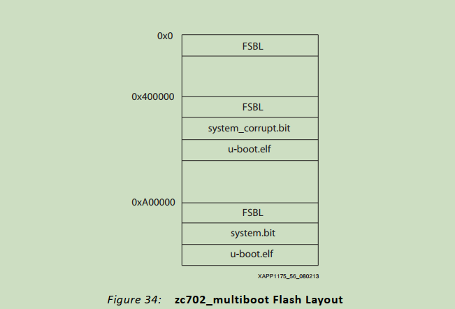

# 2024.12.20

修改Xenomai内核版本为4.14.36

**需求：**希望大家都用一个版本的软件

# 2025.2.5

实现在轨重构功能分析

# 2025.2.10

编写LVDS重构交付单，JTAG重构交付单

重构加载计划

## multiboot加载启动

在FLASH存放多份镜像

**参考文献：**

https://blog.csdn.net/weixin_43189165/article/details/97761784

《xapp1175_zynq_secure_boot.pdf》
