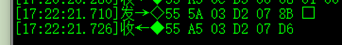
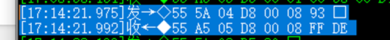

**设置串口波特率：9600**

55 5A 03 D2 07 8B

**最小检测距离：8cm** 

55 5A 04 D8 00 08 93

**最大检测距离：256cm** **（最大600cm****）**  

55 5A 02 D5 86 范围查询

55 5A 04 D6 01 00 8A  设置256

 

**灵敏度：8** **（可设置1-20****）**  

55 5A 03 DB 08 95

 

**连线说明**

 

 

 

 

 

 